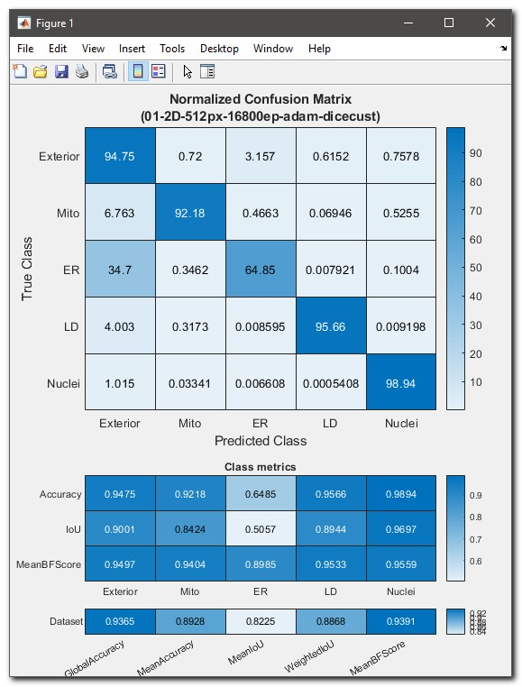
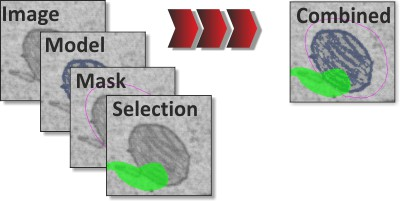

# Markdown examples

some useful markdown style examples

## Inline styles

* `*italic*` or `_italic_` -> *italic*
* `**bold**` or `__italic__` -> **bold**
* `***bold-italic***` -> ***bold-italic***
* Superscript: `A^T^A` -> A^T^A
* Subscript: `H~2~O` -> H~2~O
* Code: use apostrophe -> `inline code`
* Keys [keys table](https://facelessuser.github.io/pymdown-extensions/extensions/keys/#alphanumeric-and-space-keys): `++ctrl+alt+del+shift++` -> ++ctrl+alt+del+shift++
* left mouse click `<mouse class="left"></mouse>` -> <mouse class="left"></mouse>
* right mouse click `<mouse class="right"></mouse>` -> <mouse class="right"></mouse>
* `---` -> horizontal line across the page
* [URL links](https://mib.helsinki.fi/): `[linktext](https://link)`
* <div class="h3-like">Demo</div> `<div class="h3-like">Demonstration</div>` 
* <div class="h4-like">Section</div> `<div class="h4-like">Section</div>` 
---

Text with icons: 

* standard icons :octicons-gear-16: as `:octicons-gear-16:`, [icon search](https://squidfunk.github.io/mkdocs-material/reference/icons-emojis)  
* in color as :octicons-gear-16:{.orange-color} as `:octicons-gear-16:{.orange-color}` 
* :fontawesome-brands-youtube:{.red-color} as `:fontawesome-brands-youtube:{.red-color}` 
* inline without separate css declaration: <span style="color: #00AA00">:material-arrow-down-circle:</span><br>
`<span style="color: #00AA00">:material-arrow-down-circle:</span>`

---

## Admonitions, boxes
[https://squidfunk.github.io/mkdocs-material/reference/admonitions/](https://squidfunk.github.io/mkdocs-material/reference/admonitions/)

=== "Standard box"

    !!! info "The first parameter"
        
        The first parameter defines the type:
    
        * `!!!` - fixed box
        * `???` - collapsible box
        * `???+` - collapsible box in the expanded view

        ```
        !!! info "The first parameter"
            
            The first parameter defines the type:
        ```

=== "Collapsible"

    ??? success "The second parameter"
        
        The second parameter defines the icon:
    
        * note: octicons/tag-16
        * abstract: octicons/checklist-16
        * info: octicons/info-16
        * tip: octicons/squirrel-16
        * success: octicons/check-16
        * question: octicons/question-16
        * warning: octicons/alert-16
        * failure: octicons/x-circle-16
        * danger: octicons/zap-16
        * bug: octicons/bug-16
        * example: octicons/beaker-16
        * quote: octicons/quote-16****
            
        ```
        ??? success "The second parameter"
        
            The second parameter defines the icon:
        ```
    
    ???+ warning "Collapsible in the expanded view"
            
        Use `???+` to make it expanded

        ```
        ???+ warning "Collapsible in the expanded view"
            
            Use `???+` to make it expanded
        ```

=== "Inline"

    !!! info inline "Inline Admonitions before the text"
        Admonition text 1 
    Here is my main text
    ```
    !!! info inline "Inline Admonitions before the text"
        Admonition text 1 
    ```
    <br><br>
    !!! info inline end "Inline Admonitions after the text"
        Admonition text 2
    ```
    !!! info inline end "Inline Admonitions after the text"
        Admonition text 2
    ```
    Here is my main text
        
---

## Annotations

Add annotations (1), and one the link (2).
{.annotate }
    
1. :man_raising_hand: I'm an annotation!<br>
    the icon is defined in mkdocs.yml in<br>`annotation: material/chevron-right-circle`
2. [https://squidfunk.github.io/mkdocs-material/reference/annotations/](https://squidfunk.github.io/mkdocs-material/reference/annotations/)

```
Add annotations (1) some other text.
{.annotate }
    
1. :man_raising_hand: I'm an annotation!<br>

```

---

## Footnotes

Footnote A[^3] and Footnote B [^4]
[^3]:
    Footnote A
[^4]:
    Footnote B

```
Footnote A[^3] and Footnote B [^4]
[^3]:
    Footnote A
[^4]:
    Footnote B
```

---

## Headers

```
# Header 1 - Title 
## Header 2 
### Header 3 
<div class="h3-like">Demonstration</div> 
#### Header 4 
<div class="h4-like">Section</div> 
##### Header 5 
###### Header 6
```

## Grid cards

<div class="grid cards" markdown>

- :material-clock-fast:{ .lg .middle } __Set up__
    extra subtitle text

    ---
    Include in ```mkdocs.yaml```: 
    ```
    markdown_extensions:
        - md_in_html 
    ```
    [:octicons-arrow-right-24: Link to docs](https://squidfunk.github.io/mkdocs-material/reference/grids/)

-   :material-scale-balance:{ .lg .middle } **Open Source, MIT**
        
    ---
    Material for MkDocs is licensed under MIT and available on [GitHub]<br>
    [:octicons-arrow-right-24: License](index.md)

</div>

---    

### Two columns example

<div class="grid" markdown>

=== "Unordered list"
    
    * Sed sagittis eleifend rutrum
    * Donec vitae suscipit est
    * Nulla tempor lobortis orci
    
=== "Ordered list"
    
    1. Sed sagittis eleifend rutrum
    2. Donec vitae suscipit est
    3. Nulla tempor lobortis orci
    
``` title="Note!"
=== "Unordered list"
    
    * Sed sagittis eleifend rutrum
    * Donec vitae suscipit est
    * Nulla tempor lobortis orci
    
=== "Ordered list"
    
    1. Sed sagittis eleifend rutrum
    2. Donec vitae suscipit est
    3. Nulla tempor lobortis orci
```
</div>

---

## Images
Skip light box, i.e. do not zoom/zoom out, requires `manual: false` 
{.off-glb  }<br>
`{.off-glb  }`
continue text after image

Inline image {.inline-image} as 
`{.inline-image}`

{.on-glb align=left width="300"}
`{.on-glb align=left width="300"}`
<br>
Glithbox configuration settings ([press here](https://github.com/blueswen/mkdocs-glightbox#usage)).

<div class="clear-float"></div>

!!! info "Stop after image style"

    Use `<div class="clear-float"></div>` to break the floating pattern and start drawing text after the previous image


Image with caption
{.on-glb width="300" }
/// caption
Image caption
///
```
{.on-glb width="300" }
/// caption
Image caption
///
```

---

## JavaScript example

Toggle over the following text to see a hover tooltip: 
<span data-help="This saves your work" data-help-title="Save Button">**Save**</span><br>
`<span data-help="This saves your work" data-help-title="Save Button">**Save**</span>`

---

## Lists

=== "Unordered list"

    * Item 1 -> `* Item 1`
    * Item 2 -> `* Item 2`
    * Item 3 -> `* Item 3`

=== "Ordered list"

    1. Item 1 -> `1. Item 1`
    2. Item 2 -> `3. Item 2`
    3. Item 3 -> `3. Item 3`

=== "Definition list"
    ```
    `Definition 1`

    :   Paragraph 1.    
    ```

    `Definition 1`

    :   Sed sagittis eleifend rutrum. Donec vitae suscipit est. Nullam tempus
        tellus non sem sollicitudin, quis rutrum leo facilisis.

    `Definition 1`

    :   Paragraph 2.

        Paragraph 2.

=== "Task list"
    ```
    - [x] Lorem ipsum dolor sit amet, consectetur adipiscing elit
    - [ ] Vestibulum convallis sit amet nisi a tincidunt
        * [x] In hac habitasse platea dictumst
        * [x] In scelerisque nibh non dolor mollis congue sed et metus
        * [ ] Praesent sed risus massa
    - [ ] Aenean pretium efficitur erat, donec pharetra, ligula non scelerisque
    ```

    - [x] Lorem ipsum dolor sit amet, consectetur adipiscing elit
    - [ ] Vestibulum convallis sit amet nisi a tincidunt
        * [x] In hac habitasse platea dictumst
        * [x] In scelerisque nibh non dolor mollis congue sed et metus
        * [ ] Praesent sed risus massa
    - [ ] Aenean pretium efficitur erat, donec pharetra, ligula non scelerisque

---

## Tabs and code block
=== "Tab 1"
    For code blocks use apostrophe x3 times to mark start and end
    ```
    === "Tab 1"
    
        tab 1 text
    
    === "Tab 2"
    
        tab 2 text
    ```

=== "Tab 2"

     An example of a code block for MATLAB; use apostrophe x3<br> 
    ``````matlab title="Example of the code block" linenums="1" hl_lines="4-5"```

    ```matlab title="Example of the code block" linenums="1" hl_lines="4-5"
    function foo(par1)
    % my function text
    for i = 1:5
        disp(i);
        fprintf('%d/5', i);
    end
    ```
---

## Tables

=== "Aligned to left"
    | Method      | Description                          |
    | :---------- | :----------------------------------- |
    | `GET`       | :material-check:     Fetch resource  |
    | `PUT`       | :material-check-all: Update resource |
    | `DELETE`    | :material-close:     Delete resource |

    ```
    | Method      | Description                          |
    | :---------- | :----------------------------------- |
    | `GET`       | :material-check:     Fetch resource  |
    | `PUT`       | :material-check-all: Update resource |
    | `DELETE`    | :material-close:     Delete resource |
    ```

=== "Aligned to center"
    | Method      | Description                          |
    | :---------: | :----------------------------------: |
    | `GET`       | :material-check:     Fetch resource  |
    | `PUT`       | :material-check-all: Update resource |
    | `DELETE`    | :material-close:     Delete resource |

    ```
    | Method      | Description                          |
    | :---------: | :----------------------------------: |
    | `GET`       | :material-check:     Fetch resource  |
    | `PUT`       | :material-check-all: Update resource |
    | `DELETE`    | :material-close:     Delete resource |
    ```

=== "Aligned to right"
    | Method      | Description                          |
    | ----------: | -----------------------------------: |
    | `GET`       | :material-check:     Fetch resource  |
    | `PUT`       | :material-check-all: Update resource |
    | `DELETE`    | :material-close:     Delete resource |

    ```
    | Method      | Description                          |
    | ----------: | -----------------------------------: |
    | `GET`       | :material-check:     Fetch resource  |
    | `PUT`       | :material-check-all: Update resource |
    | `DELETE`    | :material-close:     Delete resource |
    ```
---

## Tooltips

* Link with tooltip, inline syntax: [hover me](index.md "hit to return back to index.html")<br>
`[hover me](index.md "hit to return back to index.html")`
* Icon with a tooltip :material-information-outline:{ title="Important information" }<br>
`:material-information-outline:{ title="Important information" }`

---

## Widgets
Button: `<span class="widget widget-button">Button</span>`<br>
<span class="widget widget-button">Button text</span>

Edit box: `<span class="widget widget-edit">Editbox</span>`
<br><span class="widget widget-edit">Edit box text</span>

Dropdown: `<span class="widget widget-dropdown">Dropdown</span>`<br>
<span class="widget widget-dropdown">Dropdown item</span>

Checkbox checked: `<span class="widget widget-checkbox">Checkbox</span>`<br>
<span class="widget widget-checkbox">Checkbox</span>

Checkbox unchecked: `<span class="widget widget-checkbox widget-checkbox-unchecked">Unchecked</span>`<br>
<span class="widget widget-checkbox widget-checkbox-unchecked">Unchecked checkbox</span>

Radio: `<span class="widget widget-radio">Radio</span>`<br>
<span class="widget widget-radio">Radio</span>
