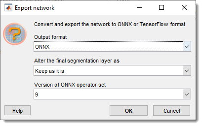
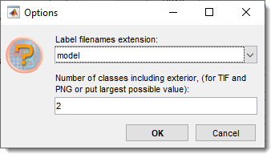

# Deep MIB - Options Tab

Additional options and settings for deep learning segmentation in Microscopy Image Browser.

---

## Overview

{.on-glb width="440" align=left}

The **Options tab** provides supplementary settings for customizing Deep MIB’s behavior during training, prediction, and data management.

---

## Custom training plot section

Configures the custom training progress plot displaying the loss function during training.

<label class="widget widget-checkbox">Custom training progress plot</label> enables the custom plot when checked; unchecked uses MATLAB’s standard plot (*MATLAB version only*)  
Refresh rate... sets the iteration interval for plot updates. Higher values reduce updates, boosting training performance  
Number of points... defines the number of plot points. Lower values enhance drawing speed, higher values show more detail  
<label class="widget widget-checkbox">Preview image patches</label> displays input image and model patches in the custom plot, reducing performance. 
Adjust visibility with Fraction of images for preview...  
Fraction of images for preview... sets the fraction of patches shown (1 = all, 0.01 = 1%)
<label class="widget widget-checkbox">Calculate accuracy for instance 2D</label> (*2D Instance workflow only*) adds the mean Average Precision (mAP) metric to validation. 
When checked, Deep MIB attaches `mAPInstanceSegmentationMetric` to the SOLOv2 training so that, at each validation interval, the detector is run over the whole validation set and the resulting mAP is shown on the **Validation accuracy** gauge of the custom training progress plot. 
Requires validation images (*Directories and Preprocessing → Fraction of images for validation* > 0). 
Because it runs full inference plus IoU matching on every validation pass, it noticeably slows training; leave it unchecked to compute and plot validation **loss** only, in which case the Validation accuracy gauge shows `N/A`. 
The Training accuracy gauge is always `N/A` for this workflow, since SOLOv2 reports only loss during training

---

## Config files section

Manages Deep MIB configuration files (`.mibCfg`), which store all settings, including network name and directories, but not the trained network itself. these are auto-generated during training alongside `.mibDeep` files or saved manually.

- Load loads DeepMIB config file (`.mibCfg`) to restore all settings
- Save manually saves the current configuration  
- Duplicate copies the network (`.mibDeep`) and config (`.mibCfg`) to new files, updating the network name in the config. 
This operation is useful for backups or when another network needs be trained from already trained one.

---

## Tools section

### Import network

Import network imports externally designed or trained networks (MATLAB format only). 
Use MATLAB Deep Network Designer to create networks, then import them into Deep MIB for training or prediction, 
generating `.mibCfg` and `.mibDeep` files.

### Export network

Export network exports trained networks to ONNX or TensorFlow formats.

??? abstract "Additional details of the export process"
    {.on-glb}  
    - Version of ONNX operator set: chooses ONNX operator set (6, 7, 8, 9)  
    - Alter the final segmentation layer as: modifies the last segmentation layer (e.g., replacing non-standard layers like CustomDice for ONNX compatibility)  
    ???+ abstract "list of available options"

          - **Keep as it is**: retains the original layer  
          - **Remove the layer**: removes the segmentation layer, making softmax the final layer  
          - **pixelClassificationLayer**: swaps to a standard pixel classification layer  
          - **dicePixelClassificationLayer**: swaps to a Dice loss-based layer  

### Count labels

Count labels counts labels in model files.

??? abstract "Details of Count Labels"
    - Select the directory with labels  
    - Specify the file extension (`.model`, `.mibCat`, `.png`, `.tif`, `.tiff`) and number of classes  
    
    - Save results to `.mat`, `.xls`, or `.csv`  

### Balance classes

Balance classes (*beta*) balances rare classes in 2D Semantic workflows for standard image formats (TIF, PNG, JPG), generating patches from large rasters.

??? abstract "Details of Balance classes"
    Place images and labels in `Images` and `Labels` subfolders under
    **Directories and Preprocessing → Directory with images and labels for training**.  
    Balanced results are saved to `ImagesBalanced` and `LabelsBalanced` subfolders. 
    Driven by MATLAB’s [balancePixelLabels](https://se.mathworks.com/help/vision/ref/balancepixellabels.html) function.

---

*Back to [MIB](../index.md) | [DeepMIB](index.md)*