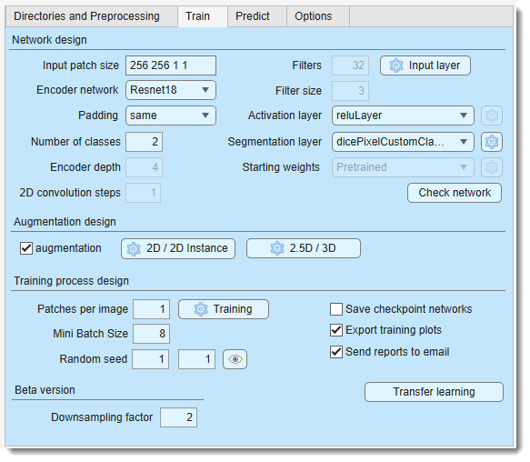
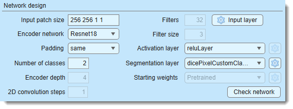
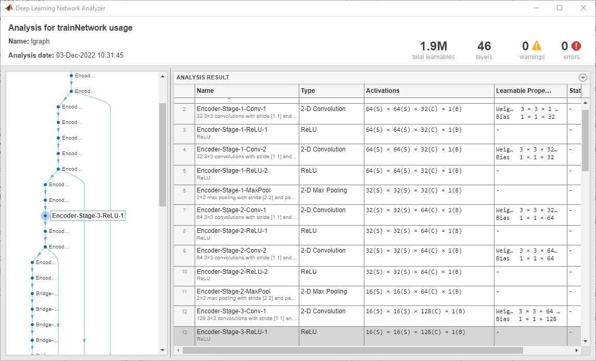
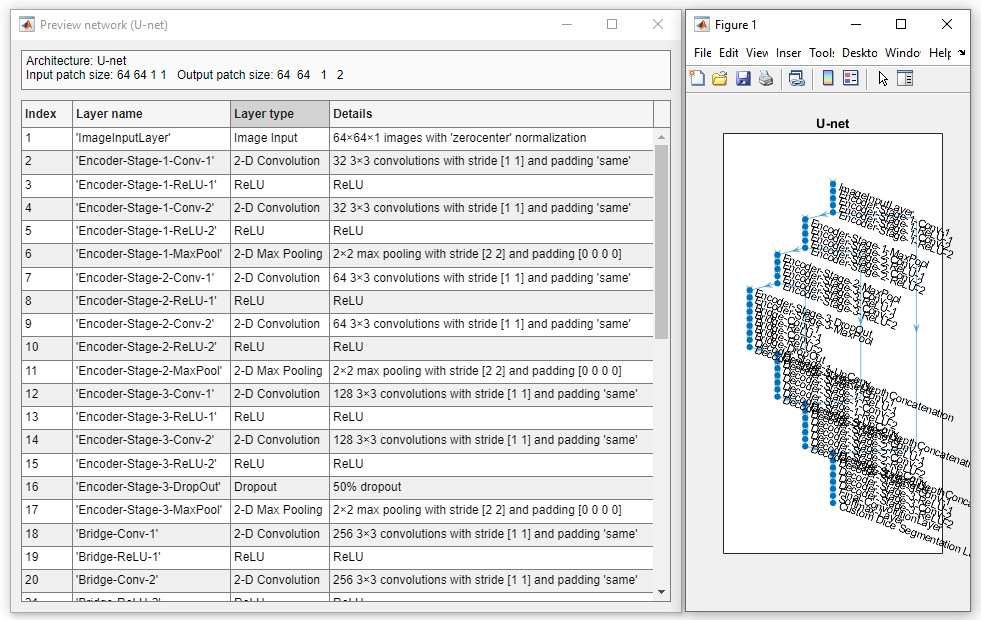
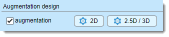
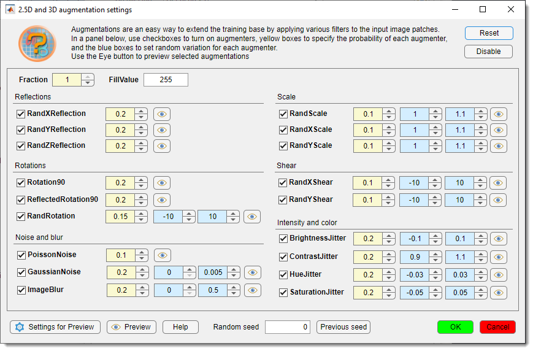
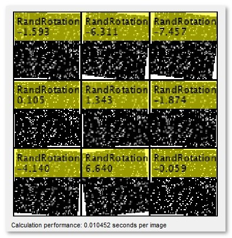
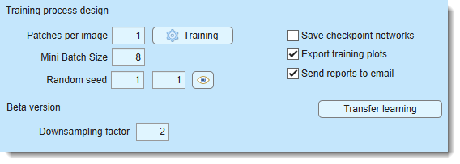
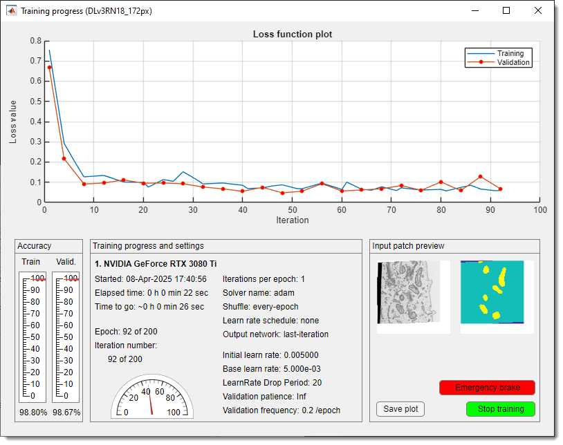

# Deep MIB - Train Tab

Settings for generating and training deep convolutional networks in Microscopy Image Browser.

---

## Overview

{.on-glb width="440"}

The **Train tab** in Deep MIB contains settings for designing and training deep convolutional networks. before starting, 
adjust the default settings to your project’s needs and ensure the output network file is specified using the 
Network filename button in the *Network panel*.

---

## Network design

The *Network design* section configures the network architecture.

- Input patch size... defines the dimensions of image blocks 
(`height, width, depth, colors`) for training (e.g., "572 572 1 2" for a 572x572x1 patch with 2 color channels), 
Define the input patch size based on available GPU memory, desired field of view, dataset size, and channels. 
Patches are randomly sampled, with the count set in Patches per image...  
- Encoder network selects the encoder for supported architectures, 
sorted from lightweight to more complex  
- Padding sets convolution padding type:  
      - **same**: adds zero padding to keep input/output sizes equal  
      - **valid**: no padding, reducing output size but minimizing edge artifacts 
      (though *same* with overlap prediction also reduces artifacts). 

    !!! info
    
        Press Check network to verify compatibility of the input patch size with the selected padding method

- Number of classes... specifies the total number of materials, including `Exterior`  
- Encoder depth... sets the number of encoding/decoding layers in U-Net, 
controlling downsampling/upsampling by 2^D. Tweak with Downsampling factor... (*Beta version*) to adjust patch size  
- Filters... defines the number of output channels (filters) in the first encoder stage, doubling per subsequent stage, mirrored in the decoder  
- Filter size... sets convolutional filter size (e.g., 3, 5, 7)  
- Input layer configures input image normalization settings  
-  Activation layer selects the activation layer type, with additional settings 
via the {.inline-image} button when available  

    ??? abstract "list of available activation layers"
    
        Compare activation layers [here](https://se.mathworks.com/help/deeplearning/ug/compare-activation-layers.html):  
        - *reluLayer*: [Rectified Linear Unit (ReLU) layer](https://se.mathworks.com/help/deeplearning/ref/nnet.cnn.layer.relulayer.html), *default activation layer*   
        - *leakyReluLayer*: [Leaky Rectified Linear Unit (ReLU) layer](https://se.mathworks.com/help/deeplearning/ref/nnet.cnn.layer.leakyrelulayer.html) scales negative inputs   
        - *clippedReluLayer*: [Clipped Rectified Linear Unit (ReLU) layer](https://se.mathworks.com/help/deeplearning/ref/nnet.cnn.layer.clippedrelulayer.html) performs a threshold operation, where any input value less than zero is set to zero and any value above the clipping ceiling is set to that clipping ceiling  
        - *eluLayer*: [Exponential linear unit (ELU) layer](https://se.mathworks.com/help/deeplearning/ref/nnet.cnn.layer.elulayer.html) exponential nonlinearity for negatives   
        - *swishLayer*: [Swish activation layer](https://se.mathworks.com/help/deeplearning/ref/nnet.cnn.layer.swishlayer.html) applies f(x) = x / (1+e^(-x))   
        - *tanhLayer*: [Hyperbolic tangent (tanh) layer](https://se.mathworks.com/help/deeplearning/ref/nnet.cnn.layer.tanhlayer.html)  

- Segmentation layer selects the output layer, with settings via the {.inline-image} button when available  

    ??? abstract "List of available segmentation layers"
     
        - [pixelClassificationLayer](https://se.mathworks.com/help/vision/ref/nnet.cnn.layer.pixelclassificationlayer.html): cross-entropy loss  
        - [focalLossLayer](https://se.mathworks.com/help/vision/ref/nnet.cnn.layer.focallosslayer.html): focal loss for class imbalance  
        - [dicePixelClassificationLayer](https://se.mathworks.com/help/vision/ref/nnet.cnn.layer.dicepixelclassificationlayer.html): generalized Dice loss for class imbalance  
        - **dicePixelCustomClassificationLayer**: modified Dice loss for rare classes  

- Starting weights states where the initial weights come from and how much of
the network is retrained. The available states are a property of the selected workflow.

    ??? info "List of available properties"

        | Network design | Starting weights |
        |---|---|
        | 3D Semantic; U-net +Encoder with the `Classic` encoder; SegNet | `None (random)` |
        | DeepLab v3+ / Z2C + DLv3; U-net +Encoder with a Resnet encoder | `Pretrained` |
        | 2D Patch-wise (Resnet/Xception) | `None (random)` or `ImageNet` *(user choice)* |
        | 2D Instance (SOLOv2) | `COCO, frozen then trainable` *(default)*, `COCO, frozen backbone` or `COCO, trainable backbone` |

        - `Pretrained` means the network starts from an already trained template rather than from scratch. **What** that
        template is depends on the design: DeepLab v3+ with a Resnet encoder downloads a MIB-hosted template the first time
        it is used and asks you to choose the **Electron Microscopy** or **Light microscopy/Pathology** variant, whereas the
        U-net Resnet encoders are fetched from the MIB encoder repository. The downloaded template is cached in the DeepMIB
        directory (*Preferences → External directories*) and reused silently from then on, so the choice is a property of
        your installation and is not stored in the configuration file.

        - `ImageNet` applies to the 2D Patch-wise classification networks and requires the MATLAB version of MIB plus the
        matching support package; it is not offered in the standalone version.

        - For SOLOv2 the network always starts from COCO weights, and the choice is what happens to the backbone. The two
        single-phase states want **different learning rates**, which is why the default combines them:

            - `COCO, frozen then trainable` **(default, recommended)** runs training in two phases automatically. The backbone is
            held fixed while the heads learn, then it is unfrozen and training continues from that network at a much lower rate
            so the features adapt to microscopy data. Nothing has to be restarted by hand.

            - `COCO, frozen backbone` holds the COCO features fixed for the whole run. Fast, tolerant of a high learning rate,
            and the safest choice on a very small number of annotated images.

            - `COCO, trainable backbone` unfreezes from the very start. Only use it deliberately, and only with the learning rate
            already lowered - see the warning below.

            The two phases solve different problems. The frozen phase is **searching** - the heads start from random
            weights and have to travel a long way, which works over a wide band (`1e-3` and `1e-2` both converged here).
            The trainable phase is **protecting** - the COCO backbone is already at a good point, and how large a step
            it tolerates is a property of those pretrained weights, not of whatever phase 1 used.

            The epoch budget is **not** increased: whatever the frozen phase leaves unused is handed to the trainable phase, so
            `MaxEpochs` still describes the whole run. Each phase draws its own progress plot, and the exported `.score` and
            CSV files contain one continuous curve across both.

            At the moment of the switch the frozen-phase network is **always** written to
            `<Results>/ScoreNetwork/net_checkpoint__frozenPhaseEnd_<iterations>__<timestamp>.mat`, whether or not
            <label class="widget widget-checkbox">Save checkpoint networks</label> is enabled.

        ??? warning "Never unfreeze the backbone at the learning rate that suits a frozen one"
    
            A rate that is perfectly safe with a frozen backbone (`1e-3` to `1e-2`) destroys the pretrained weights within
            the first hundred iterations once the backbone is trainable. The symptom is unmistakable: the loss drops a
            little, then flatlines for the rest of the run, and the validation mAP stays at exactly `0` - the network
            detects nothing at all, not even on its own training images.
    
            `COCO, frozen then trainable` handles this for you. If you use `COCO, trainable backbone` directly, set the
            initial learning rate to about `1e-4` with Adam, and prefer to continue training an already trained frozen
            network rather than unfreezing from scratch.

    ??? info "Starting weights settings"

        The {.inline-image} button next to the dropdown is
        enabled for `COCO, frozen then trainable` and configures the schedule:

        | Setting | Default | Meaning |
        |---|---|---|
        | Minimum frozen share | 0.1 | No switch happens before this share of the total epochs |
        | Maximum frozen share | 0.25 | The switch happens no later than this |
        | Plateau window | 25 epochs | The mean loss of the last window is compared with the window before it |
        | Plateau tolerance | 0.01 | Below 1% improvement between those windows, the loss counts as flat |
        | Trainable phase learn rate | 1e-4 | The learning rate phase 2 runs at, capped at the initial rate |

- Check network previews and validates the network (limited info in standalone MIB)  

    ??? abstract "Snapshots of the network check window for the MATLAB and standalone versions of MIB"
    
        
MATLAB version:
 
        {.on-glb}  
          
        
Standalone version:

        {.on-glb}

---

## Augmentation design

{.on-glb align=left}

Augmentation enhances training data with image processing filters (17 for 2D, 18 for 3D networks), configurable via buttons next to <label class="widget widget-checkbox">Augmentation</label>.

- <label class="widget widget-checkbox">Augmentation</label>: enables augmentation of input patches  
- 2D: sets augmentation for 2D networks (17 operations)  
- 3D: sets augmentation for 3D networks (18 operations)  
 
Specify the fraction of patches to augment, plus probability and variation per filter. 
Multiple filters may apply to a patch based on probability.

??? abstract "2D/3D augmentation settings"
    Press 2D or 3D to open the settings dialog:  
    {.on-glb}  
    - Toggle augmentations with checkboxes  
    - Set probability (yellow) and variation (light blue)  
    - Reset restores defaults  
    - Disable turns off all augmentations  
    - Fraction probability of patch augmentation (1 = all, 0.5 = 50%)  
    - FillValue background color for downsampling/rotation (0 = black, 255 = white for 8-bit)  
    - {.inline-image} previews patches with augmentations, fixed or random based on Random seed (0 = random)  
    - {.inline-image} adjusts preview parameters 

    ??? abstract "Details settings for preview"
          {.on-glb}  
          Example augmentations from Preview:  
          {.on-glb}

    - Help: links to training help  
    - Previous seed: restores the last random seed (when *Random seed* = 0)  
    - OK: applies settings  
    - Cancel: discards changes

---

## Training process design

{.on-glb align=left width="460"}

The *Training process design* section configures the training process, started with Train.

!!! info "`<Results>` in the paths below"

    Everything training writes goes into subfolders of the **directory with resulting images**, which you set on the
    [Directories and preprocessing](deepmib-dirs.md) tab - it is not fixed to any particular name. `<Results>` stands for
    that directory throughout this page, so `<Results>/ScoreNetwork` is the `ScoreNetwork` subfolder inside whichever
    results directory the project uses.

- Patches per image... sets patches per image/dataset per epoch. Use 1 patch with many epochs and *Shuffling: every-epoch* (via Training) for best results, or adjust as needed  
- Mini Batch Size... number of patches processed simultaneously, limited by GPU memory. Loss is averaged across the batch  
- Random seeds for training and validation... seeds the random number generator for training initialization 
(use any fixed value except `0` for reproducibility, otherwise use `0` for random initialization each training attempt). 
Training patches are re-sampled every epoch either way - this seed only fixes the sequence they are drawn in  

    ??? info "Random seed for the valication patches"
        Validation seed... seeds the **validation** patches, separately from the training seed above  
    
        The two want opposite things. Training benefits from fresh patches every epoch; validation only means something if the
        patches do **not** move, because a loss measured on different crops each time reports which crops were drawn as much as
        how good the network is - and `OutputNetwork: best-validation-loss` then picks the luckiest draw rather than the best
        network.
    
        Validation patches are re-cropped on every pass by default, in **all** workflows that crop patches. With a non-zero
        value the same patches are used at every evaluation, so the curve is comparable point to point. Use `0` to restore the
        previous behaviour of fresh random validation patches at every evaluation.
    
        | Workflow | What the seed does |
        |---|---|
        | 2D / 2.5D / 3D Semantic | The validation patches are extracted once under this seed and replayed at every evaluation |
        | 2D Instance | Every validation image is always cropped at the same windows |
        | 2D Patch-wise | Nothing - validation uses whole images from a fixed file list and never moves |

        The {.inline-image} button beside the seed inspects **the patches that seed
        produces**, so a seed can be judged before spending a training run on it. A draw that lands mostly on background
        makes the validation loss a poor guide, and `OutputNetwork: best-validation-loss` then selects against a set that
        does not represent the data - press the button, look, change the seed, look again.

        It first asks how many patches the validation set holds and offers two ways to look:

        - **Show collage** - a montage of the first patches in the set. It uses the same appearance settings as the
        augmentation preview (*Augmentation → 2D/3D →*
        {.inline-image}): number of images,
        display size, and the label font and colours. Labels show the source and, for **2D Instance**, how many annotated
        objects the patch contains - the quickest way to spot a patch that is nearly empty.

        - **Export to disk** - every validation patch written at **100% magnification** to
        `<Results>/ScoreNetwork/ValidationPatches`, as an image (`<index>_<source>.tif`) plus a MIB model of its labels
        (`Labels_<index>_<source>.model`). Open the pair in MIB to check the annotations at full resolution. For
        **2D Instance** each object gets its own index in the model, exactly as instance predictions are stored.

        Both options show a progress dialog that can be cancelled. Cancelling an export keeps the patches already
        written and reports how many of the total were done.

        With a seed of `0` both options give one example draw, since the patches are re-cropped at every evaluation.

        !!! note "Class names in exported semantic models"

            Semantic exports label their materials `Class01`, `Class02`, … rather than the names from your model file.
            The label **indices** are correct, only the names are generic. If a validation label set cannot be read, the
            images are still exported and the models are skipped.
    
        !!! note "How many validation patches there are"
    
            Patches per image... applies to the validation images as well, so the
            validation set holds *patches per image x number of validation images* observations. With only a handful of
            validation images, raising *Patches per image* is the cheapest way to make the validation curve less noisy.
    
        !!! warning "The semantic patches are held in memory"
    
            Freezing the semantic validation set means keeping every validation patch in RAM for the whole run. Deep MIB
            reports the size on the console when it does so, and backs out with a warning above 2 GB, leaving the patches
            randomised rather than risking the run. Lower *Patches per image* or use fewer validation images if you hit that.

- Training sets multiple parameters 
(see [trainingOptions](https://se.mathworks.com/help/deeplearning/ref/trainingoptions.html)). 

    !!! tip
        set *Plots* to "none" for up to 25% faster training

- <label class="widget widget-checkbox">Save checkpoint networks</label> saves checkpoints after each epoch 
to `<Results>/ScoreNetwork`. Resume training from checkpoints via a dialog. In R2022a or newer, it is possible to adjust frequency for saving checkpoints  

    ??? note "What a new run clears, and what it keeps"

        Choosing **Start new training** in the resume dialog deletes only the checkpoint networks
        (`net_checkpoint__*.mat`). MATLAB names those after the iteration alone, so they accumulate across runs at
        tens of MB each and would otherwise fill the restore dialog.

        Score, CSV, PNG and FIG exports are **kept**. Every one of them is written with a
        `<yyMMddHHmm>_<network name>` prefix, so runs cannot overwrite each other and the history of a project stays
        in the folder.

- <label class="widget widget-checkbox">Export training plots</label> saves accuracy/loss scores to `<Results>/ScoreNetwork` in `.score` (MATLAB) and CSV formats, using the network filename. When the Deep MIB progress window is in use, a `.png` snapshot of it and a reopenable `.fig` are written alongside them when training finishes  
- <label class="widget widget-checkbox">Send reports to email</label> emails progress/finish updates. configure SMTP settings via the checkbox  

### Configuration of email notifications 

???+ abstract "Configuration of email notifications"

    {.on-glb width="350" align=left}  
    - Destination email recipient address  
    - STMP server address SMTP server address  
    - STMP server port server port  
    - <label class="widget widget-checkbox">STMP authentication</label> enables authentication  
    - <label class="widget widget-checkbox">STMP use starttls</label> enables TLS/SSL  
    - STMP username server username (e.g., Brevo email)  
    - STMP password server password
    (hidden, toggle **Check to see the password in plain text after OK press** to view) 
    - <label class="widget widget-checkbox">Send email when training is finished</label> emails on completion  
    - <label class="widget widget-checkbox">Send progress emails</label> emails progress (custom training dialog only, frequency tied to checkpoints)  
    - Test connection tests settings after saving with OK
    
    

 
    !!! tip "Important!"
        **Important**: Use dedicated SMTP services (e.g., [Brevo](https://www.brevo.com)) instead of personal email accounts

    ??? abstract "Configuration of brevo.com SMTP server"
          - Sign up at [Brevo](https://www.brevo.com)  
          - Access **SMTP and API** from the top-right menu:  
          {.on-glb width="400"}  
          - Click Generate a new SMTP key  
          - Copy the key to the password field in email settings
---

## Start the training process

Click Train to begin. If a network file already exists 
in Network filename..., a dialog offers to resume training.  
A `.mibCfg` config file is saved in the same directory, loadable via **Options tab → Config files → Load**.

During training, a loss function plot appears (blue = training, red = validation), with accuracy gauges at the bottom left. 
Perform <mouse class="right"></mouse> over the plot to scale it via a context menu. 
Stop training with Stop or Emergency brake (faster but may not finalize networks with batch normalization).

!!! note "Stopping a **2D Instance** run early"

    Instance segmentation trains through MATLAB's `trainSOLOV2`, whose trainer only ends the
    current epoch when asked to stop — it still walks through the epochs that were left
    before it returns. Deep MIB makes those leftover epochs as cheap as it can, but
    Stop still costs roughly a minute per 1000
    remaining epochs. The network and the full training curve are finalized normally.

    Emergency brake leaves the trainer immediately
    and rebuilds the network from the most recent checkpoint, so keep
    **Train tab → Save checkpoint networks** enabled if you expect to use it. The recovered
    network is up to *Checkpoint frequency* epochs behind the point where you pressed the
    button, and the exported training curve is the one drawn in the progress window rather
    than the full per-iteration log.

By default, Deep MIB uses a custom progress plot. If you want to use default MATLAB’s training plot (*MATLAB version only*), 
uncheck **Options tab → Custom training plot → Custom training progress window**.  
Disable plots for speed via **Train tab → Training → Plots → none**.  
Preview patches (bottom right) reduce performance; adjust frequency in 
**Options tab → Custom training plot → Preview image patches** and **Fraction of images for preview** (1 = all, 0.01 = 1%).

{.on-glb}
/// caption
Custom DeepMIB training loss plot
///

After training, the network and config files are saved to the location in Network filename....

---

*Back to [MIB](../index.md) | [DeepMIB](index.md)*