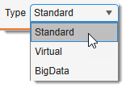

# Dataset types

{align=left}

Every buffer in MIB stores its dataset in one of three **types**, chosen with the
Standard selector at the bottom of the
[Datasets panel](../../user-interface/panels/datasets/index.md). The type controls
*how the pixels are held* — entirely in RAM, streamed from disk for browsing, or
streamed from disk **and** segmentable — and therefore which datasets you can open and
what you can do with them.

When a real dataset is open, switching the type shows a confirmation first (the current
dataset is closed or converted); switching the type of an empty/placeholder buffer happens
silently. Choosing **BigData** while a dataset is open offers **Convert current** (write the
open image to an OME-Zarr v3 pyramid on disk and reopen it in BigData mode) or **New** (start
an empty BigData placeholder).

| Type | In memory? | Editable model? | Typical use |
|------|:----------:|:---------------:|-------------|
| **Standard** | whole dataset in RAM | ✅ full | small–medium datasets |
| **Virtual** | read on demand | ❌ browse-only | quickly browse datasets too large for RAM |
| **BigData** | read on demand, pyramidal | ✅ disk-backed model | segment datasets far larger than RAM |

---

## Standard

The entire dataset is loaded into RAM. This is the default and the most capable mode.

Benefits

- Best performance — all pixels are immediately in memory.
- **All** tools, filters, processing and export formats are available.
- Full multi-step Undo/Redo.

Limitations

- The dataset (and its model/mask/selection layers) must fit in RAM, with headroom for processing.
- Not suitable for datasets larger than available memory — use **Virtual** (to browse) or **BigData**
  (to browse *and* segment) instead.

---

## Virtual

Pixels are read from disk **on demand** (e.g. an OME-Zarr v3 pyramid, HDF5, or a BioFormats-backed file),
so only the currently viewed region is held in memory.

Benefits

- Open and **browse** datasets far larger than RAM with a small memory footprint.
- Supports more on-disk formats than BigData (anything the virtual readers can stream).

Limitations

- **Browse-only** — segmentation layers (Selection, Mask, Model) and most pixel-editing/processing
  tools are disabled; Undo is not kept for these layers.
- Slower per access than Standard (each view reads from disk).
- To segment a large dataset instead of just viewing it, use **BigData**.

---

## BigData

For datasets **too large to fit in RAM that you also want to segment**. The image is a pyramidal,
chunked **OME-Zarr v3** store read on demand (zoom selects the matching resolution level; pan reads only
the visible region), and the segmentation **model is a disk-backed, pyramidal 63-class store** that mirrors
the image pyramid. Edits are written straight to disk and propagated across levels, so a model can be far
larger than memory and survives across sessions.

Benefits

- **Segment** datasets much larger than RAM — only the visible region/level is ever in memory.
- The model is **saved live to disk** (an OME-Zarr v3 group next to the image) and reloads across sessions;
  material names and colours are preserved.
- Smooth zoom/pan and **orientation switching** (XY / ZX / ZY) by reading the appropriate pyramid level.
- Export any pyramid level to standard formats, streamed slice-by-slice for the memory-optimized formats
  (see [Save Image As](../../user-interface/ribbon/home/index.md#save-image-as) and
  [Save model as...](../../user-interface/ribbon/model/index.md#save-model-as)).
- Selectable Zarr backend (native `zarrMex` or `zarr-python`); define in
  [Preferences->Input / Output](../../user-interface/ribbon/home/home-preferences.md#input-output)
- **3D volume rendering** — the Render →
  MIB Rendering button on the Home ribbon now supports
  BigData: pick a pyramid level to render in 3D (a memory estimate is shown for each level), and
  optionally enable the live-update checkbox so the overlay refreshes automatically as you segment
  in the main window.

Limitations

- Reads **OME-Zarr v3 only**. Other formats (TIFF, HDF5, BioFormats/WSI, …) must first be **converted** —
  switch the type dropdown to *BigData → Convert current*, or use *Ribbon → Home → Export → Export to Zarr3*, or use
  [Image converter plugin](../../plugins/file-processing/image-converter.md)
- **Browse-only until a model exists** — create a model (Segmentation panel → *Create*, or *Ribbon → Model →
  New model*, or load one) to enable segmentation.
- Up to **63 materials** (packed model), and **a single time point** (time-series is not yet supported).
- The **source image is read-only** — you edit the model, not the image pixels. To change image pixels,
  convert the (cropped) region to Standard.
- A few tools are **not available**: [Object Picker](../../user-interface/panels/segm/segm-objpick.md),
  [Black-and-White Thresholding](../../user-interface/panels/segm/segm-bwthres.md), and SAM's *Automatic everything*. Each
  [segmentation tool page](../../user-interface/panels/segm/index.md) states its BigData support.

!!! tip "Getting into BigData mode"
    Open a `.zarr3` dataset directly (it opens as BigData), or switch an open Standard/Virtual dataset with
    the **Dataset type → BigData** dropdown and choose *Convert current*.

---

## How BigData works

This section explains the machinery behind BigData segmentation — useful for understanding why
editing stays fast on a multi-gigapixel slide and what the **Save model** options do.

### The image and model pyramids

A BigData image is a **pyramid**: the same picture stored at several resolutions
(`s0` = full resolution, `s1` = half/quarter, … `sN` = coarsest thumbnail), each split into small
**chunks** on disk. When you zoom, MIB picks the pyramid level whose scale matches the zoom; when you
pan, it reads only the chunks under the viewport. Nothing else is loaded, so memory use stays tied to
the size of the *window on screen*, not the size of the slide.

The **model** (your segmentation) is stored the same way: a parallel pyramid of the same levels, packed
so each voxel holds the material index plus the mask and selection bits. It lives in an OME-Zarr v3
group next to the image and is written **live** as you segment — there is no separate "load the whole
model into RAM" step.

### Edits are written at the zoom you draw — plus coarser

When you paint at, say, 16% zoom, the stroke is written to **that** pyramid level **and every coarser
level** immediately (a coarser level is small, so downsampling the edited patch into it is cheap). The
**finer** levels (higher resolution than where you drew) are **not** written right away — they are marked
as needing an update and reconstructed later. This is what keeps a brush stroke cheap regardless of zoom
or slide size: the cost scales with the *edit*, not with the whole image.

### Finer levels are rebuilt on demand (and cached)

When you zoom **in** to a level finer than where an edit was made, MIB reconstructs that region for the
finer level by up-sampling from the level that holds the data, writes it down, and **caches** it — so the
next view of the same area is a direct read with no recomputation. An optional, label-aware **smoothing**
(*Preferences → Input/Output → Zarr → Smoothing*) removes the blocky stair-steps that plain up-sampling
would produce at the finer grid.

### The level map and its sidecar file

To know, for every region, **which level currently holds the real data**, MIB keeps a small **level map**.
It records per tile the finest materialized level, so reads know whether they can go straight to disk or
must reconstruct first. Two consequences follow:

- **Selection-aware operations are fast.** Assigning the selection to a material and the other
  shortcuts (A / S /
  R) and clearing it
  (C) work only inside the selection's tracked footprint instead
  of scanning the whole slide.
- **The map is persisted as a sidecar file** next to the model store, named `<model-name>.levelmap`
  (for example `Labels_CMU-1.levelmap`). It is written when you close the model and when you press
  **Save model** (see below). It does **not** exist mid-session until you save or close.

!!! info "Why a loaded model is always precise"
    A model on disk is treated as **precise at every level** unless the sidecar explicitly says some
    tiles still have deferred (not-yet-written) finer levels. So an **imported / externally-created
    model** — where the whole pyramid was written properly — loads at full detail; deferral is purely a
    within-a-session optimisation, and that state lives in the sidecar.

### Saving a BigData model

Pixel edits are already on disk the moment you draw them; the only volatile state is the in-memory level
map. Pressing Save on the
[Model ribbon](../../user-interface/ribbon/model/index.md) therefore offers two choices:

| Choice | What it does | Speed |
|--------|--------------|:-----:|
| **Finalize & save** | Materializes **every** resolution level from the level map, so the on-disk model is consistent at all zooms — required for export and for opening the store in external readers. | slower on a large slide |
| **Save sidecar** | Writes **only** the small level-map file. A fast crash-safety checkpoint: because edits are already on disk, persisting the level map is enough for a reopen to restore the model precisely (rebuilding deferred finer levels on demand) without re-materializing. | fast |

!!! note "The sidecar file is kept after Finalize — this is expected"
    After **Finalize & save**, the `.levelmap` sidecar file is **not deleted**: it is updated to record
    that every level is now fully materialized. On the next open MIB reads that record and knows the
    model is complete. Without the sidecar, MIB would reach the same conclusion via a fallback — but
    keeping it makes the distinction between a fully-materialized model and one with deferred levels
    explicit and reliable. **You can safely ignore the sidecar file** — do not delete it, as it is the
    only durable marker that the model is consistent at all zooms.

!!! tip "Protect against a crash"
    During a long session, use **Save model → Save sidecar** periodically. If MIB then closes
    unexpectedly, reopening the model reads the sidecar and restores everything you drew — at every zoom —
    without the cost of full finalization. Run **Finalize & save** once at the end (or before exporting)
    to write every level to disk.

### Efficiency in one line

Edit cost scales with the **size of the edit**, not the size of the slide: small footprints are read,
merged, written and propagated; finer levels are deferred and rebuilt lazily; and the level map lets both
reads and selection operations target exactly the region that changed.

---

*Back to [MIB](../../index.md) | [Getting Started](../index.md)*
