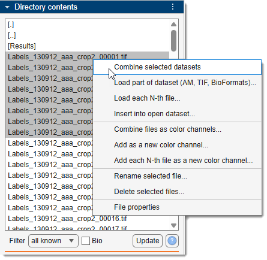

# First Dataset

This walkthrough takes you from an empty MIB window to a loaded, navigable dataset with your first
segmentation. It assumes MIB is already [running](../starting-mib/index.md).

!!! tip "New to the terminology?"
    A quick read of [Basic concepts](../basic-concepts/index.md) (layers, dataset types, models)
    will make the steps below clearer.

!!! tip "Explore the Tip of the Day"
    Each time MIB starts it shows a **Tip of the Day** window highlighting a feature you may not
    know about. Browsing a few of these is one of the quickest ways to discover 
    what MIB can do and find out about other nuances.

---

## 1. Choose a working directory

Point MIB at the folder that holds your images. You can:

- use the Load button in the [Home ribbon](../../user-interface/ribbon/home/index.md)
- use the working-directory widgets in the [Status Bar](../../user-interface/statusbar/index.md)

{.off-glb }

- simply **drag and drop** image files onto the image document - the working directory updates automatically.

!!! warning "Drag and drop can crash MATLAB"
    Because of a bug in MATLAB itself, dropping a file onto the image document occasionally brings
    down the **whole MATLAB session** without warning, losing anything unsaved. The fault happens
    inside MATLAB's own native drag handler, before MIB is told about the drop, so MIB cannot catch
    it or warn you first.

    It is intermittent and seems to accumulate: a drop often works, and it is a later one that
    fails. Binary files trigger it more readily than plain text.

    **If it happens to you more than rarely, stop using drag and drop** and open files with the
    Load button or the Status Bar widgets above instead.
    Both reach the same place by a route that does not involve the drag handler.

## 2. Find your files

The files in the chosen folder appear in the
[Directory Contents panel](../../user-interface/panels/dircontents/index.md). Use the
Filter dropdown to narrow the list to a given format.

!!! note "Choosing a reader"
    The reader dropdown beside it decides which library opens the files, and which extensions
    *Filter* offers:

    - Default - MIB's own native readers.
    - BioFormats - the
      [Bio-Formats](https://www.openmicroscopy.org/bio-formats/) library, which is how the wide
      variety of proprietary microscopy formats are opened.
    - OpenSlide - for whole-slide images. This one
      **needs an extra MATLAB support package**, *Medical Imaging Toolbox Interface for Whole Slide
      Imaging File Reader* (**Home** tab → **Add-Ons** → **Get Add-Ons**, then search for *Whole
      Slide Imaging File Reader*). Without it, opening a file with this reader fails with an error
      naming the package.

    See the [Directory Contents panel](../../user-interface/panels/dircontents/index.md) for details.

## 3. Select and load

{.on-glb align=right width="300"}   

- Select files with <mouse class="left"></mouse>, or multiple files with
  ++ctrl++ + <mouse class="left"></mouse> and ++shift++ + <mouse class="left"></mouse>.
- <mouse class="right"></mouse> and choose
  [**Combine selected datasets**](../../user-interface/panels/dircontents/index.md#file-list-box)
  to load them as a single 2D/3D/4D dataset.

:octicons-info-16:{.orange-color} A single file can also be opened by double-clicking it.

## 4. Adjust the display

Press Display in the
[View Settings panel](../../user-interface/panels/selection_imview/viewsettings.md) to tune brightness, contrast, and visible color channels . This changes
only how the image is shown - the pixel data is untouched.

## 5. Navigate

- Pan the image using <mouse class="right"></mouse>.
- Scroll the **mouse wheel** to move between slices.
- Press ++w++ to zoom in and ++q++ to zoom out.
- See all customizable bindings on the [Key and mouse shortcuts](../../user-interface/key-and-mouse-shortcuts.md) page.

## 6. Make a model

Painting becomes a result only once it is stored in a **model**, so create one before you segment.

{.on-glb align=right width="250"}

- Press Create in the
  [Segmentation panel](../../user-interface/panels/segm/index.md#create-button) and choose how many
  materials the model may hold. **63** is the default and the right choice for most work.
- Press + above the segmentation table to
  [add a material](../../user-interface/panels/segm/index.md#-squeeze-recolor-buttons) - one per
  structure you intend to segment. Double-click a material in the table to rename it.

:octicons-info-16:{.orange-color} If a model is already open, Create
asks before replacing it - the existing model is deleted, so save it first if you want to keep it.

## 7. Make your first selection

Pick a tool in the [Segmentation panel](../../user-interface/panels/segm/index.md) - for example the
[Brush](../../user-interface/panels/segm/segm-brush.md) - and paint over a structure. Then transfer
the selection into the model:

- ++a++ - add the selection on the current slice to the active material,
- ++shift+a++ - add the selection on all slices.

Your result is now stored in the **Model** layer, ready to save or analyse.

## 8. Save the model

!!! warning "Remember to save the model"
    The model lives in **memory** until you save it (unless you are working in the *BigData* mode), and nothing writes it to disk for you. Save
    early and often - segmentation is slow to redo.

- [**Ribbon → Model → Save model**](../../user-interface/ribbon/model/index.md#save-model) writes it
  without asking anything, to `Labels_<name of the dataset>.model` (or wherever it was last saved or
  loaded from). This is the one to repeat as you work.
- [**Ribbon → Model → Save model as...**](../../user-interface/ribbon/model/index.md#save-model-as)
  prompts for a name and a format: the native `*.model`, or Amira, IMOD, NRRD, TIF, PNG, STL and
  OME-Zarr v3 for other programs.

:octicons-info-16:{.orange-color} The [Quick Access Bar](../../user-interface/quick-access-bar/index.md)
carries a *Save model* button that does the same as *Save model*.

---

## Where to go next

- [Basic concepts](../basic-concepts/index.md) - layers, dataset types, and models explained.
- [Tutorials](../tutorials/index.md) - step-by-step guides and video demonstrations.
- [User Interface](../../user-interface/index.md) - full reference for every panel and ribbon tab.

---

*Back to [MIB](../../index.md) | [Getting started](../index.md)*
