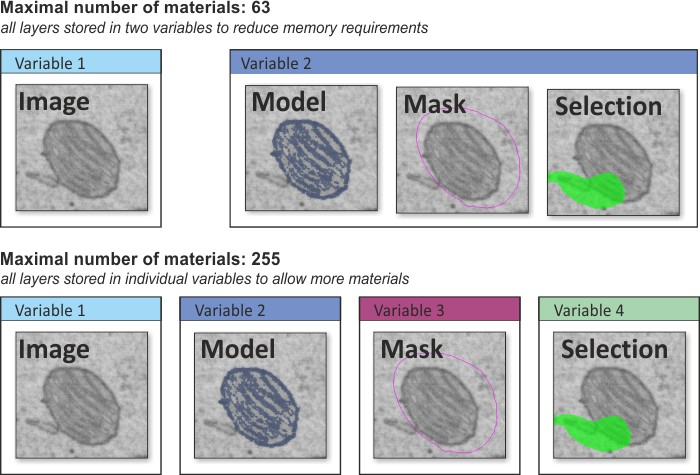

# Image Layers

Microscopy Image Browser (MIB) organizes datasets in a layered structure, storing each opened image in the **Image** layer. This is supplemented by **Model**, **Mask**, and **Selection** layers, all matching the Image layer’s X, Y, Z dimensions. These additional layers support the image segmentation process.

## General Organization

For visualization, MIB combines all layers to produce the image shown in the [Image Document](../user-interface/image-document/index.md). 
You can toggle each layer on or off, adjust transparency, and change colors (see the [View Settings Panel](../user-interface/panels/selection_imview/viewsettings.md) docs).

By default, the **Model**, **Mask**, and **Selection** layers share a single memory container, limiting materials to 63 but minimising memory use. MIB supports four model types with increasing material limits and memory costs:

| Model type | Max materials | Memory (relative) |
|-----------|:-------------:|:-----------------:|
| **63 materials** *(default)* | 63 | lowest |
| **255 materials** | 255 | ~2× default |
| **65535 materials** | 65 535 | ~2.5× default |
| **4294967295 materials** | ~4.3 billion | ~5× default |

Choose the organization type in the [Ribbon → Model → Convert type](../user-interface/ribbon/model/index.md#convert-type).

??? example "Image Example"
    

    When working with **65535** or **4294967295** material models, the [Segmentation Panel](../user-interface/panels/segm/index.md) layout changes: the **+** / **−** material buttons are replaced by controls to find the next empty index and squeeze the index space.
    Materials should be named with numbers representing the target material index (e.g., `11555` means the selection is assigned to index 11555 when added to the model).
    The `Variable 2` in the image example has `uint16` or `uint32` class

    [:fontawesome-brands-youtube:{.red-color} Short demonstration (MIB 2.1)](https://youtu.be/r3lpmWyvrJU)

## Image Layer

The **Image** layer holds the core 2D-4D microscopy dataset. It’s always present and forms the foundation of MIB’s data structure.

MIB supports three dataset types - **Standard** (full dataset in RAM), **Virtual** (browse large files without loading them fully), and **BigData** (segment datasets far larger than available RAM using a pyramidal on-disk store). See [Dataset types](../user-interface/panels/datasets/index.md#dataset-types) for details.

## Selection Layer

The **Selection** layer is used for image segmentation, acting as a temporary workspace that’s easy to modify with 
manual or automatic tools. By default, it appears in green, but you can change its color in 
the [Preferences Dialog](../user-interface/ribbon/home/home-preferences.md#colors-and-styles).

Segmentation tools typically affect only the **Selection** layer (except some automatic routines that modify the **Mask** layer), 
leaving the **Model** layer untouched to preserve final results. 

If you make a mistake during selection, you can:

- Undo recent actions with ++ctrl+z++ or the **Undo** button in the [Quick Access Bar](../user-interface/quick-access-bar/index.md).
- Fix manually using the [Brush tool](../user-interface/panels/segm/segm-brush.md) in eraser mode: 
hold ++ctrl++ while brushing.
- Clear the **Selection** layer completely with ++c++ (or ++shift+c++ to clear the entire dataset).

When satisfied with the selection, transfer selection to the **Model** layer using:

- ++a++, add selection on the current slice to the selected material of the model
- ++shift+a++, add selection on all slices to the selected material of the model
- ++r++, replace the selected material of the model with the selection on the current slice
- ++shift+r++, replace the selected material of the model with the selection for the whole dataset

## Model Layer

The **Model** layer stores the final segmentation results. You can save it to a file, visualize it, or analyze it further.

## Mask Layer

The **Mask** layer is an auxiliary segmentation tool used to define areas for independent analysis or 
filtering, such as with [Ribbon -> Mask -> Mask Statistics](../user-interface/ribbon/mask/mask-stats.md). 
It operates separately from the **Selection** and **Model** layers.

The **Mask** layer also very useful when doing the [local black-and-white thresholding](../user-interface/panels/segm/segm-bwthres.md), 
where it defines the areas to be thresholded.

---

*Back to [MIB](../index.md) | [Getting started](index.md)*
