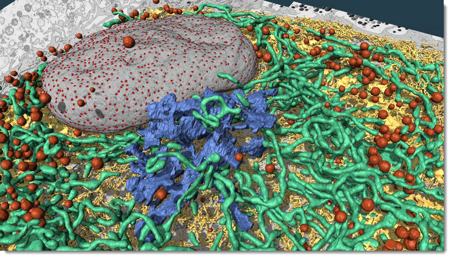

# Getting Started

Welcome to the **Getting Started** section for Microscopy Image Browser (MIB), a powerful tool for image segmentation, processing, and analysis in microscopy.
This section guides new users through the essentials of using MIB, from installation to exploring its features and understanding its licensing.

**MIB3** is the recent version of MIB available from 2026 and built on MATLAB's AppContainer framework
(ribbon UI, docked documents) and requires MATLAB R2025a or newer (1)
{.annotate }

1. :warning: **R2026a is recommended**

{.on-glb }

### Explore the following subpages to begin:

- [Installation](installation/index.md): instructions for downloading and setting up MIB on your system
- [Features](https://mib.helsinki.fi/features_all.html): overview of MIB's key capabilities and tools
- [Tutorials](tutorials/index.md): step-by-step guides to help you master MIB's functionality
- [Acknowledgements](acknowledgements.md): recognition of contributors and code sources
- [Licenses](licenses/index.md): details on MIB's licensing and external dependencies

### Configuration Files

MIB stores its configuration parameters in two files that are created automatically when MIB is closed.

**MIB3** (current) uses separate files for machine-specific preferences and user statistics:

| File | Location | Notes |
|------|----------|-------|
| `mib3.mat` | Windows: `C:\Users\Username\Matlab\`   macOS: `/Users/username/Matlab/`   Linux: `/home/username/Matlab/` | Main preferences (display settings, last-used path, etc.). Falls back to the system TEMP directory if `Matlab/` cannot be created. |
| `mib_user.mat` | Windows: `C:\Users\Username\AppData\Roaming\MathWorks\MIB\`   macOS: `~/Library/Application Support/MIB/`   Linux: `~/.local/share/MIB/` | User statistics (tier data). Stored in the OS roaming profile so it syncs automatically across workstations (**Note** the location can be defined from the Personal stats dialog from *Home->Help*). Falls back to the same `Matlab/` folder as `mib3.mat` if the roaming directory is unavailable. |

**MIB2** (2.60 and newer) stored a single `mib.mat` in:

- **Windows**: `C:\Users\Username\MATLAB\` (fallback: `C:\Users\Username\AppData\Local\Temp\`)
- **macOS**: `/Users/username/MATLAB/` (fallback: local TEMP)
- **Linux**: `/home/username/MATLAB/` (fallback: local TEMP)

**MIB2** (2.52 and older) used `im_browser.mat` in:

- **Windows**: `c:\temp\im_browser.mat` (fallback: `C:\Users\Username\AppData\Local\Temp\im_browser.mat`)
- **Linux**: script directory or `/tmp/`

!!! tip
    If MIB does not start, check the MATLAB path and/or delete the configuration file (`mib3.mat` or the legacy equivalent) listed above, then restart.

### Previous versions

This documentation describes **MIB3** - the current release. Previous releases are hosted on GitHub and include their own documentation and release notes:

| Version | Repository | Notes                                                        |
|---------|-----------|--------------------------------------------------------------|
| **MIB2** | [github.com/Ajaxels/MIB2](https://github.com/Ajaxels/MIB2) | Controller-View-Model architecture; recommended for MATLAB releases: R2014b - R2024b   |
| **MIB** | [github.com/Ajaxels/MIB](https://github.com/Ajaxels/MIB) | original release, recommended for MATLAB releases: R2011a - R2017a |

!!! tip
    If you are running MATLAB older than R2026a, use **MIB2** from the link above.

*Back to [MIB](../index.md)*