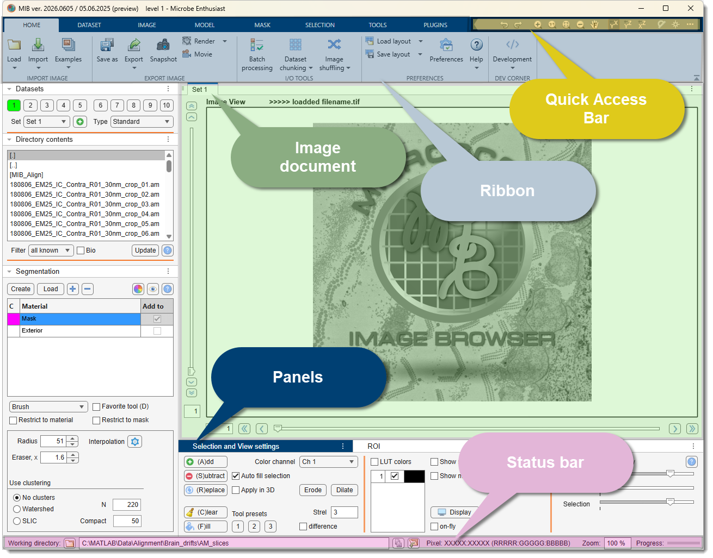

# Starting MIB

Once MIB is [installed](../installation/index.md), you can launch it either from inside MATLAB or
as a standalone application. This page shows both, and what to expect on the first launch.

!!! info "Requirements"
    The MATLAB version of MIB3 requires **MATLAB R2025a or newer** (**R2026a is recommended**).
    If you run an older MATLAB, use **MIB2** instead — see [Configuration files → Previous versions](../configuration/index.md#previous-versions).

---

## Launch from MATLAB

Add the `mib` folder to the MATLAB path (or `cd` into it) and run the entry point:

```matlab
cd C:\Matlab\MIB3\mib
mib3
```

Adjust the path to wherever you unpacked MIB. The first run may take a few extra seconds while
MATLAB initialises the required libraries.

!!! tip
    To start MIB automatically, add the `mib3` command to your MATLAB `startup.m` file.

---

## Launch the standalone app

The standalone Windows build does not require a MATLAB license — only the matching **MATLAB Runtime**,
which the installer sets up for you.

- Start MIB from the **Start menu** / desktop shortcut created during installation, or
- run the installed `MIB.exe` directly.

See the [Installation](../installation/index.md) page for download and setup details.

---

## On first launch

MIB opens its main window — the ribbon along the top, the image document in the centre, and the
side panels for directory contents, segmentation, and view settings.

{.on-glb width="500"}

For a guided tour of every part of the window, see the [User Interface](../../user-interface/index.md)
section. When you are ready to open an image, continue to [First dataset](../first-dataset/index.md).

!!! tip "MIB does not start?"
    Check that the `mib` folder is on the MATLAB path, and/or delete the configuration file
    (`mib3.mat`) and restart. See [Configuration files](../configuration/index.md) for its location.

---

*Back to [MIB](../../index.md) | [Getting started](../index.md)*
