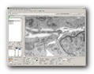
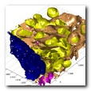
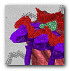
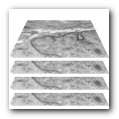
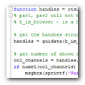

# Tutorials

*Back to [MIB](../../index.md) | [Getting started](../index.md)*

Microscopy Image Browser (MIB) offers a range of tutorials to help you master its features, 
from basic navigation to advanced image segmentation. 
These resources are available in two formats: 
detailed guides on the [main MIB website](https://mib.helsinki.fi/tutorials.html) and video demonstrations 
linked from the [MIB features page](https://mib.helsinki.fi/features_all.html). 
 
Below, we outline the tutorials organized by category to guide your learning.

---

## Introduction

{align=left}

[Introductory tutorials](https://mib.helsinki.fi/tutorials.html) help new users get started with MIB’s interface and core concepts

## Image Segmentation

{align=left}

[Segmentation tutorials](https://mib.helsinki.fi/tutorials_segmentation.html) focus on tools and workflows for processing images, 
like those described in [Segmentation Tools](../../user-interface/panels/segm/index.md):

## Visualization

{align=left}

[Visualization tutorials](https://mib.helsinki.fi/tutorials_visualization.html) cover rendering of volumes and models.

## Tools

{align=left}

[Tool-specific tutorials](https://mib.helsinki.fi/tutorials_tools.html) detail variety of MIB’s utilities and pipelines

https://mib.helsinki.fi/tutorials_programming.html

## Programming

{align=left}

[Programming tutorials](https://mib.helsinki.fi/tutorials_programming.html) cater to advanced users customizing MIB.

https://mib.helsinki.fi/tutorials_programming.html

---

## YouTube Tutorials

For visual learners, MIB provides a variety of video tutorials linked from the [features page](https://mib.helsinki.fi/features_all.html). 
These videos demonstrate practical workflows and introduce segmentation tools.

- [:fontawesome-brands-youtube:{.red-color} Playlists with long tutorials](https://www.youtube.com/playlist?list=PLGkFvW985wz8cj8CWmXOFkXpvoX_HwXzj)
- [:fontawesome-brands-youtube:{.red-color} Playlist with short clips](https://www.youtube.com/playlist?list=PLGkFvW985wz-ogX3H-KU0GarGu1PeKAEc)

---

*Back to [MIB](../../index.md) | [Getting started](../index.md)*