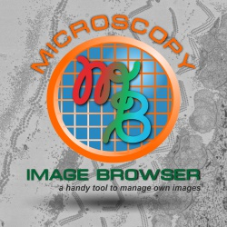

# Microscopy Image Browser

{ align=left}

**Microscopy Image Browser**  
*Image segmentation and beyond*

Microscopy Image Browser (MIB) is a GUI tool written in MATLAB for segmentation of multidimensional datasets obtained by light or electron microscopy.

**Powered by MATLAB, [The MathWorks, Inc.](https://www.mathworks.com/)**

---

## How to cite

Microscopy Image Browser:
- **I. Belevich, M. Joensuu, D. Kumar, H. Vihinen, and E. Jokitalo**  
  Microscopy Image Browser: A platform for segmentation and analysis of multidimensional datasets  
  *PLoS Biology 2016 Jan 4;14(1):e1002340. [doi: 10.1371/journal.pbio.1002340](http://journals.plos.org/plosbiology/article?id=10.1371/journal.pbio.1002340)*

DeepMIB:

- **I. Belevich and E. Jokitalo**  
  DeepMIB: User-friendly and open-source software for training of deep learning network for biological image segmentation  
  *PLoS Comput Biol. 2021 Mar 2;17(3):e1008374. [doi: 10.1371/journal.pcbi.1008374](https://journals.plos.org/ploscompbiol/article?id=10.1371/journal.pcbi.1008374)*

---

## Development Team
:fontawesome-solid-people-group:{.orange-color}
Developed during 2010–2025 by:  
&nbsp;&nbsp;&nbsp;&nbsp;&nbsp;&nbsp;**Core Developer:**  
&nbsp;&nbsp;&nbsp;&nbsp;&nbsp;&nbsp;[Ilya Belevich](http://researchportal.helsinki.fi/en/persons/ilya-belevich)  
&nbsp;&nbsp;&nbsp;&nbsp;&nbsp;&nbsp;**Developers:**  
&nbsp;&nbsp;&nbsp;&nbsp;&nbsp;&nbsp;Merja Joensuu, Darshan Kumar, [Helena Vihinen](http://researchportal.helsinki.fi/en/persons/helena-vihinen), and [Eija Jokitalo](https://tuhat.helsinki.fi/portal/en/persons/eija-jokitalo(3444154d-d268-4795-948b-24b60f8083ca).html) 
---

## Address and links

{.inline-image width="32"}  [Visit the Microscopy Image Browser home page](http://mib.helsinki.fi) 
 
:material-microscope:{.orange-color}  [Visit the Electron Microscopy Unit](https://www.helsinki.fi/en/infrastructures/bioimaging/embi)  
 
:material-office-building:{.orange-color} *Electron Microscopy Unit*    
&nbsp;&nbsp;&nbsp;&nbsp;&nbsp;&nbsp;*Institute of Biotechnology*  
&nbsp;&nbsp;&nbsp;&nbsp;&nbsp;&nbsp;*PO Box 56 (Viikinkaari 9)*  
&nbsp;&nbsp;&nbsp;&nbsp;&nbsp;&nbsp;*00014, University of Helsinki*  
&nbsp;&nbsp;&nbsp;&nbsp;&nbsp;&nbsp;*Finland*

## API Class Reference

Access the API class reference from the MIB interface:  
**Ribbon → Home → Help → Class Reference**

---

*Back to [Index](index.md)*