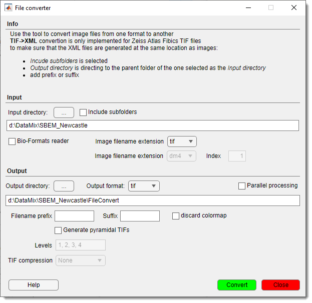
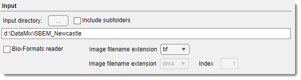
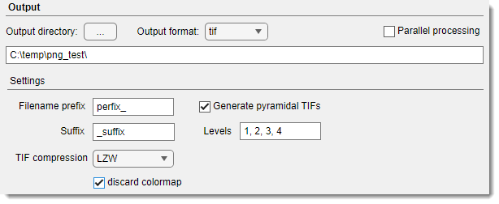
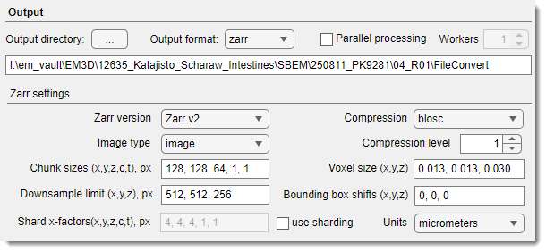

# Image Converter

---

The **Image Converter** plugin in **Microscopy Image Browser (MIB)** enables batch conversion of images from any [MIB-supported format](https://mib.helsinki.fi/features_all_fileformats.html) (e.g., NRRD, HDF5) to AM, JPG, PNG, TIF, or XML-header formats. It streamlines dataset preparation for analysis or compatibility with other tools.

## Overview

{.on-glb align=left width="300"}

The plugin provides a graphical interface to convert multiple image files efficiently. 

Key features include:

- Support for various input and output formats.
- Optional use of Bio-Formats for advanced file reading.
- Generation of pyramidal TIFs for large datasets.
- Parallel processing to speed up conversions.
- Customizable filename prefixes and suffixes.

## Usage

Access the plugin via:

- `Ribbon → Plugins → File Processing → Image Converter`.

[:fontawesome-brands-youtube:{.red-color} demonstration](https://www.youtube.com/watch?v=Xu1waZ913bE)

!!! note
    Ensure input files are in a supported format. Check the [supported formats list](https://mib.helsinki.fi/features_all_fileformats.html) for compatibility.

### Steps
1. **Select Input Directory**:

    - Choose the folder containing images to convert ....
    - Enable Include Subfolders to process 
    nested directories.
   
2. **Specify Input Format**:

    - Select the input image extension (e.g., NRRD, HDF5).
    - Use Bio-Formats reader for complex formats, 
    specifying the format and series index if needed.
   
3. **Select Output Directory**:

    - Choose where converted images will be saved.

4. **Configure Output**:

    - Select the output format (e.g., TIF, PNG).
    - Add optional Prefix or Suffix to output filenames.
    - Enable Discard colormap to remove colormap data.
??? warning "TIF->XML convertion"
     TIF->XML convertion is only implemented for Zeiss Atlas Fibics TIF files
     to make sure that the XML files are generated at the same location as images:
   
     - Include subfolders is selected
     - Output directory is directing to the parent folder of the one selected as the Input directory
     - Add prefix or suffix
      
5. **Pyramidal TIF Options** (if TIF output):

    - Check Generate pyramidal TIFs for multi-resolution output.
    - Set Levels  (e.g., "1, 2, 3, 4") and 
    TIF Compression type.
   
6. **Enable Parallel Processing**:

    - Speed up conversion for large datasets (optional).
   
7. **Convert**:

    - Click Convert to start the process.

## GUI Components

### Input Panel

 
... Input directory, specify path to source images. 

Include subfolder, check to process subdirectories.

Image filename extension, input format dropdown for standard image formats

Bio-Formats reader, enable Bio-Formats reader to read variety of microscopy image formats.

  - Bio-Formats Input format extension a separate dropdown to specify input image format.
  - Bio-Formats index series index for multi-series files.

### Output Panel for standard image format

... Output directory, path for converted images. 
In case when Include subfolder the structure of the input
directories will be preserved in the output directory

Output Format, output format dropdown to define format 
for resulting images:
    
- JPG, Joint Photographic Experts Group format    
- PNG, Portable Network Graphics format
- TIF, Tag Image File Format
- ZARR, OME-ZARR version 2 or version 3 chunked format for large datasets, see below
- XML, Extensible Markup Language suitable for metadata extraction

Filename Prefix customize prefix text to be added before the original filename

Filename Suffix customize suffix text to be added after the original filename

Discard colormap, remove colormap from output files.

Parallel processing, enable multi-core file conversion.

Generate pyramidal TIFs, create multi-resolution TIFs.

Levels pyramidal downsampling factors levels for TIF output.

??? info "Scale labels to downsampling scale"
    
    The scale level in the pyramid is calculated as `scaleFactor = 1/2^(levelsVec-1);`

TIF compression compression type for TIFs.

### Output Panel for OME-Zarr

In this mode, MIB can convert files from variety formats into [OME-Zarr](https://zarr.readthedocs.io/en/stable/).

??? note "Requirements and limitations"
    - MIB version 2.92 (beta 7) or newer
    - installed Python environment with [zarr-python](https://mib.helsinki.fi/downloads_systemreq.html#zarr)
    - the processing requires enough memory to load a sub-volume that is defined by `zChank` or `zChunk x zShard` value
    - for parallel processing mode, make sure that you have enough memory to load as many `zChunks` as many parallel processing workers defined  

??? note "Loading of OME-Zarr in MIB"
    It is possible to open OME-Zarr version 2 or version 3 (MIB version 2.92 beta 8 or newer). 

    To open the dataset:

    - make sure that the directory has `.zarr`, `.zarr2`, `.zarr3` ending
    - select the directory using the <mouse class="left"></mouse> in the [Directory contents](../../user-interface/panels/dircontents/index.md) panel
    - open the OME-Zarr dataset using the `Combine selected datasets` option available via <mouse class="right"></mouse>

Zarr version, defines which version of the Zarr format to use for writing the dataset.

- 'Zarr v2' - legacy Zarr format, widely supported (e.g. MoBIE, OME-Zarr v0.4).
- 'Zarr v3' - newer Zarr format with sharding support, but fewer tools support it.

Both are written by the bundled native engine, so neither needs Python. Selecting 'Zarr v2' clears
Use sharding, which is a Zarr v3 feature.

Image type, specifies the type of data stored in the Zarr array.

- 'image' - intensity/volumetric image data (microscopy, CT, etc).
- 'labels' - segmentation or annotation data (integer label maps).

Chunk sizes, the chunk size for storing data, written as a comma-separated list in the order \[X, Y, Z, C, T\]. 
Each chunk forms a file with these dimensions, for Zarr version 3, the chunks are merged into shards to minimize number of files. This parameter controls input/output performance:
the smaller chunks give faster random access, while the larger chunks give faster sequential access. 

??? note "Example"

    Example: '128, 128, 64, 1, 1' - chunks of 128×128×64 voxels per channel per timepoint.

Shard X factors, sharding factor for Zarr v3 (how many chunks are grouped together into a shard). Written as \[X, Y, Z, C, T\].
Reduces overhead when dealing with many small chunks, improves cloud performance.

??? note "Example"

    Example: '4, 4, 4, 1, 1' - each shard groups 4×4×4 chunks in XYZ per color channel and timepoint

    **Note:** Only relevant if Zarr version = 3.

Downsample limit, definition of the smallest volume size until which the dataset is downsampled. 
For anisotropic datasets, the downsampling procedure brings the volume first to the isotropic voxels and after that downsamples all dimensions evenly.

??? note "Example"

    Example: '512, 512, 256' - if dataset is larger than this, downsampled levels will be generated until each axis fits within the limit.

Compression, compression algorithm used to store chunk data. 

Compression level, compression level settings: **1..9** - compression levels, the higher the value the more compression output is expected, but with the slowest computation times.

Voxel size, physical voxel size of the dataset in order \[X, Y, Z\], given in the specified units. 

??? note "Example"

    Example: '0.013, 0.013, 0.030' - voxel size 13 nm x 13 nm x 30 nm if units = micrometers.

Bounding box shift, offset (translation) applied to the dataset bounding box along \[X, Y, Z\]. 
Useful when aligning multiple datasets into a common coordinate system.

??? note "Example"

    Example: '0, 0, 0' (no shift).

Units, units for physical voxel size:

??? note "Possible values"

    - 'nanometers'
    - 'micrometers'
    - 'millimeters'
    - 'pixels' (unitless)

### Buttons

Help  open the Help page.

Convert start the conversion process.

Close exit the plugin.

---

*Back to [MIB](../../index.md) | [User Interface](../../user-interface/index.md) | [Plugins](../index.md) | [File processing](index.md)*