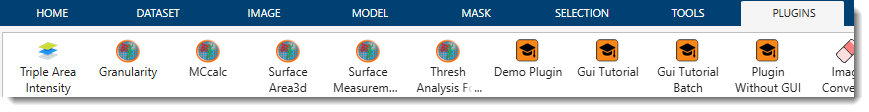
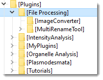

# Plugins

---

## Overview

{align=left}

Plugins in Microscopy Image Browser (MIB) extend its functionality beyond core features, allowing users to customize workflows, integrate new tools, and automate tasks. 
This page provides an overview of how plugins work, how to access them, and a list of commonly used plugins available in MIB.

- Plugins are typically written in MATLAB and stored in the `Plugins` directory of your MIB installation.
- Access plugins via the **Ribbon → Plugins** menu.

---

## Managing plugins

{align=left}

Plugins in Microscopy Image Browser (MIB) are organized in a two-tier structure under the `Plugins` folder within your MIB installation directory (e.g., `C:\MIB\Plugins\`). 

This structure helps categorize and manage plugins efficiently:

- **First Tier (Categories)**: Defines broad plugin categories, such as `File Processing` or `Organelle Analysis`. These are subfolders directly under `Plugins`.
- **Second Tier (Plugins)**: Contains individual plugins within each category folder. For example, the image above shows the `File Processing` category with two plugins: `ImageConverter` and `MultiRenameTool`.

MIB automatically detects and integrates plugins when you start the application, provided they are correctly placed in this structure. 
No additional configuration is typically needed for detection.

The plugins are automatically detected and connected by MIB.
??? warning "Plugins in the compiled version"
    For plugins to work in the standalone (compiled) version of MIB, they must be:

    - **Compiled**: ensure the plugin’s MATLAB code is compiled into a format compatible with the standalone executable (e.g., using MATLAB Compiler).
    - **Included**: Include the plugins into **Files installed for your end user** in the place the original plugin in deploytool of MATLAB
    ??? info "Files installed for your end user"
        {align=left}

    - Once included, MIB will automatically detect and connect these plugins upon launch. Uncompiled `.m` files won’t work in the standalone version without additional setup.

Removing a plugin

To remove a plugin:

* Navigate to the `Plugins` folder in your MIB installation.
* Delete the plugin’s folder (e.g., `Plugins\File Processing\ImageConverter`).
* Restart MIB to update the plugin list.

---

## Available plugins

The table below lists plugins bundled with MIB. 

| Plugin Category        | Plugin Name                                                                      | Description                                                                                                                                                              |
|------------------------|----------------------------------------------------------------------------------|--------------------------------------------------------------------------------------------------------------------------------------------------------------------------|
| **File Processing**    | [**Image Converter**](file-processing/image-converter.md)                        | Batch converts images from [any MIB-supported format](https://mib.helsinki.fi/features_all_fileformats.html) (e.g., NRRD, HDF5) to AM, JPG, PNG, TIF, or XML-header formats. |
|                        | [**Multi Rename Tool**](file-processing/multi-rename-tool.md)                    | Renames multiple files in bulk, with options to adjust digit padding (e.g., `img001` to `img1`) and perform search-and-replace operations.                               |
| **Intensity Analysis** | [**Triple Area Intensity**](intensity-analysis/triple-area-intensity.md)         | Measures intensity across multiple adjacent regions (e.g., different materials) and corrects values using a background reference for accurate analysis.                  |
| **Organelle Analysis** | [**Granularity**](organelle-analysis/granularity.md)                             | Analyzes model granularity, such as the ratio of sheets to tubules in endoplasmic reticulum (ER) morphology, aiding in structural studies.                              |
|                        | [**MCcalc**](organelle-analysis/mccalc.md)                                       | Uses ray-tracing to detect and quantify contacts between organelles (e.g., mitochondria and ER), ideal for spatial relationship studies.                                |
|                        | [**Surface Area 3D**](organelle-analysis/surface-area-3d.md)                     | Computes the surface area of 3D-segmented objects, useful for volumetric analysis of organelles or structures.                                                           |
|                        | [**Thres Analysis for Objects**](organelle-analysis/thres-analysis-for-objects.md) | Analyzes intensity properties of segmented objects with customizable thresholding, enhancing object-specific measurements.                                               |
| **Plasmodesmata**      | [**Cell Wall Thickness**](plasmodesmata/cellwall-thickness.md)                   | Measures plant cell wall thickness in volume electron microscopy datasets, tailored for plasmodesmata research in plant biology.                                        |
|                        | [**Spatial Control Points**](plasmodesmata/spacial-control-points.md)            | Generates sets of random points along an object’s centerline (e.g., plasmodesmata), useful for spatial distribution analysis.                                           |
| **Tutorials**          | [**GUI Tutorial**](tutorials/gui-tutorial.md)                                    | Reference App Designer GUI plugin with four operations (Crop, Resize, Convert, Invert) — the starting point for plugin development.                                     |
|                        | [**GUI Tutorial (Batch)**](tutorials/gui-tutorial-batch.md)                        | The same four operations plus full batch-processing / macro support via the `BatchOpt` system.                                                                          |
|                        | [**Demo Plugin**](tutorials/mib-app-design-plugin.md)                            | Minimal batch-compatible App Designer plugin demonstrating the `BatchOpt` widget-sync system and the three calling modes.                                               |
|                        | [**MIB Plugin Without GUI**](tutorials/mib-plugin-without-gui.md)                | Demonstrates a simple plugin without a graphical interface, focusing on backend functionality for quick scripting.                                                      |

---

## Writing your own plugins

MIB supports custom plugin development in MATLAB. 
Check the [Programming tutorials](https://mib.helsinki.fi/tutorials_programming.html) section on MIB website for details.

MIB is compatible with 3 types of plugins:

### Plugins without GUI
The simplest configuration, easy to implement. Suitable to perform specific operation with limited interaciton with the user.
??? info "Example" 
    check `Development\mibPlugin_withoutGUI\` for example

### Plugins with GUI written with GUIDE

[GUIDE](https://se.mathworks.com/help/matlab/ref/guide.html) is the original framework of MATLAB for development of tools with user interface (check `Development\mibPlugin_withoutGUI\` for example).
??? info "Examples"

    - check `Development\mibPluginGUI_ver1\` for example of a basic plugin
    - check `Development\mibPluginGUI_ver2_Batch_compatible\` for example of a plugin compatible with batch processing operations ([Ribbon → Home->Batch processing](../user-interface/ribbon/home/home-batchprocessing.md))
    - check `Development\ccreating GUI with guide.pdf` for instructions on how to adapt the example towards a new plugin

!!! warning "GUIDE is going to be removed from MATLAB"
    GUIDE is expected to be removed in R2025a, but the syntax will still be working in MATLAB and MIB

###  Plugins with GUI written using AppDesigner
[AppDesigner](https://se.mathworks.com/help/matlab/ref/appdesigner.html) is a newer framework with many features. It is typically recommended for GUI development with MIB
??? info "Examples"

    - check `Development\mibPluginGUI_ver3_appDesigner\` for example of a plugin compatible with batch processing operations ([Ribbon → Home->Batch processing](../user-interface/ribbon/home/home-batchprocessing.md)) 
    - check `Development\creating GUI with appdesigner.pdf` for instructions on how to adapt the example towards a new plugin

## Writing your own plugins

Microscopy Image Browser (MIB) supports custom plugin development in MATLAB, allowing users to tailor functionality to their specific needs. For detailed guidance, refer to the [Programming Tutorials](https://mib.helsinki.fi/tutorials_programming.html) section on the MIB website, which includes step-by-step examples and best practices.

MIB is compatible with three types of plugins, each suited to different levels of complexity and user interaction.

### Plugins without GUI

This is the simplest plugin type, ideal for performing specific operations with minimal user interaction. These plugins are lightweight, typically consisting of a single `.m` file that executes a predefined task without a graphical interface.

??? info "Example"
    - **Location**: Check the `Development\mibPlugin_withoutGUI\` folder in your MIB installation.
    - **Purpose**: Demonstrates a basic script that processes data directly (e.g., applying a filter to the current image).
    - **Use Case**: Perfect for quick automation tasks, such as batch-converting file formats or applying a fixed transformation.

### Plugins with GUI written with GUIDE

[GUIDE](https://se.mathworks.com/help/matlab/ref/guide.html) is MATLAB’s original framework for creating tools with graphical user interfaces (GUIs). Plugins built with GUIDE offer interactive controls (e.g., buttons, sliders) and are well-suited for tasks requiring user input.

??? info "Examples"
    - **Basic Plugin**: 
        - **Location**: `Development\mibPluginGUI_ver1\` 
        - **Description**: A simple GUIDE-based plugin with a minimal interface, useful as a starting point for customization.
    - **Batch-Compatible Plugin**: 
        - **Location**: `Development\mibPluginGUI_ver2_Batch_compatible\` 
        - **Description**: Extends the basic plugin to support batch processing, integrating with [Ribbon → Home -> Batch Processing](../user-interface/ribbon/home/home-batchprocessing.md). Ideal for repetitive tasks across multiple datasets.
    - **Instructions**: 
        - **File**: `Development\creating GUI with guide.pdf` 
        - **Content**: A guide on adapting these examples to create your own GUIDE-based plugin.

!!! warning "GUIDE is scheduled for removal from MATLAB"
    MATLAB plans to discontinue GUIDE in release R2025a. While existing GUIDE plugins will remain functional in MIB and MATLAB beyond this date, new development should consider App Designer for future-proofing. Check [MathWorks documentation](https://se.mathworks.com/help/matlab/ref/guide.html) for updates on this transition.

### Plugins with GUI written using App Designer

[App Designer](https://se.mathworks.com/help/matlab/ref/appdesigner.html) is MATLAB’s modern framework for GUI development, offering enhanced features like responsive layouts, better component libraries, and improved integration with MATLAB’s ecosystem. It’s the recommended choice for new plugin development in MIB.

??? info "Examples"
    - **Batch-Compatible Plugin**: 
        - **Location**: `Development\mibPluginGUI_ver3_appDesigner\` 
        - **Description**: An App Designer-based plugin supporting batch processing (see [Ribbon → Home -> Batch Processing](../user-interface/ribbon/home/home-batchprocessing.md)). It showcases interactive controls and data handling in a modern interface.
    - **Instructions**: 
        - **File**: `Development\creating GUI with appdesigner.pdf` 
        - **Content**: A tutorial on modifying this example to build your own plugin.

#### Why choose App Designer?
- **Modern Features**: Supports responsive UIs, modern MATLAB objects (e.g., `uitable`), and easier debugging.
- **Future-Proof**: Unlike GUIDE, App Designer is actively supported and aligns with MATLAB’s long-term direction.

---

*Back to [MIB](../index.md)*
