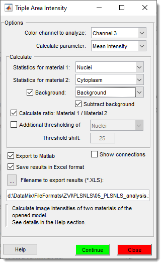
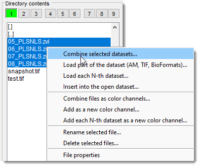
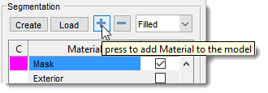
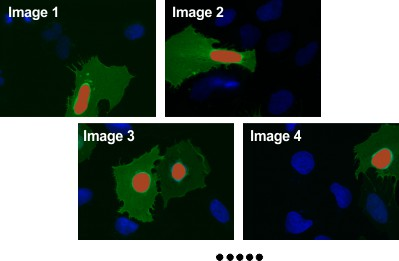
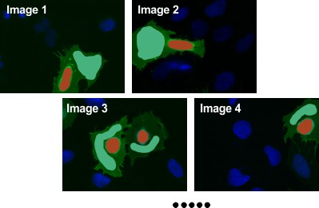
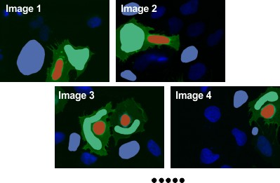
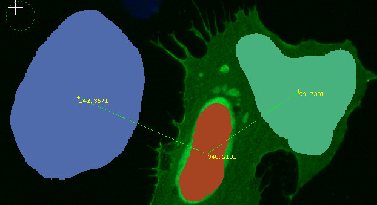
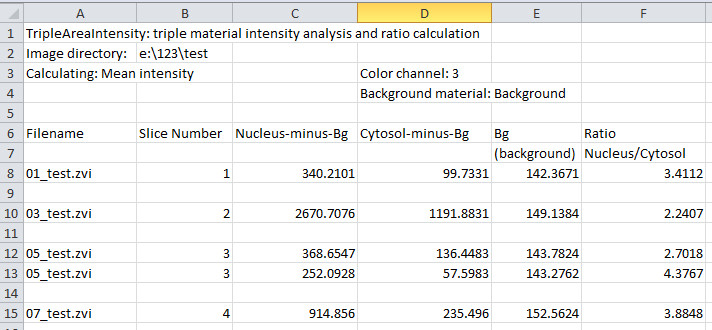

# Triple Area Intensity

---

The **Triple Area Intensity** plugin in **Microscopy Image Browser (MIB)** calculates image intensities (mean, min, max, or sum) for three areas defined by materials in a model, such as cytosol, nucleus, and background in cells. Results can be displayed in MIB’s Image View panel, stored in the Annotation layer, or saved as an Excel spreadsheet.

{.on-glb align=left width="300"}

## Overview

This plugin measures intensities across three model materials, enabling comparisons 
(e.g., cytosol vs. nucleus) with optional background correction. It supports ratio 
calculations and visualization of connected areas, making it ideal for quantitative 
analysis in microscopy datasets.

## Usage

The following steps demonstrate how to compare image intensities between cytosol and nucleus, using a background reference. 
Access the plugin via: `Ribbon → Plugins → Intensity Analysis → TripleAreaIntensity`.

### Load Images

{.on-glb align=right width="300"}

- Highlight files in the [Directory Contents](../../user-interface/panels/dircontents/index.md) panel using ++shift++ + <mouse class="left"></mouse>.
- <mouse class="right"></mouse> and select `Combine selected datasets` to load as a 3D/4D stack.

### Create segmentation model

**Create Model**

- Click Create in the [Segmentation](../../user-interface/panels/segm/index.md) panel to start a new model.

{align=right}
**Add Nucleus Material**

   - Click `+` in the [Segmentation](../../user-interface/panels/segm/index.md) panel to add a material.
   - Name the new material as `Nuclei`
  

{align=right}
**Segment Nuclei**

- Use the [Brush](../../user-interface/panels/segm/segm-brush.md) or [Segment-anything model](../../user-interface/panels/segm/segm-sam.md) tool 
   in the [Segmentation](../../user-interface/panels/segm/index.md) panel to draw nuclei areas.
- Ensure material `Nuclei` is selected in `Add to`.
- Press ++shift+a++ to add drawn areas to `Nuclei` across all slices.

**Add Cytosol Material**

- Click `+` to add another material and rename it to `Cytoplasm`.

{align=right}
**Segment Cytoplasm**

   - Use the `Brush` tool to draw cytoplasm areas, ensuring the number of cytoplasm objects 
   matches the number of nuclei.
   - Select material `Cytoplasm` in `Add to`.
   - Press ++shift+a++ to add drawn areas to `Cytoplasm` across all slices.

**Add Background Material**

- Click `+` to add a third material and rename it to `Background`.

{align=right}
**Segment Background**

- Use the `Brush` tool to draw areas outside cells for background intensity.
- Select material `Background` in `Add to`, ensuring at least one background area per image.
- Press ++shift+a++ to add drawn areas to `Background` across all slices.

### Configure Plugin

{.on-glb align=right width="300"}

- Start the plugin: `Ribbon → Plugins → Intensity Analysis → TripleAreaIntensity`.
- Select the color channel and parameter (`Mean`, `Max`, `Min`, `Sum`).
- Set `Calculate → Statistics for material 1` to `Nucleus`.
- Set `Calculate → Statistics for material 2` to `Cytoplasm`.
!!! info

    The plugin calculate image intensity for the selected color channel under
    Statistics for material 1 and
    Statistics for material 2

- Check `Background` and select `Background` in the dropdown.
!!! info

    Include `Background` to compensate for uneven illumination within images

- Optionally check Subtract background to adjust intensities.
!!! info "Subtract background"

    When Subtract background is in the checked state, 
    the plugin will subtract intensities under background areas from the acquired values

- Check `Calculate ratio: Material 1 / Material 2` for ratio output. 
!!! info "Calculate ratio"

    When Calculate ratio: Material 1 / Material 2 is 
    in the checked state, the plugin additionally calculates the ratio of intensities after background
    subtraction.

- Specify a filename for Excel export.

### Run Analysis
{.on-glb align=right width="300"}

Click Continue to calculate intensities.

Results appear in the [Image Document](../../user-interface/image-document/index.md) panel (e.g., Background: 142.3671, Nucleus: 340.2101, Cytosol: 99.7331, with background subtracted).

Annotations are stored in `Ribbon → Model → Annotations`.
!!! note "Show connections"

    If `Show connections` is enabled, connected areas are linked in the `Mask` 
    layer (clear via `Ribbon → Mask → Clear mask`).

!!! warning
    Ensure the number of cytosol objects matches nuclei for accurate pairing. 
    Use `Show connections` to verify object relationships visually.

**Snapshot of results exported using the Microsoft Excel format** 
{.on-glb align=left width="300"}

## Additional Options

Additional Thresholding: apply thresholding to a 
material based on background intensity plus a Threshold shift value.
  
Export to MATLAB: send results to MATLAB’s main 
workspace as a structure.
  
Show connections: visualize paired areas in 
the `Mask` layer, removable via `Ribbon → Mask → Clear mask`.

## Credits

Written by Ilya Belevich, University of Helsinki  
- Version: 1.3, 25.11.2022  
- Email: [ilya.belevich@helsinki.fi](mailto:ilya.belevich@helsinki.fi)  
- Web: [https://researchportal.helsinki.fi/en/persons/ilya-belevich](https://researchportal.helsinki.fi/en/persons/ilya-belevich)  

Includes code by [Gunther Struyf](http://stackoverflow.com/questions/12083467/find-the-nearest-point-pairs-between-two-sets-of-of-matrix).

---

*Back to [MIB](../../index.md) | [User Interface](../../user-interface/index.md) | [Plugins](../index.md) | [Intensity Analysis](index.md)*