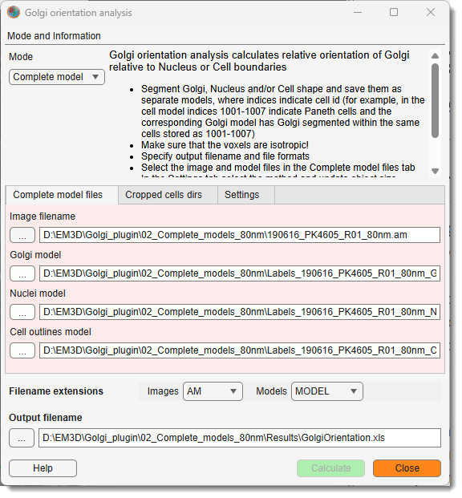
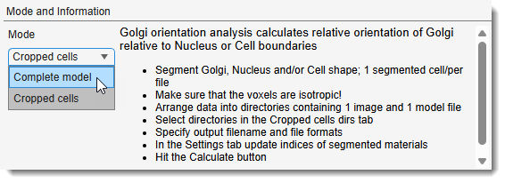
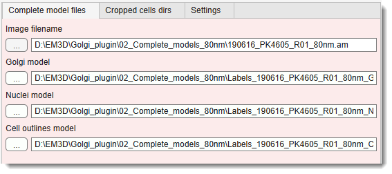
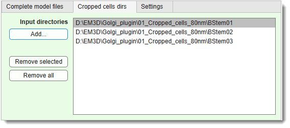
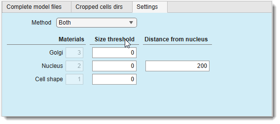
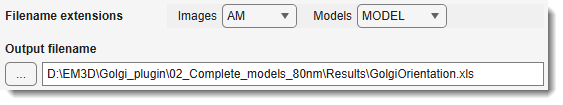
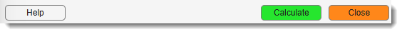

# Golgi Orientation

---

## Overview

{.on-glb align=right width="300"}

The **Golgi Orientation** plugin in **Microscopy Image Browser (MIB)** calculates the relative
orientation of Golgi apparatus with respect to the nucleus surface or cell boundary in segmented
3-D microscopy models.

For each detected Golgi object the plugin computes a **distance map** from the reference structure
(nucleus or cell boundary) and reports the **standard deviation of the distance values** sampled
at all Golgi voxels.  A low standard deviation indicates that the Golgi is concentrated at a
uniform distance from the reference structure (well-oriented), while a high standard deviation
indicates a more dispersed arrangement.

Results are saved as a MATLAB `.mat` file and, optionally, as a `.csv` or `.xls` spreadsheet.

A step-by-step video tutorial is available on YouTube :fontawesome-brands-youtube:{.orange-color}: [Golgi Orientation plugin tutorial](https://youtu.be/yJGyDAt-IK8)

Two analysis modes are available:

| Mode | Input | Best for |
|------|-------|----------|
| **Complete model** | A single 3-D dataset with separate model files for Golgi, nuclei, and cell outlines | Large volumes containing many cells |
| **Cropped cells** | One directory per cell, each containing one image and one multi-material model file | Per-cell crops prepared in advance |

---

## Launching the Plugin

`Ribbon → Plugins → Organelle Analysis → Golgi Orientation`

---

## GUI Components

### Mode and Information Panel

{.on-glb align=right width="360"}

Mode selects the analysis mode:

- **Complete model** — loads separate model files for the entire volume; switches to the
  *Complete model files* tab.
- **Cropped cells** — processes a list of per-cell directories; switches to the
  *Cropped cells dirs* tab.

The information panel below the dropdown updates automatically to show step-by-step
instructions for the selected mode.

---

### Complete model files Tab

{.on-glb align=right width="360"}

Visible when Mode is set to **Complete model**.

Image filename — full path to the image file.
Click ... to browse.

Golgi model — path to the model file containing segmented Golgi
objects. Each unique label index corresponds to one cell. Click ... to browse.

Nuclei model — path to the model file containing segmented nuclei
(required for *Relative to nucleus* and *Both* methods). Click ... to browse.

Cell outlines model — path to the model file containing segmented cell
boundaries (required for *Relative to cell boundary* and *Both* methods).
Click ... to browse.

!!! note "Model index convention"
    In **Complete model** mode the label index is used as a **cell identifier**: Golgi object 1005,
    nucleus 1005, and cell boundary 1005 all belong to the same cell.  Make sure the three model
    files share the same labelling scheme.

---

### Cropped cells dirs Tab

{.on-glb align=right width="360"}

Visible when Mode is set to **Cropped cells**.

Input directories — list of directories to process.
Each directory must contain **exactly one image file** and **exactly one model file** matching the
selected filename extensions.

Add... — open a folder-picker dialog to add one or
more directories to the list.

Remove selected — remove the currently highlighted
directory from the list.

Remove all — clear the entire list.

!!! note "Directory layout"
    Each directory should hold one cropped cell with a **single-cell model** containing the
    relevant materials at the indices specified in the *Settings* tab.

---

### Settings Tab

#### Method

{.on-glb align=right width="360"}

Method — orientation reference:

- **Relative to nucleus** — distance map is computed from the nucleus surface.
- **Relative to cell boundary** — distance map is computed from the outer cell boundary (inside-out,
  so voxels far from the boundary get large distances).
- **Both** — compute both maps and report both standard-deviation columns.

#### Materials Panel *(Cropped cells mode only)*

Spinner indices that identify each structure inside a single-cell model file:

Golgi — material index of the Golgi (default: `3`).

Nucleus — material index of the nucleus (default: `2`).

Cell shape — material index of the cell outline (default: `1`).

#### Size Threshold Panel *(Complete model mode only)*

Minimum object size filters applied before analysis to discard noise or artefacts:

Golgi — discard Golgi objects smaller than this value (in voxels, default: `0` = keep all).

Nucleus — discard nuclei smaller than this value (default: `0`).

Cell shape — discard cell boundary objects smaller than this value (default: `0`).

#### Distance from Nucleus Panel *(Complete model mode only)*

Distance from nucleus — crop margin added around each nucleus bounding box
before computing the distance map, in voxels (default: `200`).  Increase this value if a warning
appears that Golgi voxels lie outside the cropped region.

---

### Filename Extensions and Output

{.on-glb align=right width="360"}

Images — extension of image files to look up in each
input directory when using *Cropped cells* mode (e.g. `AM`, `TIF`, `H5`).

Models — extension of model files (`MODEL`, `TIF`, `TIFF`).

Output filename — path and base name for the results file.
Click ... to browse.  The plugin always saves a `.mat`
file; if the extension is `.csv` or `.xls` a spreadsheet is written as well.

---

### Action Buttons

{.on-glb align=right width="360"}

Calculate — run the analysis with the current settings.

Help — toggle the in-panel information text.

Close — close the plugin window and save the current
settings to the MIB session so they are restored next time the plugin is launched.

---

## Output Table

### Complete model mode

| Column | Description |
|--------|-------------|
| Cell Id | Shared label index identifying the cell |
| Golgi stack Id | Index of the detected Golgi component (as originally found by `bwconncomp`) |
| Golgi index | Rank of this Golgi within the cell (1, 2, …) |
| Golgi volume, units | Golgi volume in physical units (width × height × depth voxel size) |
| Golgi volume, px | Golgi volume in voxels |
| Std relative to Nucleus | Std of distance-map values at Golgi voxels (nucleus reference) |
| Std relative to Cell boundary | Std of distance-map values at Golgi voxels (cell-boundary reference) |
| Nucleus volume, units | Nucleus volume in physical units |
| Nucleus volume, px | Nucleus volume in voxels |
| Cell volume, units | Cell volume in physical units |
| Cell volume, px | Cell volume in voxels |

### Cropped cells mode

| Column | Description |
|--------|-------------|
| Directory | Full path to the input directory |
| Directory short | Directory name only |
| Dataset name | Image filename |
| Model name | Model filename |
| Golgi stack Id | Index of the detected Golgi component |
| Volume, units | Golgi volume in physical units |
| Std relative to Nucleus | Std of nucleus-distance map values at Golgi voxels |
| Std relative to Cell boundary | Std of cell-boundary distance map values at Golgi voxels |

---

## Usage

### Complete model mode

1. **Segment** Golgi, nuclei, and cell boundaries as separate model files in MIB.  Use a
   consistent label index per cell across all three files (e.g. cell 1005 → Golgi label 1005,
   nucleus label 1005, cell outline label 1005).

2. **Resample** the dataset to isotropic voxels before computing 3-D distance maps.

3. Launch the plugin: `Ribbon → Plugins → Organelle Analysis → Golgi Orientation`.

4. Set Mode to **Complete model**.

5. Browse to the image and the three model files on the **Complete model files** tab.

6. Open the **Settings** tab and choose the Method.
   Adjust Distance from nucleus and size thresholds as needed.

7. Set the Output filename and the file extensions.

8. Click Calculate.

!!! tip 

	See below the download links for example datasets

### Cropped cells mode

1. **Segment** each cell individually in MIB.  In each cell's model file assign:
   - material index = Cell shape to the cell outline
   - material index = Nucleus to the nucleus
   - material index = Golgi to the Golgi

2. Save each cell as a separate directory with one image and one model file.

3. **Resample** to isotropic voxels.

4. Launch the plugin and set Mode to **Cropped cells**.

5. On the **Cropped cells dirs** tab click Add... and
   select all input directories.

6. On the **Settings** tab set the correct material indices and choose the
   Method.

7. Set Output filename and file extensions.

8. Click Calculate.

---

## Example Datasets

Example datasets are available from Zenodo:

[https://doi.org/10.5281/zenodo.21068508](https://doi.org/10.5281/zenodo.21068508)

The archive contains two test sets:

**Cropped cells test set** — three directories (`BStem01`, `BStem02`, `BStem03`), each with one
image (AM format, 80 × 80 × 80 nm voxels) and one model file containing cell outline (material 1),
nucleus (material 2), and Golgi (material 3).

**Complete model test set** — one directory with:

- one image file (AM format, 80 × 80 × 80 nm voxels)
- `Labels_*_CellOutlines_as_objects.model` — cell outlines, one label per cell
- `Labels_*_Golgi_as_objects.model` — Golgi, matching labels
- `Labels_*_Nuclei_as_objects.model` — nuclei, matching labels

### Running the cropped-cells example

A step-by-step video tutorial is available on YouTube [:fontawesome-brands-youtube:{.orange-color}](https://youtu.be/yJGyDAt-IK8)

1. Launch the plugin and set Mode to **Cropped cells**.
2. Click Add... and select the three `BStem0*` directories.
3. On the **Settings** tab keep the default material indices (Cell shape = 1, Nucleus = 2, Golgi = 3)
   and set Method to **Both**.
4. Set Output filename to a `.xls` or `.csv` path.
5. Click Calculate.

### Running the complete-model example

A step-by-step video tutorial is available on YouTube [:fontawesome-brands-youtube:{.orange-color}](https://youtu.be/yJGyDAt-IK8)

1. Set Mode to **Complete model**.
2. Browse to the image and the three model files.
3. On the **Settings** tab set Method to **Both**.
4. Click Calculate.

---

## Citation

!!! info "If you use this plugin in your research, please cite"

	**Golgi organization regulates stem cell function in the small intestine**
	
	Ilya Belevich, Lucas Porcile, Agustin Sola-Carvajal, David Grommisch, Karl 
	Annusvar, Paul Heinz, Srustidhar Das, Anna T. Webb, Simon Andersson, Nalle 
	Pentinmikko, Eduardo J. Villablanca, James R. Goldenring, Maria Kasper, Eija Jokitalo, 
	Robert J. Coffey, Pekka Katajisto, Sandra Scharaw
	
	*Nature Communications, 2026, accepted*
	

---

## Credits

- **Author**: Ilya Belevich, University of Helsinki ([ilya.belevich@helsinki.fi](mailto:ilya.belevich@helsinki.fi))
- **Part of**: Microscopy Image Browser ([https://mib.helsinki.fi](https://mib.helsinki.fi))

---

*Back to [MIB](../../index.md) | [User Interface](../../user-interface/index.md) | [Plugins](../index.md) | [Organelle Analysis](index.md)*
