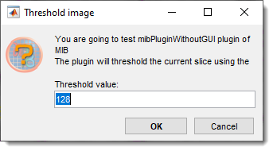
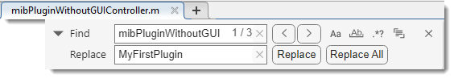

# MIB Plugin without GUI

---

## Overview

{align=left}

The **MIB Plugin Without GUI** is a tutorial example for creating plugins for **Microscopy Image Browser (MIB)** 
**without** a graphical interface. 
<br>It demonstrates how to build a simple plugin that prompts 
the user for a threshold value and generates a mask layer by thresholding the current image slice.

<div class="clear-float"></div>

This plugin serves as a starting point for developers to understand MIB plugin architecture 
and customize functionality for their needs.

## Understanding of sections

### Filenames

The plugin without GUI has only a single file that is called as `[PLUGIN-NAME]Controller.m`, where `[PLUGIN-NAME]` is the name
of the plugin. 

!!! warning
    This name should match with the name of the directory where the plugin is located.

??? info "Example" 
    For example `mibPluginWithoutGUIController.m`:
    
    - `[PLUGIN-NAME]` -> `mibPluginWithoutGUI`, located under `Plugins/Tutorials/mibPluginWithoutGUI` directory
    - Full path: `MIB/Plugins/Tutorials/mibPluginWithoutGUI/mibPluginWithoutGUIController.m`

??? info "Plugins with GUI"
    Plugins with GUI will also have additional files.

    - **GUIDE** based plugins have `[PLUGIN-NAME]GUI.m` and `[PLUGIN-NAME]GUI.fig` files that are created by 
    MATLAB [guide](https://se.mathworks.com/help/releases/R2024b/matlab/ref/guide.html) editor.
    (*e.g.* `MyPluginGUI.m` and `MyPluginGUI.fig`. These, together with `MyPluginController.m` should be placed under `MyPlugin`
    directory). See more [here](gui-tutorial.md)
    - **AppDesigner** based plugins have `[PLUGIN-NAME]GUI.mlapp` created by 
    MATLAB [appdesigner](https://se.mathworks.com/help/releases/R2024b/matlab/ref/appdesigner.html) editor.
    (*e.g.* `MyPluginGUI.mlapp`. This file, together with `MyPluginController.m` should be placed under `MyPlugin`
    directory). See more [here](mib-app-design-plugin.md).

### properties

This section can be used to define properties of the plugin class. These properties will be available to all functions
withing the plugin class

```matlab
properties
    mibModel
    % handles to the model
    noGui = 1
    % a variable indicating a plugin without GUI
end
``` 

### events

This plugin has a single event that is triggered when the plugin is closed.
```matlab
events
    %> Description of events
    closeEvent
    % event firing when plugin is closed
end
```

### constructor
Constructor is the first function that is initialized when the plugin starts.

`mibModel` that holds data classes of MIB is passed as a parameter and assigned into `obj.mibModel` variable available to
all functions of the plugin.

The following section checks whether MIB is in the virtual stack mode and closes the plugin in this case without any
output

`obj.calculateBtn_Callback()` command starts the main function of the plugin

```matlab
function obj = mibPluginWithoutGUIController(mibModel)
    obj.mibModel = mibModel;    % assign model
            
    % check for the virtual stacking mode and close the controller
    if isprop(obj.mibModel.I{obj.mibModel.Id}, 'Virtual') && obj.mibModel.I{obj.mibModel.Id}.Virtual.virtual == 1
        warndlg(sprintf('!!! Warning !!!\n\nThis plugin is not compatible with the virtual stacking mode!\nPlease switch to the memory-resident mode and try again'), ...
            'Not implemented');
        return;
    end
            
    obj.calculateBtn_Callback();  % start the main function
end
```

## Adapting the function to a new plugin
Perform the following operations to use this plugin as a template for a new plugin.

* Create a folder for your plugins under `MIB/Plugins/` for example `MyPlugins` so that the full path is<br>
`MIB/Plugins/MyPlugins`
* Create a subfolder under `MIB/Plugins/MyPlugins` and name it with the name of your new plugin
(e.g.`MIB/Plugins/MyPlugins/MyFirstPlugin`) 
* Copy `mibPluginWithoutGUIController.m` to `MIB/Plugins/MyPlugins/MyFirstPlugin`
* Rename `mibPluginWithoutGUIController.m` to `MyFirstPluginController.m`
* Open `MyFirstPluginController.m` in MATLAB 
* Do Find and Replace to search for `mibPluginWithoutGUI` and replace with `MyFirstPlugin`, ++ctrl+f++ key shortcut.
???+ info "Snapshot"
     

* Edit `calculateBtn_Callback `to implement your desired functionality, such as:

    - Processing multiple slices.
    - Applying different filters (e.g., edge detection).
    - Exporting results to a file.
  
* Save the plugin
* Restart MIB to refresh the list of plugins.
* Run your plugin from `Menu → Plugins → MyPlugins → MyFirstPlugin`.

## Calculate function

This is the main function of the plugin, upon completion, the plugin is closed. Everything within this function can be 
replaced with a custom code.

```matlab
function calculateBtn_Callback(obj)
    % start main calculation of the plugin
            
    % ----- below a small test, replace it with your own code
    
    global mibPath; % get global mibPath variable 
            
    % setup question dialog to get thresholding value
    prompts = {'Threshold value:'}; % question prompt
    defAns = {'128'}; % default answer
    dlgTitle = 'Threshold image'; % dialog title
    % additional explamation text
    options.Title = sprintf('You are going to test mibPluginWithoutGUI plugin of MIB\nThe plugin will threshold the current slice using the provided threshold value and assign it to the Mask layer');
    options.TitleLines = 3; 
    % generate the dialog
    answer = mibInputMultiDlg({mibPath}, prompts, defAns, dlgTitle, options);
    if isempty(answer); return; end 
    % convert the provided answer from string to double
    threhsoldValue = str2double(answer{1});
                
    wb = waitbar(0, 'Please wait'); % add a waitbar to follow the progress
            
    [height, width, ~, depth] = obj.mibModel.I{obj.mibModel.Id}.getDatasetDimensions('image');  % get dataset dimensions
    img = cell2mat(obj.mibModel.getData2D('image'));    % get the currently displayed image
    waitbar(0.5, wb);   % update the waitbar

    mask = zeros([height, width, depth], 'uint8'); % allocate space for the mask layer
    mask(img<threhsoldValue) = 1; % threshold image
    waitbar(0.95, wb);     % update the waitbar
            
    obj.mibModel.setData2D('mask', mask); % send the mask layer back to MIB
    delete(wb);         % delete the waitbar

    % notify mibModel to switch on the Show mask checkbox, 
    % which also redraws the image
    % alternatively, 
    % notify(obj.mibModel, 'plotImage');
    % can be used to force image redraw
    notify(obj.mibModel, 'showMask'); 
 end
```
## Credits

**Author**: Ilya Belevich, University of Helsinki (ilya.belevich@helsinki.fi)

**Part of**: Microscopy Image Browser (https://mib.helsinki.fi)

---

*Back to [MIB](../../index.md) | [User Interface](../../user-interface/index.md) | [Plugins](../index.md) | [Tutorials](index.md)*
