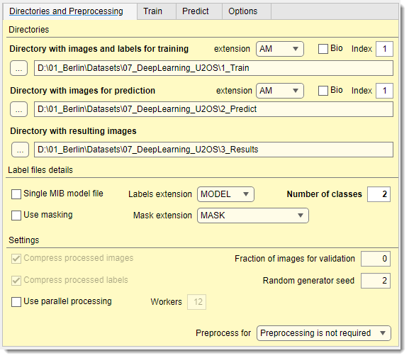
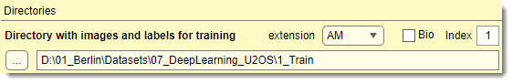
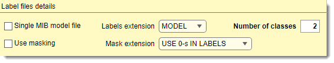
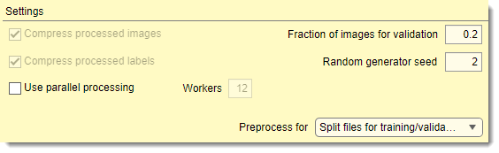
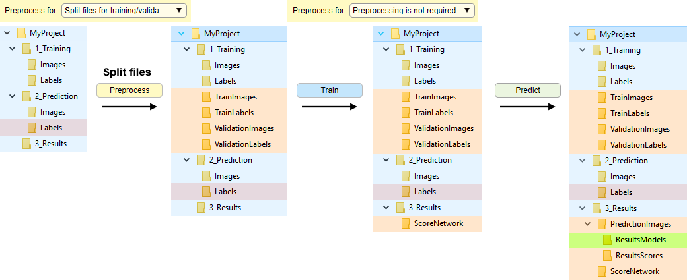
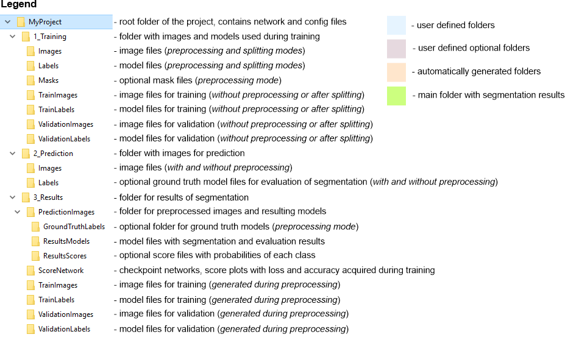
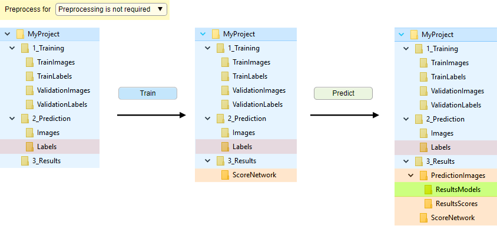
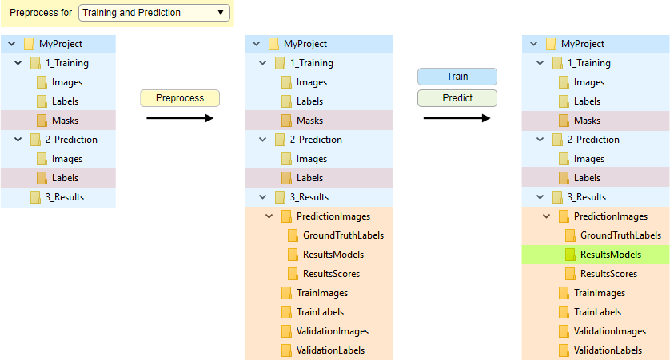
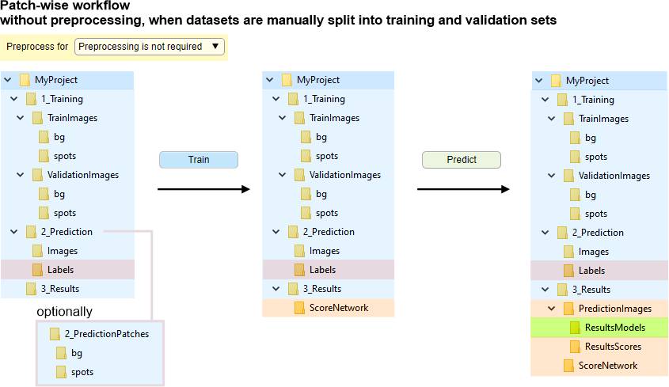
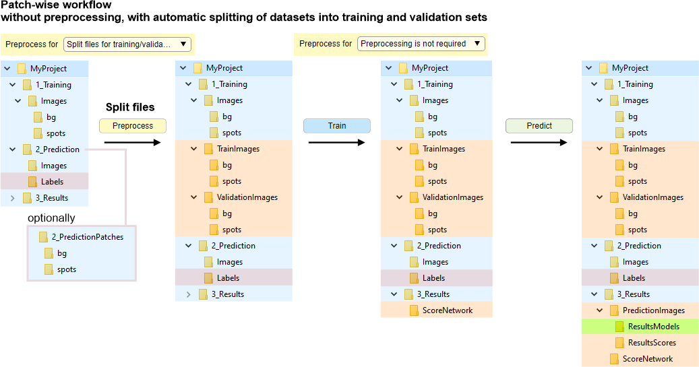

# Deep MIB - Directories and Preprocessing Tab

*Back to [MIB](../../index.md) | [User interface](../index.md) | [DeepMIB](index.md)*

Configuration of directories and preprocessing settings for deep learning segmentation in Microscopy Image Browser.

---

## Overview

The **Directories and Preprocessing tab** in Deep MIB allows users to specify directories containing images for 
training and prediction, along with parameters for image loading and preprocessing.

{.on-glb width="440"}

---

## Widgets and settings

### Directories

Directory with images and labels for training

*Used only for training*

Select the directory containing images and models for training (named `1_Training` 
in [directory organization schemes below](deepmib-dirs.md#organization-of-directories)). 
For 2D networks, use individual 2D images; for 3D networks, use individual 3D datasets.  

- extension: specifies the image file 
    extension  
- <label class="widget widget-checkbox">Bio</label>: toggles between standard and 
Bio-Formats readers. For Bio-Formats collections, use Index... to specify 
- the file index within the container  

For better performance, convert Bio-Formats images to standard formats or use preprocessing (see below).

???+ warning "important notes considering training files"
    - Number of model/mask files must match the number of image files, except for 2D networks where a single `.model` file is allowed 
      if <label class="widget widget-checkbox">Single MIB model file</label> is checked (requires [preprocessing](#preprocessing-of-files))  
    - For standard image format labels, specify the total number of classes (including `Exterior`) 
       in Number of classes  
    - **Important**: avoid numeric material names in `.model` format; use descriptive names instead

---

Directory with images for prediction

*Used only for prediction*

Specify the directory with images for prediction (named `2_Prediction` in [directory organization schemes below](deepmib-dirs.md#organization-of-directories)). 
Place images in an `Images` subfolder (or directly in the specified folder). 
Optionally, include ground truth labels in a `Labels` subfolder.

!!! info

    - In preprocessing mode, images are converted and saved to `3_Results/PredictionImages`. 
    - Fround truth labels, if present, are processed to `3_Results/PredictionImages/GroundTruthLabels` for evaluation (see [Predict tab](deepmib-predict.md)).  
    - For 2D networks, use 2D images or 3D stacks; for 3D networks, use 3D datasets.  

extension: specifies the image file extension   
<label class="widget widget-checkbox">Bio</label>: toggles between standard and Bio-Formats readers. 
For Bio-Formats collections, use Index to specify the file index.

---

Directory with resulting images

Specify the main output directory where results and preprocessed images are stored. 
Deep MIB automatically creates subfolders:

- `PredictionImages`: preprocessed images for prediction  
- `PredictionImages/GroundTruthLabels`: ground truth labels for prediction images, if available  
- `PredictionImages/ResultsModels`: main output directory for generated labels after prediction. 
Combine 2D models in MIB using Shift + <mouse class="left"></mouse> during loading  
- `PredictionImages/ResultsScores`: prediction scores (probability) for each material, scaled 0-255  
- `ScoreNetwork`: accuracy/loss plots (if *Export training plots* is enabled in the *Train* tab) and network 
checkpoints (if <label class="widget widget-checkbox">Save progress after each epoch</label> is checked).  
Scores are timestamped and overwritten with new training  
- `TrainImages`: preprocessed training images (*preprocessing mode only*)  
- `TrainLabels`: preprocessed training labels (*preprocessing mode only*)  
- `ValidationImages`: preprocessed validation images (*preprocessing mode only*)  
- `ValidationLabels`: preprocessed validation labels (*preprocessing mode only*)

### Label file details

- <label class="widget widget-checkbox">Single MIB model file</label>: (*2D networks only*) uses a single `.model` file for labels  
- Labels extension: (*2D networks only*) selects the model file extension. 3D networks use MIB `.model` format  
- Number of classes: (*TIF/PNG only*) defines the number of classes, including `Exterior`. Auto-updated for `.model` files  
- <label class="widget widget-checkbox">Use masking</label>: excludes parts of training data using masks (file count must match images). with preprocessing, requires `.mask` format; without, use USE 0-s IN LABELS for 0-value areas in labels (recommended to skip preprocessing).  

!!! info

      - With USE 0-s IN LABELS, the first predicted material is `Exterior` (index 0). assign the first ground truth material to background  
      - With preprocessing masks, `Exterior` indicates background  
      - Masking may reduce precision due to patch inconsistency; minimize its use  
- Mask extension: selects mask file extension. With preprocessing, only `.mask` is allowed for 3D networks; without, any format is permitted

### Additional settings

- <label class="widget widget-checkbox">Compress processed images</label> compresses preprocessed images 
to `.mibImg` format (loadable in MIB or MATLAB, e.g., `res = load('img01.mibImg', '-mat');`). Slows down performance  
- <label class="widget widget-checkbox">Compress processed labels</label> compresses preprocessed labels 
to `.mibCat` format (loadable via **Ribbon → Model → Load model**). 
Slows performance but reduces file size significantly  
- <label class="widget widget-checkbox">Use parallel processing</label> enables multi-core processing, 
with core count set in Workers. Speeds up preprocessing  
- Fraction of images for validation sets the fraction of images 
randomly assigned to validation (based on *Random generator seed*). If 0, validation is skipped  
- Random generator seed initializes the random seed for 
splitting training/validation images. fixed values ensure reproducibility; If 0 uses system time for randomness  
- Preprocess for selects the mode for the Preprocess button (see schemes below)

---

## Preprocessing of files

Preprocessing of files was originally required for most workflows, however now Deep MIB 
supports unprocessed images in many cases. 
In this case the **Preprocess for** should be set to 

- Split for training/validation to automatically split images into the
training and validation sets
- Preprocessing is not required after images were split into the training
and validation sets 

??? info "When the preprocessing step is required or recommended"
    Preprocessing is recommended or required when:  
    - Labels are in a single `.MODEL` file (*for 2D workflows*)  
    - Training data uses proprietary formats readable only by Bio-Formats  
    During preprocessing, images and models are converted to `.mibImg` and `.mibCat` formats (MATLAB-based) optimized for training and prediction.

---

## Organization of directories

Sections below provide schemes for directories organization for several cases:

- [Automatic file splitting](deepmib-dirs.md#automatic-file-splitting) [**recommended for most cases**] without file conversion, with automatic splitting of files for training and validation
- [Manual file splitting](deepmib-dirs.md#manual-file-splitting) without file conversion, files arranged manually into correct folders
- [Conversion of files](deepmib-dirs.md#conversion-of-files) with preprocessing/file conversion, files are converted to `.mibImg` and `.mibCat` formats and split for training and validation
- [Patch-wise workflow](deepmib-dirs.md#patch-wise-workflow) this workflow requires slightly different organization of directories 

### Automatic file splitting

Without file conversion, with automatic splitting of datasets into training and validation sets. 
Images and labels are randomly split into training and validation sets upon 
clicking 
Preprocess when 
Preprocess for: Split for training and validation. 
 Splitting depends on the Random generator seed 
value (when "0" uses a new random seed each time).

???+ abstract "Directory tree for automatic file splitting without file conversion"
    {.on-glb}

??? abstract "Snapshot with the legend"
    {.on-glb}

---

### Manual file splitting

Without file conversion, when datasets are manually split into training and validation sets.
 
Images for training are loaded on-demand without preprocessing.
  In order to proceed, 
split files into `TrainImages`, `TrainLabels`, and optional `ValidationImages`, `ValidationLabels` subfolders
(see *Snapshot with the directory tree* below).  
Automatic splitting is also available (see  [Automatic file splitting](#automatic-file-splitting)). 
For Bio-Formats, preprocessing is recommended to improve file reading speed.

???+ abstract "Directory tree for manual file splitting without file conversion"
    {.on-glb}

??? abstract "Snapshot with the legend"
    {.on-glb}

### Conversion of files
Organization of directories with file conversion during preprocessing and automatic split for training and validation.

Enabled when Preprocess for is set to:  
- **Training and prediction**: preprocesses for both  
- **Training**: preprocesses only training images  
- **Prediction**: preprocesses only prediction images

Start conversion by pressing Preprocess.

???+ abstract "Directory tree for conversion of files"
    {.on-glb}

??? abstract "Snapshot with the legend"
    {.on-glb}

---
### Patch-wise workflow

Organization of directories for 2D patch-wise workflow. The 2D patch-wise workflow organizes training 
images in `Images/[ClassnameN]` subfolders (e.g., `bg`, `spots`).  
Number of folders should match the number of classes.

Patch-wise, manually split files into training and validation sets

Place training images in subfolders named by class under:  
- `1_Training/TrainImages`: training images  
- `1_Training/ValidationImages`: validation images (optional)  
The images can be automatic split (see the next section). 

For prediction ground truth, use `2_Prediction/Images` and `2_Prediction/Labels` (semantic style) or `2_Prediction/[ClassnameN]` 
(patch-wise style).

???+ abstract "Directory tree for patch-wise, manually split files"
    {.on-glb}  
    `bg` and `spots` are example class names.

??? abstract "Snapshot with the legend"
    {.on-glb}

Patch-wise, automatic split files into training and validation sets

Automatic splitting of datasets for the patch-wise segmentation into training and validation sets

Images are randomly split (based on [Random generator seed](#additional-settings)) into training and 
validation sets upon clicking 
Preprocess when Preprocess for: Split for training and validation. 
Initially, place all images in `1_Training/Images/[ClassnameN]`. 
Prediction ground truth follows the same options as above.

???+ abstract "Directory tree for patch-wise, automatic split files"
    {.on-glb}  
    `bg` and `spots` are example class names.

??? abstract "snapshot with the legend"
    {.on-glb}

---

*Back to [MIB](../../index.md) | [User interface](../index.md) | [DeepMIB](index.md)*