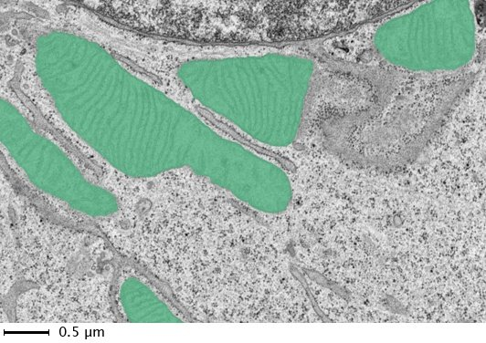
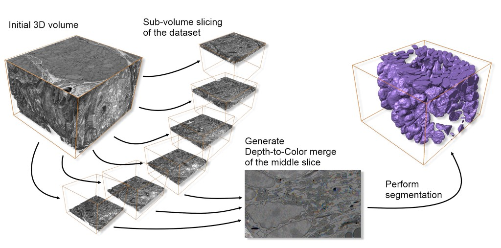
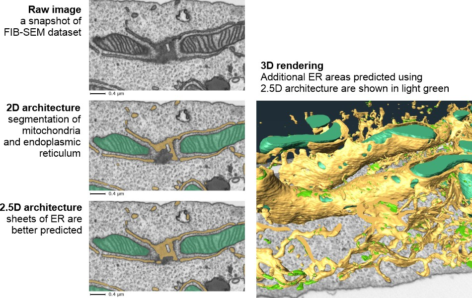
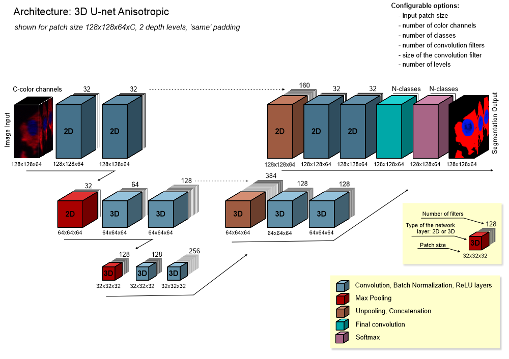
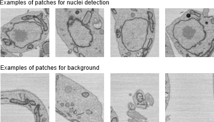
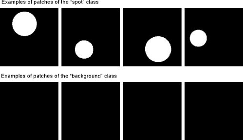
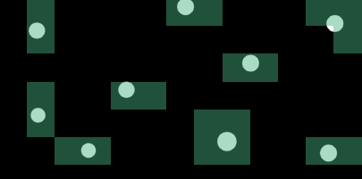
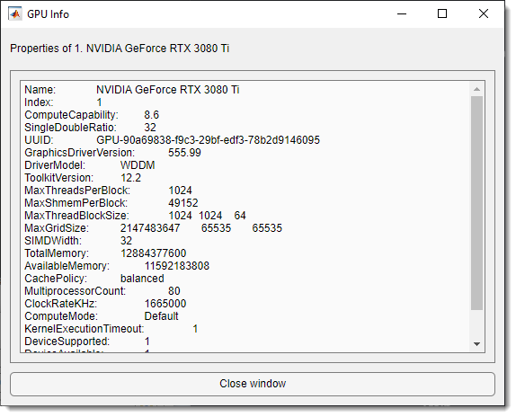

# Deep MIB - Network Panel

Configuration of workflows and network architectures for deep learning segmentation 
in Microscopy Image Browser.

---

## Overview

The **Network panel** in Deep MIB occupies the upper part of the interface and is used to select the workflow and convolutional network architecture for training deep learning models.

---

## Workflows

Start a new project by selecting a workflow:

- **2D Semantic**: clusters 2D image pixels of the same material together
- **2.5D Semantic**: uses 2D network architectures to process small subvolumes (3-9 stacks), segmenting only the central slice
- **3D Semantic**: clusters 3D image voxels of the same material together
- **2D Patch-wise**: predicts 2D images in blocks (patches), producing a downsampled image indicating object positions

---

## 2D Semantic workflow

???+ abstract "Application of DeepMIB for 2D semantic segmentation of mitochondria on TEM images"
    {.on-glb}

??? abstract "list of available network architectures for 2D semantic segmentation"
    The following architectures are available for 2D semantic segmentation:

    - **2D U-net**: a convolutional neural network developed for biomedical image segmentation at the University of Freiburg, Germany. it segments a 512x512 image in under a second on a modern GPU ([Wikipedia](https://en.wikipedia.org/wiki/U-Net)).  
      **References**:  
        - Ronneberger, O., et al. "U-Net: Convolutional Networks for Biomedical Image Segmentation." *MICCAI*, 2015 ([arXiv](https://arxiv.org/abs/1505.04597)).  
        - [MATLAB U-Net layers](https://se.mathworks.com/help/vision/ref/unetlayers.html).

    - **2D SegNet**: a convolutional network from the University of Cambridge, UK, designed for general image segmentation, less suited for microscopy data compared to U-net.  
      **References**:  
        - Badrinarayanan, V., et al. "SegNet: A Deep Convolutional Encoder-Decoder Architecture for Image Segmentation." *arXiv*, 2015 ([arXiv](https://arxiv.org/abs/1511.00561)).  
        - [MATLAB SegNet layers](https://se.mathworks.com/help/vision/ref/segnetlayers.html).

    - **2D DeepLabV3 (recommended)**: an efficient DeepLab v3+ network with selectable base networks (Resnet18, Resnet50, Xception, Inception-ResNet-v2), suitable for diverse segmentation tasks with grayscale or RGB inputs.  
        - **Resnet18**: 18-layer network, lightest option, quickest with low GPU needs, 224x224 input size, initialized with a pretrained EM/pathology template ([IEEE](https://ieeexplore.ieee.org/document/7780459)).  
        - **Resnet50**: 50-layer network, balanced performance, 224x224 input size, initialized with a pretrained EM/pathology template ([IEEE](https://ieeexplore.ieee.org/document/7780459)).  
        - **Xception** (*MATLAB version only*): 71-layer network, 299x299 input size ([arXiv](https://arxiv.org/abs/1610.02357)).  
        - **Inception-ResNet-v2** (*MATLAB version only*): 164-layer network, high GPU demands, 299x299 input size ([AAAI](https://dl.acm.org/doi/10.5555/3298023.3298188)).  
      **Reference**:  
        - Chen, L., et al. "Encoder-Decoder with Atrous Separable Convolution for Semantic Image Segmentation." *ECCV*, 2018 ([arXiv](https://arxiv.org/abs/1802.02611)).

---

## 2.5D Semantic workflow

???+ abstract "Architectures available in 2.5D workflows"
    
Depth to Color

    Subslices are arranged as color channels for standard 2D architectures, 
    improving segmentation at a 1.4-1.6x slower training cost.  
    {.on-glb}  
    Comparison of 2.5D vs. 2D results:  
    {.on-glb}  
    Available architectures (see 2D semantic section for details):  
    - **Z2C + DLv3**: DeepLab v3 with Resnet18 or Resnet50 encoders  
    - **Z2C + U-net**: standard U-net as the template  
    - **Z2C + U-net + Encoder**: U-net with Resnet18 or Resnet50 encoders

???+ abstract "Notes on application of 2.5D workflows"

    Work with 2.5D workflows mirrors 2D workflows, with these differences:  
    - **Input images and labels**: use small substacks (3-9 sections), segmenting only the central slice, saved as separate files  
    - **Generation of patches for training**: auto-generate subvolumes via:  
      - *From models*: 
        `Ribbon → Model (or Masks) → Model (Mask) statistics → detect objects → right-click → Crop to a file`  
      - *From annotations*: 
        `Ribbon → Model → Annotations → right-click over selected annotations → Crop out patches around selected annotations`  
      See [:fontawesome-brands-youtube:{.red-color} Generation of patches for deep learning segmentation](https://youtu.be/QrKHgP76_R0?si=j_58ipCpp6Sn7r11)

---

## 3D Semantic workflow

The 3D Semantic workflow suits anisotropic or slightly anisotropic 3D datasets, leveraging multiple sections to train networks for enhanced 3D structure prediction.

???+ abstract "List of available network architectures for 3D semantic segmentation"
    - **3D U-net**: a U-net variant for volumetric image segmentation.  
      **References**:  
        - Cicek, Ö., et al. "3D U-Net: Learning Dense Volumetric Segmentation from Sparse Annotation." *MICCAI*, 2016 ([arXiv](https://arxiv.org/abs/1606.06650)).  
        - [MATLAB 3D U-Net layers](https://se.mathworks.com/help/vision/ref/unet3dlayers.html).  
    - **3D U-net anisotropic**: a hybrid of 2D and 3D U-nets, with 2D convolutions and max pooling at the top layer and 3D operations elsewhere, ideal for anisotropic voxels.

    ??? abstract "architecture of 3D U-net anisotropic"
        {.on-glb}

---

## 2D Patch-wise workflow

In the 2D Patch-wise workflow, training uses image patches representing specific classes. prediction processes images in blocks (with or without overlap), assigning each block a class. this is useful for quickly locating objects or targeting specific areas for semantic segmentation.

???+ abstract "Detection of nuclei using the 2D patch-wise workflow"
    Examples of patches for nuclei detection:  
    {.on-glb}  
    Prediction results:  
    - Green: predicted nuclei locations  
    - Red: predicted background  
    - Uncolored: skipped patches (dynamic masking)  
    {.on-glb}

??? abstract "Detection of spots using the 2D patch-wise workflow"
    Training patches for "spots" and "background":  
    {.on-glb}  
    Synthetic spot detection example:  
    {.on-glb}

??? abstract "List of available networks for the 2D patch-wise workflow"
    ???+ abstract "Comparison of different network architectures"
        Indicative speed comparison (credit: MathWorks Inc.):  
        {.on-glb}

    
Resnet18

    An 18-layer network, lightweight yet effective, with adjustable input size (default 224x224). in MATLAB MIB, it can use a pretrained ImageNet version ([ImageNet](http://www.image-net.org)).  
    **Reference**: 
        - He, K., et al. "Deep Residual Learning for Image Recognition." *IEEE CVPR*, 2016.

    
Resnet50

    A 50-layer network, adjustable input size (default 224x224), pretrained on ImageNet in MATLAB MIB ([ImageNet](http://www.image-net.org)).  
    **References**:  
    - He, K., et al. "Deep Residual Learning for Image Recognition." *IEEE CVPR*, 2016.  
    - [Keras Resnet50](https://keras.io/api/applications/resnet/#resnet50-function).

    
Resnet101

    A 101-layer network, adjustable input size (default 224x224), pretrained on ImageNet in MATLAB MIB ([ImageNet](http://www.image-net.org)).  
    **References**:  
    - He, K., et al. "Deep Residual Learning for Image Recognition." *IEEE CVPR*, 2016.  
    - [GitHub deep-residual-networks](https://github.com/KaimingHe/deep-residual-networks).

    
XCeption

    A 71-layer network, computationally intensive, adjustable input size (default 299x299), pretrained on ImageNet in MATLAB MIB ([ImageNet](http://www.image-net.org)).  
    **Reference**:
         - Chollet, F. "Xception: Deep Learning with Depthwise Separable Convolutions." *arXiv*, 2017 ([arXiv](https://arxiv.org/abs/1610.02357)).

---

## Network filename

The Network filename button selects a file for saving or loading a network:

- In *Directories and Preprocessing* or *Train* tabs: defines the save file  
- In *Predict* tab: loads a pretrained network for prediction  

!!! info 
    
    The button is color-coded to match the active tab for ease of use.

---

## GPU dropdown

The GPU dropdown sets the execution environment:  
- **Name of a GPU**: lists available GPUs; select one for deep learning  
- **Multi-GPU**: uses multiple GPUs on one machine via a local parallel pool (shown if multiple GPUs are present)  
- **CPU only**: uses a single CPU  
- **Parallel** (under development): uses a local or remote parallel pool, prioritizing GPU workers if available  
Click the ? button for GPU details.

??? abstract "GPU information dialog"
    {.on-glb}

---

## Eye button

The Eye button loads and checks the network specified in *Network filename*, 
differing from the *Check network* button in the *Train* tab, which generates a network from parameters.

---

*Back to [MIB](../../index.md) | [User interface](../index.md) |  [DeepMIB](index.md)*