# Deep MIB - Predict Tab

*Back to [MIB](../../index.md) | [User interface](../index.md) |  [DeepMIB](index.md)*

Settings for efficient prediction (inference) and semantic segmentation model generation in Microscopy Image Browser.

---

## How to start the prediction (inference) process

{.on-glb width="440"}

Prediction (inference) requires a pretrained network. if you lack one, [train it first](deepmib-train.md). pretrained networks can 
be loaded into Deep MIB for segmenting new datasets.

### Steps to start prediction

1. Select the pretrained network file in Network filename... in the *Network* panel. 
This updates the *Train* panel with training settings. Alternatively, load a config file via **Options tab → Config files → Load>**  
2. Verify the prediction images directory in **Directories and Preprocessing tab → Directory with images for prediction**  
3. Confirm the output directory in **Directories and Preprocessing tab → Directory with resulting images**  
4. If needed (usually not), preprocess (convert) files:  
    - Set Preprocess for: Prediction in the **Directories and Preprocessing** tab  
    - Click Preprocess  
5. Switch to the *Predict* tab and press Predict

---

## Settings section

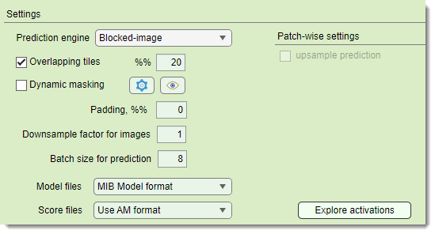{.on-glb align=left width="440"}

The *Settings* section configures prediction parameters.

Prediction engine: selects the tiling engine:

* **Legacy** used until MIB 2.83  
* **Blocked-image** recommended for later versions (supports *Dynamic masking* and *2D Patch-wise*)

<label class="widget widget-checkbox">Overlapping tiles</label>: (for *Padding: same*) tiles the patches with overlap to 
minimize edge artefacts and improve segmentation. Define overlap percentage in %%...  
??? abstract "Overlapping vs non-overlapping mode"
      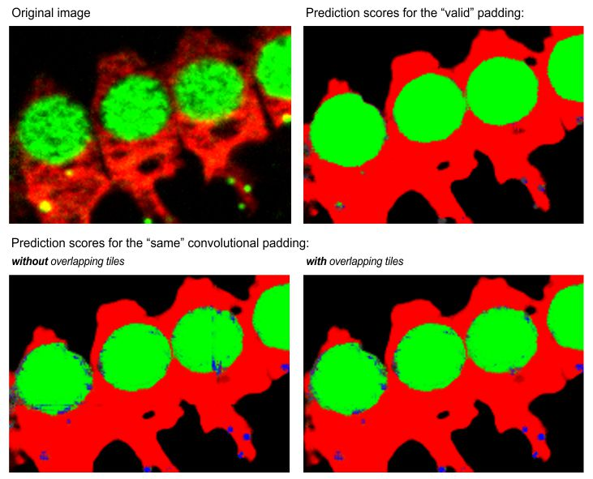{.on-glb}  
      *Same* padding without overlap may show edge artifacts, reduced with overlapping mode.  

<label class="widget widget-checkbox">Dynamic masking</label>: skips prediction on certain tiles using on-the-fly masking, configured via the {.inline-image} button
 Eye previews masking on the current *Image View* panel image
??? abstract "Dynamic masking settings and preview"
      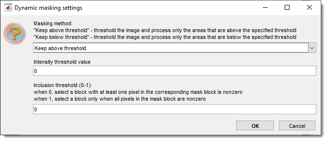{.on-glb width="370" align=left}  
      Masking method keeps blocks above or below the Intensity threshold value...  
       Intensity threshold value... sets the intensity threshold for prediction  
       inclusion threshold (0-1)... fraction of pixels above/below threshold to keep a tile  
      
      

      
      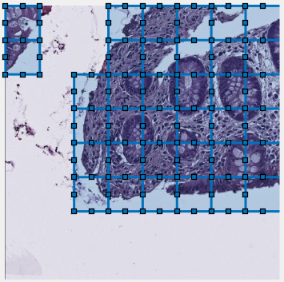{.on-glb align=left}  
      Masking preview
      

    ??? abstract "Example of patch-wise segmentation with dynamic masking"

          - Green: predicted nuclei  
          - Red: predicted background  
          - Uncolored: skipped patches  
          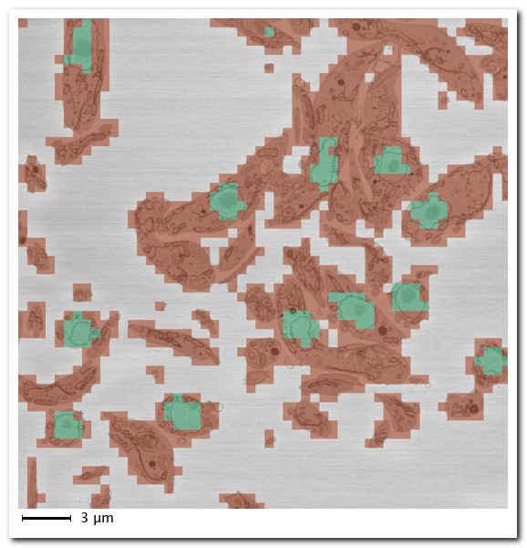{.on-glb}  

Padding, %% pads images symmetrically to reduce edge artifacts  
Downsample factor for images downsamples prediction images to match training 
(if applicable), upsampling results to original size and in case of networks with 2 classes are also smoothed  
Batch size for prediction... sets the number of patches processed by GPU simultaneously, limited by GPU memory  
Model files selects output format for models (CSV for patch-wise)  
??? abstract "list of available image formats for the model files"

      - **MIB Model format**: `.model` files, loadable in MIB or MATLAB (`model = load('filename.model', '-mat');`)  
      - **TIF compressed format**: LZW-compressed TIF, pixels encode classes (1, 2, 3, etc.)  
      - **TIF uncompressed format**: uncompressed TIF, pixels encode classes  
Score files selects output format for prediction score maps, configured via the {.inline-image} button  
??? abstract "list of available image formats for the score files"

      - **Do not generate** skips score files for better performance  
      - **Use AM format** AmiraMesh, compatible with MIB, Fiji, or Amira  
      - **Use Matlab non-compressed format** `.mibImg`, loadable in MIB or MATLAB (`model = load('filename.mibImg', '-mat');`)  
      - **Use Matlab compressed format** compressed `.mibImg`, loadable in MIB or MATLAB  
      - **Use Matlab non-compressed format (range 0-1)** `.mibImg` with 0-1 range, MATLAB-only (`model = load('filename.mat');`)  
- <label class="widget widget-checkbox">upsample predictions</label>: (*2D patch-wise only*) upsamples downsampled patch-wise predictions to match original image size

---

## Explore activations

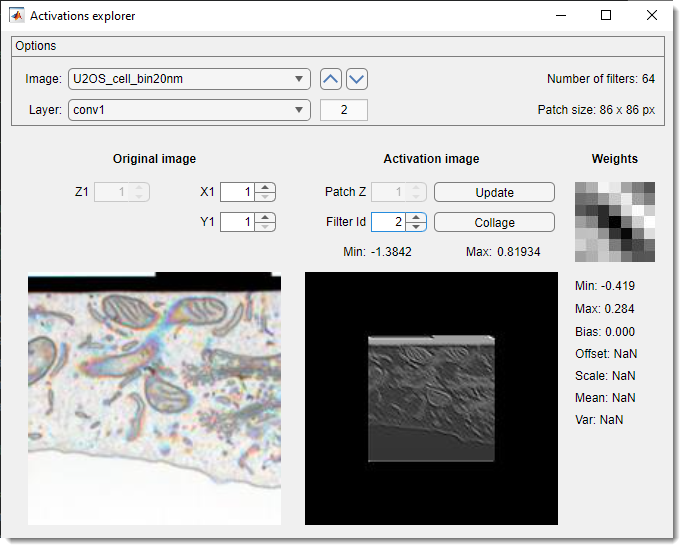{.on-glb align=left width="380"}

The *Activations explorer* evaluates network performance in detail. It is possible to see details of weights and activation images
for all layers and filters.

- Image lists preprocessed prediction images. select one to load a patch matching the network’s input size. use arrows to navigate  
- Layer lists network layers. selecting a layer triggers prediction and activation image generation  
- Z1..., X1..., Y1...
shifts the patch across the image. Update activations with Update  
- Patch Z... adjusts Z within 3D network activation patches  
- Filter Id... cycles through activation layers  
- Update recalculates activations for the current patch  
- Collage creates a collage of current layer activations  
??? abstract "Snapshot with the generated collage of activation images"

      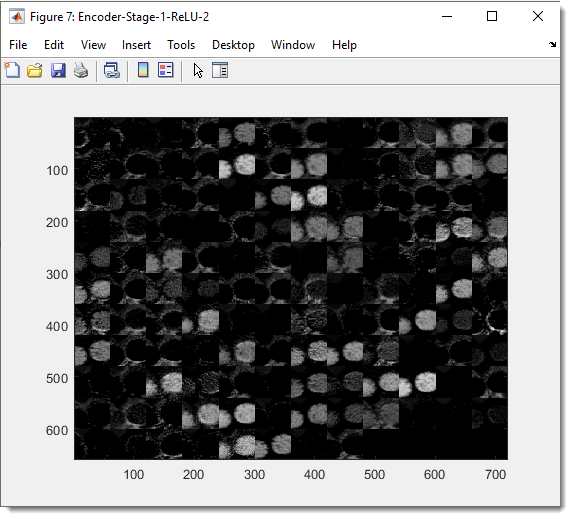{.on-glb}

---

## Preview results section

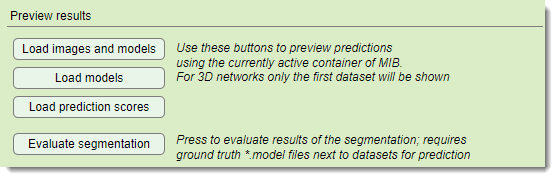{.on-glb width="500"}

Load images and models loads original images and segmentations 
into MIB’s active buffer post-prediction  
 Load models loads segmentations over the current MIB image. Requires that the image is already preloaded. 
 Load prediction scores loads score images (probabilities) into the active buffer  
 Evaluate segmentation calculates precision metrics if 
ground truth labels exist in `Labels` under `PredictionImages`. Material names must match training data  
??? abstract "Details of the Evaluate segmentation operation"
      Select metrics to compute:  
      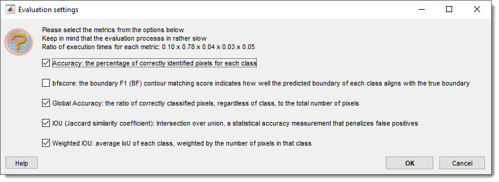{.on-glb}  
      Results show a confusion matrix (0-100 scale), class metrics (Accuracy, IoU, MeanBFScore), and global metrics:  
      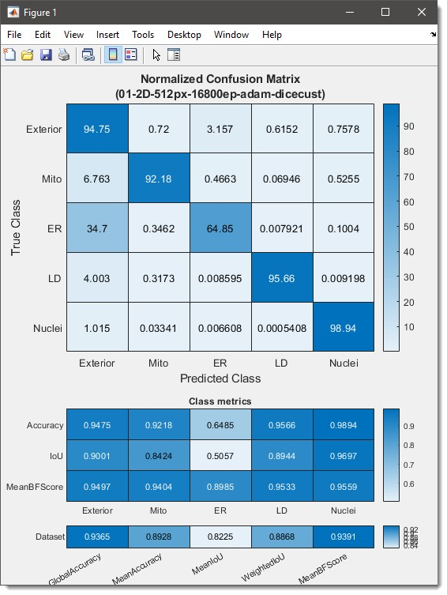{.on-glb width="420"}  
      Additional metrics (label occurrence, Sørensen-Dice coefficient) are available via the dropdown:  
      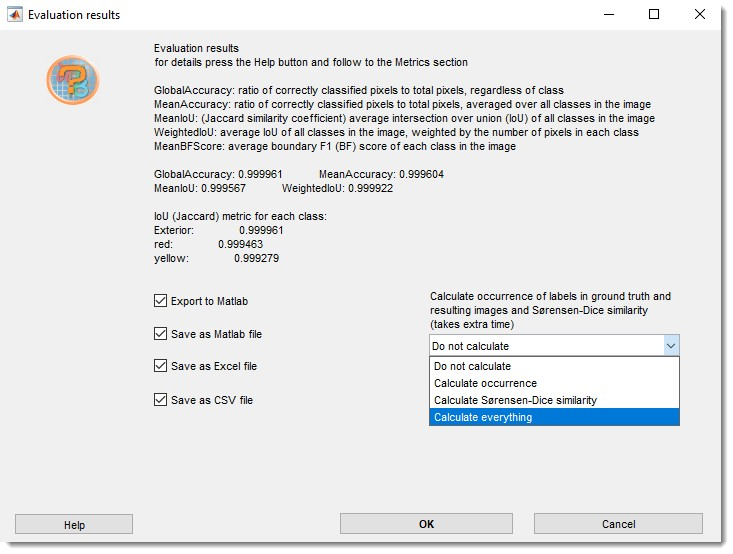{.on-glb width="460"}  
      Export results to MATLAB, Excel, or CSV in `3_Results/PredictionImages/ResultsModels` 
      (see [Directories and Preprocessing](deepmib-dirs.md)). Details of the evaluation procedure are in 
      [MATLAB evaluatesemanticsegmentation](https://se.mathworks.com/help/vision/ref/evaluatesemanticsegmentation.html)

---

*Back to [MIB](../../index.md) | [User interface](../index.md) |  [DeepMIB](index.md)*