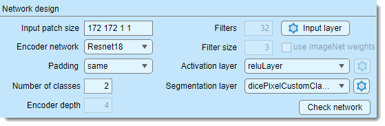
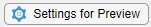
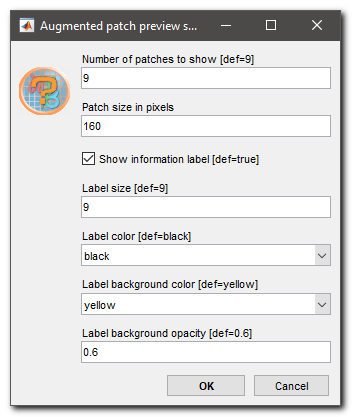
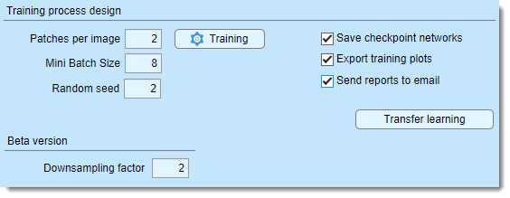
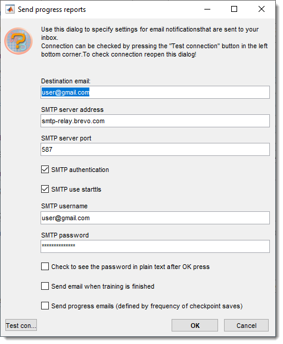
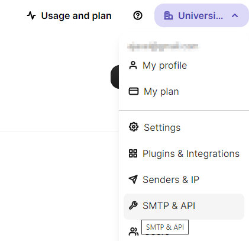

# Deep MIB - Train Tab

Settings for generating and training deep convolutional networks in Microscopy Image Browser.

---

## Overview

{.on-glb width="440"}

The **Train tab** in Deep MIB contains settings for designing and training deep convolutional networks. before starting, 
adjust the default settings to your project’s needs and ensure the output network file is specified using the 
Network filename button in the *Network panel*.

---

## Network design

The *Network design* section configures the network architecture.

- Input patch size... defines the dimensions of image blocks 
(`height, width, depth, colors`) for training (e.g., "572 572 1 2" for a 572x572x1 patch with 2 color channels), 
Define the input patch size based on available GPU memory, desired field of view, dataset size, and channels. 
Patches are randomly sampled, with the count set in Patches per image...  
- Encoder network selects the encoder for supported architectures, 
sorted from lightweight to more complex  
- Padding sets convolution padding type:  
      - **same**: adds zero padding to keep input/output sizes equal  
      - **valid**: no padding, reducing output size but minimizing edge artifacts 
      (though *same* with overlap prediction also reduces artifacts). 

!!! info

    Press Check network to verify compatibility of the input patch size with the selected padding method

- Number of classes... specifies the total number of materials, including `Exterior`  
- Encoder depth... sets the number of encoding/decoding layers in U-Net, 
controlling downsampling/upsampling by 2^D. Tweak with Downsampling factor... (*Beta version*) to adjust patch size  
- Filters... defines the number of output channels (filters) in the first encoder stage, doubling per subsequent stage, mirrored in the decoder  
- Filter size... sets convolutional filter size (e.g., 3, 5, 7)  
- Input layer configures input image normalization settings  
- Starting weights states where the initial weights come from and how much of
the network is retrained. The available states are a property of the selected workflow, architecture and encoder, so most
designs offer no choice: the dropdown is then **disabled but still shows the truthful value**, rather than being blank.

    | Network design | Starting weights |
    |---|---|
    | 3D Semantic; U-net +Encoder with the `Classic` encoder; SegNet | `None (random)` |
    | DeepLab v3+ / Z2C + DLv3; U-net +Encoder with a Resnet encoder | `Pretrained` |
    | 2D Patch-wise (Resnet/Xception) | `None (random)` or `ImageNet` *(user choice)* |
    | 2D Instance (SOLOv2) | `COCO, trainable backbone` *(default)* or `COCO, frozen backbone` |

    `Pretrained` means the network starts from an already trained template rather than from scratch. **What** that
    template is depends on the design: DeepLab v3+ with a Resnet encoder downloads a MIB-hosted template the first time
    it is used and asks you to choose the **Electron Microscopy** or **Light microscopy/Pathology** variant, whereas the
    U-net Resnet encoders are fetched from the MIB encoder repository. The downloaded template is cached in the DeepMIB
    directory (*Preferences → External directories*) and reused silently from then on, so the choice is a property of
    your installation and is not stored in the configuration file.

    `ImageNet` applies to the 2D Patch-wise classification networks and requires the MATLAB version of MIB plus the
    matching support package; it is not offered in the standalone version.

    For SOLOv2 the network always starts from COCO weights, and the choice is whether the backbone keeps training.
    `COCO, frozen backbone` holds the COCO features fixed while the heads learn; it trains faster, tolerates a high
    learning rate and is less prone to overfitting on a very small number of annotated images. **Start here.**

    `COCO, trainable backbone` lets the features adapt to microscopy data, which looks nothing like the natural
    photographs COCO was trained on, but it only works at a much lower learning rate.

    !!! warning "Lower the learning rate before unfreezing the backbone"

        A rate that is perfectly safe with a frozen backbone (`1e-3` to `1e-2`) destroys the pretrained weights within
        the first hundred iterations once the backbone is trainable. The symptom is unmistakable: the loss drops a
        little, then flatlines for the rest of the run, and the validation mAP stays at exactly `0` - the network
        detects nothing at all, not even on its own training images.

        Use an initial learning rate of about `1e-4` with Adam, and prefer to **continue training an already trained
        frozen network** rather than unfreezing from scratch: press Train,
        select the existing `.mibDeep` file in the checkpoint dialog, and the restored weights are trained with the
        freeze setting currently selected in the dropdown. The heads are already sensible at that point, so the
        gradients reaching the backbone are small enough to refine it instead of overwriting it.

-  Activation layer selects the activation layer type, with additional settings 
via the {.inline-image} button when available  

??? abstract "list of available activation layers"

    Compare activation layers [here](https://se.mathworks.com/help/deeplearning/ug/compare-activation-layers.html):  
    - *reluLayer*: [Rectified Linear Unit (ReLU) layer](https://se.mathworks.com/help/deeplearning/ref/nnet.cnn.layer.relulayer.html), *default activation layer*   
    - *leakyReluLayer*: [Leaky Rectified Linear Unit (ReLU) layer](https://se.mathworks.com/help/deeplearning/ref/nnet.cnn.layer.leakyrelulayer.html) scales negative inputs   
    - *clippedReluLayer*: [Clipped Rectified Linear Unit (ReLU) layer](https://se.mathworks.com/help/deeplearning/ref/nnet.cnn.layer.clippedrelulayer.html) performs a threshold operation, where any input value less than zero is set to zero and any value above the clipping ceiling is set to that clipping ceiling  
    - *eluLayer*: [Exponential linear unit (ELU) layer](https://se.mathworks.com/help/deeplearning/ref/nnet.cnn.layer.elulayer.html) exponential nonlinearity for negatives   
    - *swishLayer*: [Swish activation layer](https://se.mathworks.com/help/deeplearning/ref/nnet.cnn.layer.swishlayer.html) applies f(x) = x / (1+e^(-x))   
    - *tanhLayer*: [Hyperbolic tangent (tanh) layer](https://se.mathworks.com/help/deeplearning/ref/nnet.cnn.layer.tanhlayer.html)  

- Segmentation layer selects the output layer, with settings via the {.inline-image} button when available  

??? abstract "List of available segmentation layers"
 
    - [pixelClassificationLayer](https://se.mathworks.com/help/vision/ref/nnet.cnn.layer.pixelclassificationlayer.html): cross-entropy loss  
    - [focalLossLayer](https://se.mathworks.com/help/vision/ref/nnet.cnn.layer.focallosslayer.html): focal loss for class imbalance  
    - [dicePixelClassificationLayer](https://se.mathworks.com/help/vision/ref/nnet.cnn.layer.dicepixelclassificationlayer.html): generalized Dice loss for class imbalance  
    - **dicePixelCustomClassificationLayer**: modified Dice loss for rare classes  

- Check network previews and validates the network (limited info in standalone MIB)  

??? abstract "Snapshots of the network check window for the MATLAB and standalone versions of MIB"

    
MATLAB version:
 
    {.on-glb}  
      
    
Standalone version:

    {.on-glb}

---

## Augmentation design

{.on-glb align=left}

Augmentation enhances training data with image processing filters (17 for 2D, 18 for 3D networks), configurable via buttons next to <label class="widget widget-checkbox">Augmentation</label>.

- <label class="widget widget-checkbox">Augmentation</label>: enables augmentation of input patches  
- 2D: sets augmentation for 2D networks (17 operations)  
- 3D: sets augmentation for 3D networks (18 operations)  
 
Specify the fraction of patches to augment, plus probability and variation per filter. 
Multiple filters may apply to a patch based on probability.

??? abstract "2D/3D augmentation settings"
    Press 2D or 3D to open the settings dialog:  
    {.on-glb}  
    - Toggle augmentations with checkboxes  
    - Set probability (yellow) and variation (light blue)  
    - Reset restores defaults  
    - Disable turns off all augmentations  
    - Fraction probability of patch augmentation (1 = all, 0.5 = 50%)  
    - FillValue background color for downsampling/rotation (0 = black, 255 = white for 8-bit)  
    - {.inline-image} previews patches with augmentations, fixed or random based on Random seed (0 = random)  
    - {.inline-image} adjusts preview parameters 

    ??? abstract "Details settings for preview"
          {.on-glb}  
          Example augmentations from Preview:  
          {.on-glb}

    - Help: links to training help  
    - Previous seed: restores the last random seed (when *Random seed* = 0)  
    - OK: applies settings  
    - Cancel: discards changes

---

## Training process design

{.on-glb align=left width="460"}

The *Training process design* section configures the training process, started with Train.

- Patches per image... sets patches per image/dataset per epoch. Use 1 patch with many epochs and *Shuffling: every-epoch* (via Training) for best results, or adjust as needed  
- Mini Batch Size... number of patches processed simultaneously, limited by GPU memory. Loss is averaged across the batch  
- Random seed... seeds the random number generator for training initialization (use any fixed value except `0` for reproducibility, otherwise use `0` for random initialization each training attempt)  
- Training sets multiple parameters 
(see [trainingOptions](https://se.mathworks.com/help/deeplearning/ref/trainingoptions.html)). 

!!! tip
    set *Plots* to "none" for up to 25% faster training

- <label class="widget widget-checkbox">Save checkpoint networks</label> saves checkpoints after each epoch 
to `3_Results/ScoreNetwork`. Resume training from checkpoints via a dialog. In R2022a or newer, it is possible to adjust frequency for saving checkpoints  
- <label class="widget widget-checkbox">Export training plots</label> saves accuracy/loss scores to `3_Results/ScoreNetwork` in `.score` (MATLAB) and CSV formats, using the network filename  
- <label class="widget widget-checkbox">Send reports to email</label> emails progress/finish updates. configure SMTP settings via the checkbox  

### Configuration of email notifications 

???+ abstract "Configuration of email notifications"

    {.on-glb width="350" align=left}  
    - Destination email recipient address  
    - STMP server address SMTP server address  
    - STMP server port server port  
    - <label class="widget widget-checkbox">STMP authentication</label> enables authentication  
    - <label class="widget widget-checkbox">STMP use starttls</label> enables TLS/SSL  
    - STMP username server username (e.g., Brevo email)  
    - STMP password server password
    (hidden, toggle **Check to see the password in plain text after OK press** to view) 
    - <label class="widget widget-checkbox">Send email when training is finished</label> emails on completion  
    - <label class="widget widget-checkbox">Send progress emails</label> emails progress (custom training dialog only, frequency tied to checkpoints)  
    - Test connection tests settings after saving with OK
    
    

 
    !!! tip "Important!"
        **Important**: Use dedicated SMTP services (e.g., [Brevo](https://www.brevo.com)) instead of personal email accounts

    ??? abstract "Configuration of brevo.com SMTP server"
          - Sign up at [Brevo](https://www.brevo.com)  
          - Access **SMTP and API** from the top-right menu:  
          {.on-glb width="400"}  
          - Click Generate a new SMTP key  
          - Copy the key to the password field in email settings
---

## Start the training process

Click Train to begin. If a network file already exists 
in Network filename..., a dialog offers to resume training.  
A `.mibCfg` config file is saved in the same directory, loadable via **Options tab → Config files → Load**.

During training, a loss function plot appears (blue = training, red = validation), with accuracy gauges at the bottom left. 
Perform <mouse class="right"></mouse> over the plot to scale it via a context menu. 
Stop training with Stop or Emergency brake (faster but may not finalize networks with batch normalization).

!!! note "Stopping a **2D Instance** run early"

    Instance segmentation trains through MATLAB's `trainSOLOV2`, whose trainer only ends the
    current epoch when asked to stop — it still walks through the epochs that were left
    before it returns. Deep MIB makes those leftover epochs as cheap as it can, but
    Stop still costs roughly a minute per 1000
    remaining epochs. The network and the full training curve are finalized normally.

    Emergency brake leaves the trainer immediately
    and rebuilds the network from the most recent checkpoint, so keep
    **Train tab → Save checkpoint networks** enabled if you expect to use it. The recovered
    network is up to *Checkpoint frequency* epochs behind the point where you pressed the
    button, and the exported training curve is the one drawn in the progress window rather
    than the full per-iteration log.

By default, Deep MIB uses a custom progress plot. If you want to use default MATLAB’s training plot (*MATLAB version only*), 
uncheck **Options tab → Custom training plot → Custom training progress window**.  
Disable plots for speed via **Train tab → Training → Plots → none**.  
Preview patches (bottom right) reduce performance; adjust frequency in 
**Options tab → Custom training plot → Preview image patches** and **Fraction of images for preview** (1 = all, 0.01 = 1%).

{.on-glb}
/// caption
Custom DeepMIB training loss plot
///

After training, the network and config files are saved to the location in Network filename....

---

*Back to [MIB](../../index.md) | [User interface](../index.md) |  [DeepMIB](index.md)*