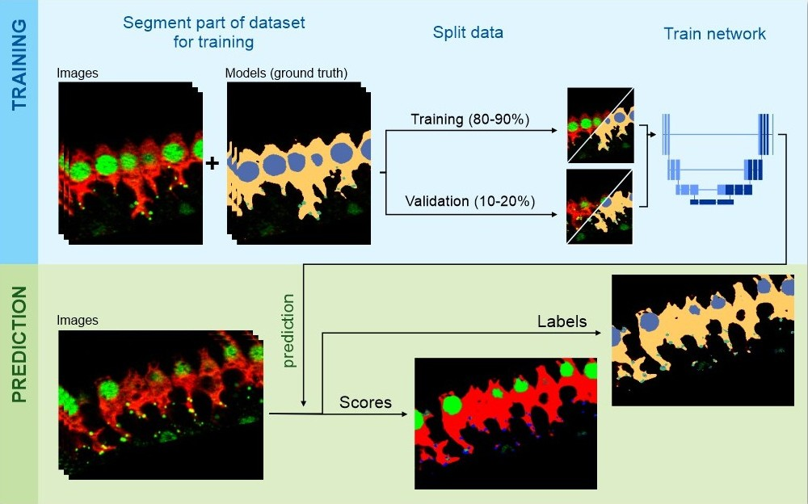
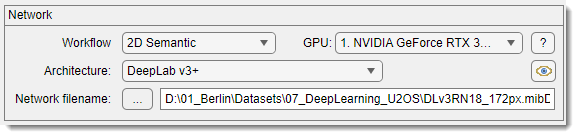
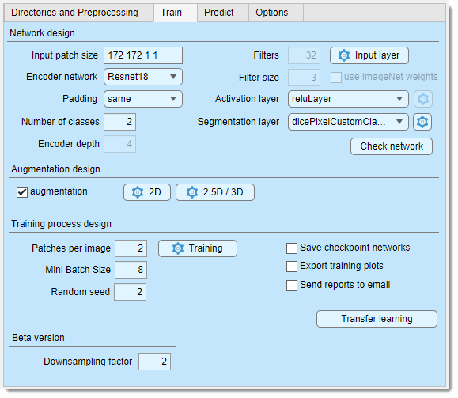
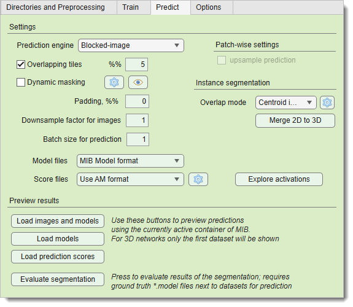
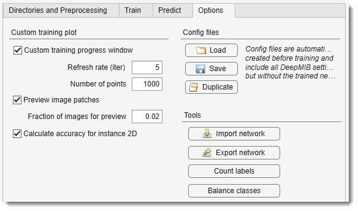

# Deep MIB - Segmentation Using Deep Learning

Tools for training and applying deep convolutional networks for image segmentation 
in Microscopy Image Browser.

---

## Overview

{.on-glb width="400" align=left}

The **Deep MIB** tool in MIB enables training of deep convolutional networks on user data and their application for image 
segmentation tasks. 

It supports a typical semantic segmentation workflow consisting of two phases:

- **Network training**: users define the network architecture via the *Network panel* and provide images and ground truth labels through the *Directories and Preprocessing tab*. the data is split into training (most of the data) and validation sets. the network trains on the training set and evaluates performance on the validation set using the *Train tab*.
- **Image prediction**: the trained network is saved to disk and can be used to segment new datasets via the *Predict tab*.

{.on-glb}

In addition to semantic segmentation, Deep MIB also offers a **2D instance segmentation**
workflow (SOLOv2), which detects each object individually. See
[2D Instance Segmentation (SOLOv2)](deepmib-instance.md) for the full procedure.

## Getting started

For detailed tutorials, refer to:

**Newest tutorial**:  
- [:fontawesome-brands-youtube:{.red-color} Deep-learning segmentation using 2.5D Depth-to-Colors workflow in MIB](https://youtu.be/ZO-WmMijN0U)

**Older tutorials**:  
- [:fontawesome-brands-youtube:{.red-color} DeepMIB: 2D U-net for image segmentation](https://youtu.be/gk1GK_hWuGE)  
- [:fontawesome-brands-youtube:{.red-color} DeepMIB: 3D U-net for image segmentation](https://youtu.be/U5nhbRODvqU)  
- [:fontawesome-brands-youtube:{.red-color} DeepMIB, features and updates in MIB 2.80](https://youtu.be/iG_wsxniBKk) (recommended for workflow without preprocessing)  
- [:fontawesome-brands-youtube:{.red-color} DeepMIB, 2D Patch-wise mode](https://youtu.be/451nwPxyD-Q)

**Trained networks and examples**:  
- [:fontawesome-brands-youtube:{.red-color} Deep learning segmentation projects of FIB-SEM dataset of a U2-OS cell](https://youtu.be/-IXB4Da9VMw)

**Generation of patches**: 
- [:fontawesome-brands-youtube:{.red-color} Generation of patches for deep learning segmentation](https://youtu.be/QrKHgP76_R0?si=j_58ipCpp6Sn7r11)

See the sections below for detailed options in Deep MIB. for available workflows 
and networks, refer to the [Network panel](deepmib-networks.md) section.

---

## Example networks

Demo pretrained Deep MIB projects are available for download and testing.  
Access them via 
**Ribbon → Home → Example datasets → DeepMIB projects**. 
Detailed information is provided in the
[Ribbon → Home](../ribbon/home/index.md#example-datasets).

---

## Network panel

The *Network panel* selects the workflow and convolutional network architecture for training.

For more details, see [Details of the Network panel](deepmib-networks.md).

---

## Directories and Preprocessing tab

{.on-glb align=left width="300"}

The *Directories and Preprocessing tab* specifies directories for training and prediction images, along with parameters for image loading and preprocessing.

For more details, see [Details of the Directories and Preprocessing tab](deepmib-dirs.md).

---

## Train tab

{.on-glb align=left width="300"}

The *Train tab* configures settings for generating and training the deep convolutional network.

For more details, see [Details of the Train tab](deepmib-train.md).

---

## Predict tab

{.on-glb align=left width="300"}

The *Predict tab* loads trained networks into Deep MIB for segmenting new datasets.

For more details, see [Details of the Predict tab](deepmib-predict.md).

---

## Options tab

{.on-glb align=left width="300"}

The *Options tab* provides additional settings and configurations.

For more details, see [Details of the Options tab](deepmib-options.md).

---

*Back to [MIB](../../index.md) | [User interface](../index.md)*