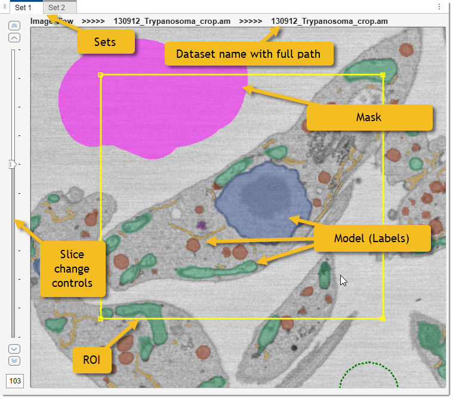
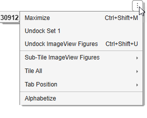
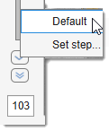
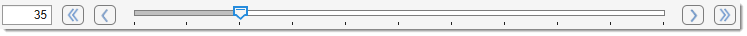

# Image Document

The **Image Document** is the central workspace in MIB3 where datasets are displayed and interacted with.
Each open dataset occupies its own document — a dockable, tabbed window within the MIB application frame.

!!! info "MIB2 comparison"
    In MIB2 the equivalent component was the fixed **Image View Panel**. MIB3 replaces it with a
    multi-document (MDI-style) design: each dataset lives in its own document tab that can be docked,
    floated, or arranged in a split-panel layout side by side.

---

## Overview

{.on-glb}
/// caption
An Image Document showing multiple overlaid layers. Navigation controls run along the bottom.
///

Each Image Document consists of:

- **Image view axes** — the main viewing area, rendering the current slice with all visible layers.
- **Z navigation** — slice controls on the left side (hidden for single-slice datasets).
- **T navigation** — time-frame controls on the bottom of the panel (hidden for single-frame datasets).

The document title bar shows the set name while additionally informs about the dataset index and its filename in a tooltip upon hovering with mouse

???+ info "MIB organises open datasets in a two-level hierarchy"

    - A **set** is a named group that holds up to 10 datasets (buffers). Sets are created and managed in the [Dataset panel](../panels/datasets/index.md).
    - A **buffer** is one of the up to 10 dataset slots inside a set. Switching between buffers within the same set is fast and does not reload data from disk.

{align=right}

A context menu at the right top corner gives access to variety of options to arrange the sets including 
a possibility to completely undock the set from the main MIB window.

Documents can be:

- **Tabbed** — stacked behind each other and selected by tab.
- **Split** — tiled side by side to compare two datasets simultaneously.
- **Floating** — undocked into a separate window.

---

## Image layers

The image axes display multiple layers simultaneously:

{.on-glb}

- **Image** — the raw grayscale or multichannel data.
- **Labels** (model) — segmented materials or a difference map for correlation analysis.
  See [Image Layers](../image-layers.md) for details.
- **Mask** — a binary support layer that extends operations on the Labels layer: it can be combined with materials via union, intersection, 
and subtraction, and it can be used to limit segmentation tools to the masked area only. 
The Mask is also used as a seed region for local thresholding with the [BW Thresholding tool](../panels/segm/segm-bwthres.md).
- **Selection** — a temporary layer modified during segmentation before being committed to Mask or Labels.
- **ROI** — Regions of Interest overlaid when ROI mode is active.

Adjust layer colors and transparency with sliders in the
[View Settings panel](../panels/selection_imview/viewsettings.md) or via
**Ribbon → Home → Preferences → [Colors and styles](../ribbon/home/home-preferences.md#colors-and-styles)**.

---

## Z navigation (slices)

Controls for scrolling through Z-slices appear at the panel left side.
They are hidden when the dataset has only one slice.

| Control | Action |
|---------|--------|
| &#124;&lt; **First** | Jump to slice 1 |
| &lt; **Prev** | Go to the previous slice |
| Z slider | Drag to scrub through slices |
| &gt; **Next** | Go to the next slice |
| &gt;&#124; **Last** | Jump to the last slice |
| 1 | Type a slice number and press ++enter++ |

### Slider step size

{align=left}

<mouse class="right"></mouse> the Z slider to open its context menu:

- **Default** — reset step to 1 (normal) and 10 (++shift++).
- **Set step…** — enter custom step values for normal and ++shift++ scrolling.

The same step is used by the mouse wheel and keyboard arrow keys.

---

## T navigation (time frames)

{align=left}

Controls for stepping through time points appear at the bottom right.
They are hidden for single-frame datasets. 

<mouse class="right"></mouse> the T slider opens the same context menu as the Z slider.

| Control | Action |
|---------|--------|
| 1 | Type a frame number and press ++enter++ |
| &#124;&lt; **First** | Jump to frame 1 |
| &lt; **Prev** | Go to the previous frame |
| T slider | Drag to scrub through frames |
| &gt; **Next** | Go to the next frame |
| &gt;&#124; **Last** | Jump to the last frame |

---

## Mouse actions

| Action | Effect                                                                                                                                                                                                 |
|--------|--------------------------------------------------------------------------------------------------------------------------------------------------------------------------------------------------------|
| Move mouse | Pixel coordinates and intensity shown in the [Status Bar](../statusbar/index.md)                                                                                                                       |
| <mouse class="left"></mouse> | Segmentation action for the active tool in the [Segmentation panel](../panels/segm/index.md)                                                                                                           |
| <mouse class="right"></mouse> + drag | Pan the image                                                                                                                                                                                          |
| ++ctrl++ + <mouse class="left"></mouse> | Erase from the current selection                                                                                                                                                                       |
| **Mouse wheel** | Change slices (scroll mode) or zoom in/out centred on cursor (zoom mode)                                                                                                                               |
| ++shift++ + **Mouse wheel** | Navigate 10 slices at a time (adjustable via slider context menu)                                                                                                                                      |
| ++alt++ + **Mouse wheel** | Navigate time frames (requires **Preferences → User interface → Alt with scroll wheel**) :material-information-outline:{.red-color title="May not yet work properly due to AppContainer limitations" } |
| ++ctrl++ + **Mouse wheel** | Adjust brush / tool size by ±1                                                                                                                                                                         |
| ++ctrl+shift++ + **Mouse wheel** | Adjust brush with bigger increments / tool size by ±5                                                                                                                                                  |

Mouse wheel behavior (slice scroll vs. zoom) is set in
[Ribbon → Home → Preferences → User interface](../ribbon/home/home-preferences.md).

!!! info "Left/right mouse button swap"
    Pan and select operations can be swapped in **Preferences → User interface → Left mouse button** —
    setting it to *Pan* makes <mouse class="left"></mouse> pan and <mouse class="right"></mouse> select.

---

## Important key actions

| Key              | Action                               |
|------------------|--------------------------------------|
| ++w++            | Zoom in towards cursor               |
| ++q++            | Zoom out from cursor                 |
| ++arrow-up++     | Next slice                           |
| ++arrow-down++   | Previous slice                       |
| ++arrow-right++  | Next time frame                      |
| ++arrow-left++   | Previous time frame                  |
| ++ctrl++ + ++f++ | Find material index under the cursor |

Customize shortcuts in [Ribbon → Home → Preferences → Keyboard shortcuts](../ribbon/home/home-preferences.md#keyboard-shortcuts). 
Full list: [Key and Mouse Shortcuts](../key-and-mouse-shortcuts.md).

---

## Drag and drop

Files can be loaded by dragging them directly from a file explorer onto the Image Document:

| File | Result |
|------|--------|
| Image files | A dialog asks whether to load the file as a new **image** dataset or as a **labels model** |
| `.model` files | Loaded as a labels model |
| `.mask` files | Loaded as the mask layer |
| `.ann` files | Loaded as annotations |

---

*Back to [MIB](../../index.md) | [User interface](../index.md)*
