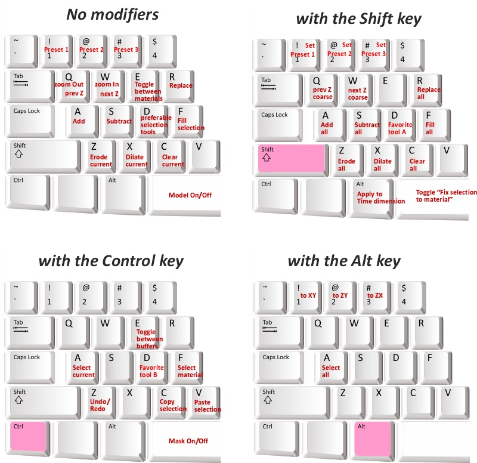

# Key and Mouse Shortcuts

---

## Overview

This page lists key and mouse shortcuts to streamline your workflow in Microscopy Image Browser.

- [:fontawesome-brands-youtube:{.red-color} Demo](https://youtu.be/qrLyrP9f018)

---

## General notes

These shortcuts assume default settings:

- <mouse class="left"></mouse> for drawing/selection 
- <mouse class="right"></mouse> for panning
??? info
    Swap these in the [Preferences dialog](ribbon/home/home-preferences.md) under Mouse settings.

- :material-mouse-scroll-wheel:{.orange-color} **mouse wheel**: changes slices by default, while ++q++ / ++w++ can be used to zoom-out and zoom-in. 
??? info
    Swap this behavior in [Preferences](ribbon/home/home-preferences.md#user-interface).

- Customize shortcuts in [Ribbon -> Home -> Preferences -> Keyboard shortcuts](ribbon/home/home-preferences.md#keyboard-shortcuts).

---

## Combination of mouse and keys

- :material-cursor-default:{.orange-color} **move cursor**: Displays intensity and coordinates in the [Status Bar](statusbar/index.md#pixel-info).
- :material-mouse-scroll-wheel:{.orange-color} **mouse wheel**: changes slices or zooms (depening on settings in [Preferences](ribbon/home/home-preferences.md)).
- ++shift++ + :material-mouse-scroll-wheel:{.orange-color}:  **mouse wheel**: jumps 10 slices up/down (adjustable via <mouse class="right"></mouse> on the 
slice slider in the [Image View Panel](image-document/index.md#slider-step-size)).
- ++alt++ + :material-mouse-scroll-wheel:{.orange-color} **mouse wheel**: :material-information-outline:{.red-color title="May not work due to limitation of AppContainers framework" }
     - scrolls time points for 5D datasets (if set in [Preferences -> User Interface -> Hold Alt with Scroll Wheel: Scroll time points](ribbon/home/home-preferences.md#user-interface)).
     - returns to the original slice (if set to *Return to the slice* in [Preferences](ribbon/home/home-preferences.md#user-interface)).
- ++alt++ + ++shift++ + :material-mouse-scroll-wheel:{.orange-color}:  **mouse wheel**: jumps 10 time points (adjustable via <mouse class="right"></mouse> on the slice 
  slider in the [Image View Panel](image-document/index.md#slider-step-size)).
- <mouse class="left"></mouse>: selects pixels based on the method in the [Segmentation Panel](panels/segm/index.md).
- Hold <mouse class="right"></mouse> to pan the image left/right and up/down.
!!! info "Alternative syntax" 
    Alternative shortcut for usage with a touch screen: ++ctrl++ + ++alt++ + ++shift++ + <mouse class="right"></mouse> 
- ++shift++ + <mouse class="left"></mouse>: adds to the existing selection. For the
[Brush](panels/segm/segm-brush.md) in the Watershed /
SLIC mode it also paints that stroke as a standard brush,
without snapping to superpixels.
- ++ctrl++ + <mouse class="left"></mouse>: removes from the existing selection ([eraser](panels/segm/segm-brush.md), negative seeds in the [Segment Anything Model](panels/segm/segm-sam.md) tool).
- ++ctrl++ + :material-mouse-scroll-wheel:{.orange-color} **mouse wheel** or ++bracket-left++ ++bracket-right++ or ++shift++ + ++bracket-left++ / ++bracket-right++: 
adjust brush/selection tool size.
- ++ctrl++ + ++shift++ + :material-mouse-scroll-wheel:{.orange-color} **mouse wheel**: adjusts brush/selection tool size in larger increments.

---

## Interaction with ROIs

To edit ROIs (e.g., size or position), use <mouse class="right"></mouse> on the ROI name in the [ROI Panel](panels/roi/index.md) list, 
then press Modify. 

---

## Keyboard shortcuts

{align=left}

| Shortcut                                                                                   | Action                                                                                                                                               |
|--------------------------------------------------------------------------------------------|------------------------------------------------------------------------------------------------------------------------------------------------------|
| ++arrow-left++, ++arrow-right++   ++alt++ + ++q++ / ++alt++ + ++w++                     | changes time points (enabled when mouse wheel is in zoom mode; see [Preferences](ribbon/home/home-preferences.md)).                                    |
| ++arrow-up++, ++arrow-down++                                                               | changes slice (Z) up/down.                                                                                                                           |
| ++q++                                                                                      | zooms out or goes to previous slice (depending on chosen settings in [Preferences](ribbon/home/home-preferences.md)).                                  |
| ++w++                                                                                      | zooms in or goes to next slice (depending on chosen settings in [Preferences](ribbon/home/home-preferences.md)).                                       |
| ++space++                                                                                  | toggles Model layer visibility.                                                                                                                      |
| ++ctrl++ + ++space++                                                                       | toggles Mask layer visibility.                                                                                                                       |
| ++shift++ + ++space++                                                                      | toggles Fix selection to material in the [Segmentation Panel](panels/segm/index.md).                     |
| ++a++                                                                                      | adds Selection (current slice) to the selected material or Mask (depending on **Add to** in the [Segmentation Panel](panels/segm/index.md)).         |
| ++shift++ + ++a++                                                                          | adds Selection (all slices) to the selected material or Mask.                                                                                        |
| ++shift++ + ++alt++ + ++a++                                                                | adds Selection (all slices and time points) to the selected material or Mask.                                                                        |
| ++ctrl++ + ++a++                                                                           | selects Mask (if shown) or the selected material (depending on **Select from** in [Segmentation Panel](panels/segm/index.md)) for the current slice. |
| ++alt++ + ++a++                                                                            | selects Mask (if shown) or the selected material (all slices).                                                                                       |
| ++s++                                                                                      | subtracts Selection (current slice) from the selected material or Mask.                                                                              |
| ++shift++ + ++s++                                                                          | subtracts Selection (all slices) from the selected material or Mask.                                                                                 |
| ++shift++ + ++alt++ + ++s++                                                                | subtracts Selection (all slices and time points) from the selected material or Mask.                                                                 |
| ++r++                                                                                      | replaces (current slice) the selected material or Mask with Selection.                                                                               |
| ++shift++ + ++r++                                                                          | replaces (all slices) the selected material or Mask with Selection.                                                                                  |
| ++shift++ + ++alt++ + ++r++                                                                | replaces (all slices and time points) the selected material or Mask with Selection.                                                                  |
| ++c++                                                                                      | clears Selection (current slice).                                                                                                                    |
| ++shift++ + ++c++                                                                          | clears Selection (all slices).                                                                                                                       |
| ++shift++ + ++alt++ + ++c++                                                                | clears Selection (all slices and time points).                                                                                                       |
| ++f++                                                                                      | fills holes in Selection (current slice).                                                                                                            |
| ++shift++ + ++f++                                                                          | fills holes in Selection (all slices).                                                                                                               |
| ++shift++ + ++alt++ + ++f++                                                                | fills holes in Selection (all slices and time points).                                                                                               |
| ++ctrl++ + ++f++                                                                           | finds material index under the cursor and selects it in the [Segmentation Table](panels/segm/index.md#segmentation-table).                           |
| ++z++                                                                                      | erodes (shrinks) Selection (current slice; 3D if enabled in [Selection Panel](panels/selection_imview/selection.md)).                                           |
| ++shift++ + ++z++                                                                          | erodes Selection (all slices, 2D).                                                                                                                   |
| ++shift++ + ++alt++ + ++z++                                                                | erodes Selection (all slices and time points, 2D).                                                                                                   |
| ++x++                                                                                      | dilates (expands) Selection (current slice; 3D if enabled in [Selection Panel](panels/selection_imview/selection.md)).                                          |
| ++shift++ + ++x++                                                                          | dilates Selection (all slices, 2D).                                                                                                                  |
| ++shift++ + ++alt++ + ++x++                                                                | dilates Selection (all slices and time points, 2D).                                                                                                  |
| ++bracket-left++ or ++bracket-right++  ++shift++ + ++bracket-left++ / ++bracket-right++ | Changes brush/selection tool size (also via ++ctrl++ + ++shift++ + :material-mouse-scroll-wheel:{.orange-color} **Mouse wheel**).                 |
| ++d++                                                                                      | swaps between fast-access selection tools (see [Segmentation Panel: "D" checkbox](panels/segm/index.md#favorite-tool-d-checkbox)).               |
| ++shift++ + ++d++                                                                          | selects favorite tool A (set in [Preferences -> Segmentation tools](ribbon/home/home-preferences.md#segmentation-tools)).                                   |
| ++ctrl++ + ++d++                                                                           | selects favorite tool B (set in [Preferences -> Segmentation tools](ribbon/home/home-preferences.md#segmentation-tools)).                                   |
| ++e++                                                                                      | toggles between two recently selected materials.                                                                                                     |
| ++ctrl++ + ++e++                                                                           | toggles between current and previous image [buffers](panels/datasets/index.md#buffer-buttons).                                           |
| ++ctrl++ + ++z++                                                                           | undoes the last action (use the **Undo** button in the [Quick Access Bar](quick-access-bar/index.md) for deeper history; not for 4D datasets).                         |
| ++ctrl++ + ++c++                                                                           | copies the current Selection layer to the buffer.                                                                                                    |
| ++ctrl++ + ++v++                                                                           | pastes the stored Selection buffer to the current slice.                                                                                             |
| ++ctrl++ + ++shift++ + ++v++                                                               | pastes the stored Selection buffer to all slices.                                                                                                    |
| ++alt++ + ++1++                                                                            | switches to XY view rotating around the current point where mouse cursor points.                                                                     |
| ++alt++ + ++2++                                                                            | switches to YZ view rotating around the current point where mouse cursor points.                                                                     |
| ++alt++ + ++3++                                                                            | switches to XZ view rotating around the current point where mouse cursor points.                                                                     |
| ++f2++                                                                                     | renames the selected material in the [Segmentation table](panels/segm/index.md#segmentation-table).                                                                                         |
| ++shift++ + ++1++ ++shift++ + ++2++ ++shift++ + ++3++                               | stores settings of the selected segmentation tool (except Lasso/Object Picker) as presets 1, 2, or 3.                                                |
| ++1++, ++2++, ++3++                                                                        | restores settings for the selected segmentation tool from presets 1, 2, or 3.                                                                        |

---

*Back to [MIB](../index.md) | [User Interface](index.md)*