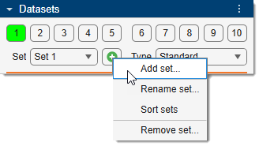
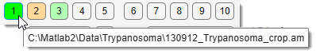
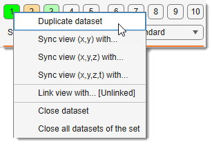
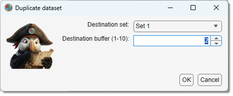
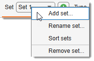

# Datasets Panel

{align=left}

The **Datasets panel** manages all open datasets in MIB.
It provides numbered buffer buttons to switch between datasets, a sets dropdown to organise buffers into named groups,
and a dataset-type selector that controls how each dataset is stored in memory.

---

## Overview

The panel contains three areas from top to bottom:

1. **Buffers 1–10** — individual dataset slots within the active set.
2. **Sets** — named groups of buffers, with controls to add and manage them.
3. **Dataset type** — memory/access mode for the dataset in the active buffer.

---

## Buffer buttons

{align=left}

Ten numbered buttons (**1** through **10**) represent the dataset containers (buffers) within the active set.

* <mouse class="left"></mouse> to make it the active buffer — its dataset is shown in the Image Document.
* <mouse class="right"></mouse> to open a context menu with additional options (see below)
* Hover over any button to see the filename of the dataset loaded in that buffer

Button color indicates the state of each buffer:

| Color        | Meaning                                                   |
|--------------|-----------------------------------------------------------|
| Bright green | Active buffer — currently displayed in the Image Document |
| Light green  | Buffer contains a loaded dataset                          |
| Light orange | Buffer contains a loaded but not saved dataset            |
| Default      | Buffer is empty                                           |

### Buffer context menu

{align=right}

<mouse class="right"></mouse> any buffer button for per-buffer operations:

| Menu item | Action |
|-----------|--------|
| **Duplicate** | Copy this dataset to another buffer (prompts for destination set and buffer) |
| **Sync XY** | Copy view position and zoom from another buffer |
| **Sync XYZ** | Copy view position, zoom, and current Z-slice from another buffer |
| **Sync XYZT** | Copy view position, zoom, Z-slice, and time frame from another buffer |
| **Link view with… \[Unlinked\]** | Link this buffer's view to another buffer — scrolling one updates the other |
| **\[Linked: A ↔ B\] press to unlink** | Unlink the currently linked pair |
| **Close** | Close the dataset in this buffer (resets it to an empty placeholder) |
| **Close Set** | Close all datasets in the entire current set |

#### Duplicate

{align=right width="300" .on-glb}

Copies the full dataset (image, labels, mask, selection, annotations) to a destination buffer.
A dialog lets you choose the destination set and buffer number.

!!! warning
    Duplicating to a non-empty buffer overwrites the existing dataset after a confirmation prompt.

#### Sync views

All three sync modes align the view of one buffer to match another:

| Mode | Dimensions synced |
|------|------------------|
| **Sync XY** | Pan position + zoom |
| **Sync XYZ** | Pan + zoom + Z slice |
| **Sync XYZT** | Pan + zoom + Z slice + time frame |

!!! warning 
    Both datasets must be in the same orientation (XY, ZX, or ZY) for sync to work.

#### Link views

When two buffers are linked, navigating in one (slice, zoom, pan) automatically mirrors the same
view state in the other. Useful for comparing two registered datasets side by side.

Toggle buffers with Ctrl + E.  
  [:fontawesome-brands-youtube:{.red-color} Demonstration](https://youtu.be/DvSBBSuEiDo)

!!! warning
    Both buffers must be in the same orientation before linking.
    Linked-view state is shown in the button tooltip and in the context menu label.

---

## Sets

{align=left}

A **set** is a named group of 10 buffers, each capable of holding one dataset.
Multiple sets allow you to organise unrelated groups of datasets independently.
Each set corresponds to one [Image Document](../../image-document/index.md) tab in the main workspace.

### Sets dropdown

Set 1
Selects the active set. Switching sets also switches the visible Image Document tab.

<mouse class="right"></mouse> the dropdown to open the sets context menu:

| Menu item | Action |
|-----------|--------|
| **Add set** | Create a new set (prompts for a name) |
| **Rename set** | Rename the currently active set |
| **Sort sets** | Sort all sets alphabetically |
| **Remove set** | Close all datasets in the set and remove it |

!!! warning
    **Remove set** closes all datasets in that set without additional confirmation per buffer.

### Add set button

+
Shortcut to add a new set, equivalent to *Sets context menu → Add set*.

---

## Dataset types

{align=left}

Standard
Sets the memory/access mode for the dataset in the active buffer.

When a real dataset is open, switching the type shows a confirmation first (the current dataset is closed
or converted); switching the type of an empty/placeholder buffer happens silently. 

Choosing **BigData** while a dataset is open offers **Convert current** (write the open image to an OME-Zarr v3 pyramid on disk
and reopen it in BigData mode) or **New** (start an empty BigData placeholder).

| Type | In memory? | Editable model? | Typical use |
|------|:----------:|:---------------:|-------------|
| **Standard** | whole dataset in RAM | ✅ full | small–medium datasets |
| **Virtual** | read on demand | ❌ browse-only | quickly browse datasets too large for RAM |
| **BigData** | read on demand, pyramidal | ✅ disk-backed model | segment datasets far larger than RAM |

### Standard

The entire dataset is loaded into RAM. This is the default and the most capable mode.

Benefits

- Best performance — all pixels are immediately in memory.
- **All** tools, filters, processing and export formats are available.
- Full multi-step Undo/Redo.

Limitations

- The dataset (and its model/mask/selection layers) must fit in RAM, with headroom for processing.
- Not suitable for datasets larger than available memory — use **Virtual** (to browse) or **BigData**
  (to browse *and* segment) instead.

### Virtual

Pixels are read from disk **on demand** (e.g. an OME-Zarr v3 pyramid, HDF5, or a BioFormats-backed file),
so only the currently viewed region is held in memory.

Benefits

- Open and **browse** datasets far larger than RAM with a small memory footprint.
- Supports more on-disk formats than BigData (anything the virtual readers can stream).

Limitations

- **Browse-only** — segmentation layers (Selection, Mask, Model) and most pixel-editing/processing
  tools are disabled; Undo is not kept for these layers.
- Slower per access than Standard (each view reads from disk).
- To segment a large dataset instead of just viewing it, use **BigData**.

### BigData

For datasets **too large to fit in RAM that you also want to segment**. The image is a pyramidal,
chunked **OME-Zarr v3** store read on demand (zoom selects the matching resolution level; pan reads only
the visible region), and the segmentation **model is a disk-backed, pyramidal 63-class store** that mirrors
the image pyramid. Edits are written straight to disk and propagated across levels, so a model can be far
larger than memory and survives across sessions.

Benefits

- **Segment** datasets much larger than RAM — only the visible region/level is ever in memory.
- The model is **saved live to disk** (an OME-Zarr v3 group next to the image) and reloads across sessions;
  material names and colours are preserved.
- Smooth zoom/pan and **orientation switching** (XY / ZX / ZY) by reading the appropriate pyramid level.
- Export any pyramid level to standard formats, streamed slice-by-slice for the memory-optimized formats
  (see [Save Image As](../../ribbon/home/index.md#save-image-as) and
  [Save model as...](../../ribbon/model/index.md#save-model-as)).
- Selectable Zarr backend (native `zarrMex` or `zarr-python`); define in [Preferences->Input / Output](../../ribbon/home/home-preferences.md#input-output)

Limitations

- Reads **OME-Zarr v3 only**. Other formats (TIFF, HDF5, BioFormats/WSI, …) must first be **converted** —
  switch the type dropdown to *BigData → Convert current*, or use *Ribbon → Home → Export → Export to Zarr3*, or use
  [Image converter plugin](../../../plugins/file-processing/image-converter.md)
- **Browse-only until a model exists** — create a model (Segmentation panel → *Create*, or *Ribbon → Model →
  New model*, or load one to enable segmentation.
- Up to **63 materials** (packed model), and **a single time point** (time-series is not yet supported).
- The **source image is read-only** — you edit the model, not the image pixels. To change image pixels,
  convert the (cropped) region to Standard.
- Edits drawn while **zoomed out** are captured at the displayed (coarser) level and then propagated, so
  fine detail is limited by the zoom at which you paint. An optional smoothing reduces blockiness of
  upsampled edits (*Preferences → Input/Output → Zarr → Smoothing*).
- A few tools are **not available**: [Object Picker](../segm/segm-objpick.md),
  [Black-and-White Thresholding](../segm/segm-bwthres.md), and SAM's *Automatic everything*. Each
  [segmentation tool page](../segm/index.md) states its BigData support.

!!! tip "Getting into BigData mode"
    Open a `.zarr3` dataset directly (it opens as BigData), or switch an open Standard/Virtual dataset with
    the **Dataset type → BigData** dropdown and choose *Convert current*.

---

*Back to [MIB](../../../index.md) | [User interface](../../index.md) | [Panels](../index.md)*
