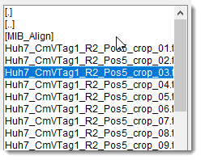
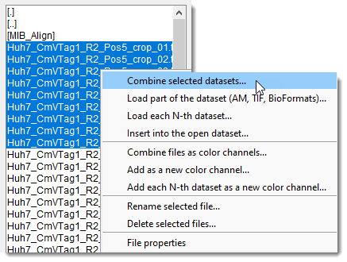
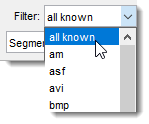
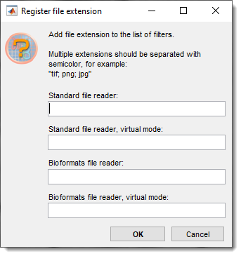

# Directory Contents Panel

---

## Overview

{.on-glb width="400" align=left} 

This panel displays a list of files in the selected directory and provides the option to filter them based on known image and video formats.

---

## File list box

{align=left}

The major part of the panel is occupied by a list box that displays files in the selected directory, 
chosen from the **Load** button of the [Home ribbon](../../ribbon/home/index.md#load) the **Working directory** of the [Status Bar](../../statusbar/index.md#working-directory). 
 Files are filtered based on the specified filter.
Selecting Filter: all known displays all readable formats.

Navigating folders

- Double-clicking \[.\] changes the folder to the top level of the current logical drive.
- Double-clicking \[..\] changes the folder to one level up.
- Double-clicking \[DIR NAME\] navigates MIB into the clicked directory and shows files inside it
 (`MIB_Align` folder in the snapshot)

Selecting and loading datasets

- Double-<mouse class="left"></mouse> a file loads it into MIB and displays it in the
[Image Document](../../image-document/index.md).
- Select individual datasets by holding Shift or 
Ctrl and clicking <mouse class="left"></mouse> on files. 
Load them via the context menu (*Combine selected datasets*, see below for details and options).
- To load **zarr3** BigData type dataset - select the directory (`*.zarr3`) and open it using *Combine selected datasets* option of the context menu

Context menu options

{.on-glb align=left width="250"}

The context menu, accessed with <mouse class="right"></mouse>, provides these operations on 
selected datasets

- **Combine selected datasets**: combine selected datasets into a single 3D stack.

??? info "Working with OME-Zarr"

    It is possible to open OME-Zarr version 2 or version 3 (MIB version 2.92 beta 8 or newer). 

    To open the dataset:

    - make sure that the directory has `.zarr`, `.zarr2`, `.zarr3` ending
    - select the directory using the <mouse class="left"></mouse>
    - open the OME-Zarr dataset using the `Combine selected datasets` option 

    A plain `.zarr` ending does not say which zarr version the store uses, so MIB detects
    it from the store itself and picks the matching reader.

    **Nested containers.** Many stores keep the image group below the root rather than at it,
    for example the MoBIE / OpenOrganelle layout where the pyramid lives in
    `<name>.zarr/recon-1/em/fibsem-uint8`, or an OME-Zarr label container. Select the top
    `.zarr` directory as usual - MIB searches the container and opens the image group it
    finds. When a container holds several image groups (an image plus its labels, several
    channels, ...), a dialog lists them so you can choose which one to open.

- **Load part of the dataset (AM, TIF, BioFormats)**: load a specific part of a larger dataset, defining start/end points, z-step, and XY binning
(available for Amira Mesh, TIF, and BioFormats-readable datasets) [:fontawesome-brands-youtube:{.red-color} demo](https://youtu.be/sae--XHIjwc).
- **Load each N-th dataset**: assemble every N-th file into a 3D stack.
- **Insert into the open dataset**: insert selected files into the currently open dataset.
- **Combine as color channels**: combine selected datasets into a single 2D slice, each assigned to 
a color channel.
- **Add as a new color channel**: add images as a new color channel to the existing dataset. 
Select channels in the [View Settings panel](../selection_imview/viewsettings.md).
- **Add each N-th dataset as a new color channel**: add images with an N-step as a new color channel to the existing dataset.
- **Rename selected file**: rename the selected file.
- **Delete selected files**: permanently delete selected files from the disk.
- **File properties**: show file details like date/time and size in bytes.

---

## Filter

{align=left}

The Filter dropdown allows filtering the file list 
based on available image type filters. 
 Available extensions depend on whether the standard 
or [Bio-Formats reader](https://www.openmicroscopy.org/bio-formats/) is used and if 
virtual mode is enabled, resulting in four filter configurations.

??? info "Modify extensions in the filter list"
    {.on-glb align=left width="260"}    
    
    To modify file extensions the list of filters:

    - <mouse class="right"></mouse> click over Filter.
    - Choose an option:
        - **Register extension**: add extensions to the filter list.
        - **Remove selected extension**: remove a selected extension from the filter list.

---

## Bio checkbox

When Bio is checked, 
the [Bio-Formats reader](http://openmicroscopy.org/info/bio-formats) loads datasets. 
 MIB supports specific biological image formats (native to various microscopes) via the 
Bio-Formats Java library, stored in 
the `mib\jars\BioFormats` directory.

!!! note
    Performance of the Bio-Formats reader may be slower than standard native readers due to Java-related overheads.

---

## Update button

The Update button refreshes the file list in the Directory Contents panel.

---

## Help button

The ? button links to this help page.

---

*Back to [MIB](../../../index.md) | [User interface](../../index.md) | [Panels](../index.md)*