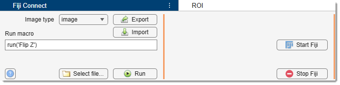
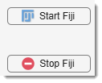
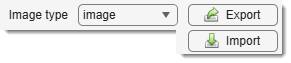
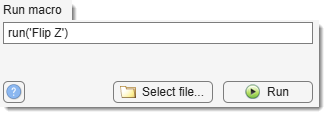

# Fiji Connect Panel

---

## Overview

{align=left}

The **Fiji Connect Panel** enables communication with [Fiji](http://fiji.sc/Fiji), 
an image processing software, using the [MIJ](http://bigwww.epfl.ch/sage/soft/mij/) 
Java package for bidirectional data exchange between MATLAB and ImageJ/Fiji. 
MIJ is developed by Daniel Sage, Dimiter Prodanov, Jean-Yves Tinevez, and Johannes Schindelin.
Ensure Fiji is installed and MIJ is integrated (see [System Requirements](https://mib.helsinki.fi/downloads_systemreq.html#fiji)).

[:fontawesome-brands-youtube:{.red-color} Visualization of datasets and models using Fiji](https://youtu.be/DZ1Tj3Fh2HM?list=PLGkFvW985wz8cj8CWmXOFkXpvoX_HwXzj)

---

## Start Fiji and Stop Fiji buttons

{align=left}

Start Fiji: launches Fiji from MATLAB, 
required for communication. 
??? warning 
    Press this button first before any actions!

Stop Fiji closes Fiji when it is not needed anymore.

---

## Image Type and Import/Export buttons

{align=left}

Image Type dropdown

Specifies the layer (e.g., Image, Model, Mask, Selection) to exchange with Fiji. 
!!! tip "Example"

    For example, selecting **Image** and pressing 
    Export sends the current image to Fiji. 
    See *Finding Edges using Fiji* below for details.

Export: sends the current dataset 
(based on Image Type) to Fiji for processing 
or analysis.

Import: iImports datasets from Fiji into 
MIB’s Image, Model, Mask, or Selection layers, as set by 
Image Type. 
Ensure Model, Mask, and Selection sizes match the Image layer in MIB.

---

---

## Run macro or send a command to Fiji

{align=left}

Run macro edit box
Enter a Fiji macro command (e.g., `run('Flip Z')` to flip 
the Z-dimension). A template is shown by default.  
Alternatively, input a path to a text file with multiple macros, 
selected via Select file....  
Check [Miji](http://fiji.sc/Miji) for syntax.

Select file... button: opens 
a dialog to choose a text file containing macro commands for execution
with Run.  
See [Miji](http://fiji.sc/Miji) for syntax.

Run button: executes the macro in 
Run macro. 
If a file path is provided, it runs all macros in that script.

---

## Help button

?: opens the help documentation for detailed instructions.

---

## Example: Finding edges using Fiji

This example shows how to detect edges in a 3D grayscale dataset and import a binary mask into MIB.

???+ info "Steps (assuming Fiji is installed and configured)"
    1. Get a test dataset from `Ribbon → Home -> Example datasets -> SBEM -> Huh7 and model`.
    2. Open the dataset in MIB.
    3. Press Start Fiji to launch Fiji.
    4. To send the image to Fiji, select **Image** in Image Type 
    and press Export.
    5. Name the dataset in the dialog that appears.
    6. In Fiji, find edges: `Menu -> Process -> Find Edges`.
    7. Generate a binary image: `Menu -> Image -> Adjust -> Auto Threshold`, set **Method** to **Mean**, 
    check Stack, and press OK.
    8. In MIB, select **Mask** in Image Type and press Import.
    9. MIB now has a new Mask layer from Fiji.

---

*Back to [MIB](../../../index.md) | [User Guide](../../index.md) | [Panels](../index.md)*