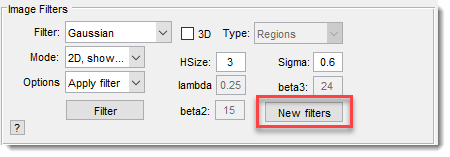
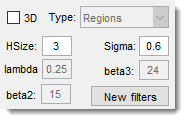

# Image Filters Panel

---

## Overview

{align=left}

The **Image Filters Panel** lets you apply various 2D and 3D image filters to enhance or process your dataset.

[:fontawesome-brands-youtube:{.red-color} MIB in brief: Image filters](https://youtu.be/VwEPZxObA5U)
 

!!! tip "Note on updated filters"

    Image filters have been significantly updated. For the best experience, 
    use the new filters dialog via the New filters 
    button or [Ribbon → Image -> Image filters](../../ribbon/image/image-filters.md).

---

## Image Filter

Image Filter: select a filter from a list of 2D and 3D options.  
Depending on the filter, specify additional parameters in edit boxes 
like HSize, 
Sigma, 
lambda, 
Type, 
Angle, 
and Iter.

???+ info "List of available filters"

    - **Average** (*2D*): MATLAB averaging filter. See [fspecial](https://se.mathworks.com/help/releases/R2024b/images/ref/fspecial.html) and
    [imfilter](https://se.mathworks.com/help/releases/R2024b/images/ref/imfilter.html) in MATLAB docs.
    - **Disk** (*2D*): MATLAB circular averaging filter (pillbox).  See [fspecial](https://se.mathworks.com/help/releases/R2024b/images/ref/fspecial.html) and
    [imfilter](https://se.mathworks.com/help/releases/R2024b/images/ref/imfilter.html) in MATLAB docs.
    - **DNN Denoise** (*2D*): Denoises images using a [deep neural network](https://se.mathworks.com/help/releases/R2024b/images/ref/denoiseimage.html) (MATLAB R2017b+, requires Neural Network Toolbox and a good GPU).
    - **Gaussian** (*2D*): MATLAB rotationally symmetric Gaussian lowpass filter. See [fspecial](https://se.mathworks.com/help/releases/R2024b/images/ref/fspecial.html) and
    [imfilter](https://se.mathworks.com/help/releases/R2024b/images/ref/imfilter.html) in MATLAB docs.
    - **Gaussian** (*3D*): Based on Dirk-Jan Kroon’s [imgaussian](http://www.mathworks.com/matlabcentral/fileexchange/25397-imgaussian), 
    using multiple 1D kernels.
    - **Gradient** (*2D/3D*): Generates a gradient image.
    - **Frangi** (*2D/3D*): Hessian-based Frangi Vesselness filter for detecting vessels/ridges. 
    Based on Marc Schrijver and Dirk-Jan Kroon’s [implementation](http://www.mathworks.com/matlabcentral/fileexchange/24409-hessian-based-frangi-vesselness-filter). References: Frangi [1998](http://www.dtic.upf.edu/~afrangi/articles/miccai1998.pdf), [2001](http://www.tecn.upf.es/~afrangi/articles/tmi2001.pdf).
    - **Motion** (*2D*): MATLAB filter approximating camera motion. See [fspecial](https://se.mathworks.com/help/releases/R2024b/images/ref/fspecial.html) and
    [imfilter](https://se.mathworks.com/help/releases/R2024b/images/ref/imfilter.html) in MATLAB docs.
    - **Median** (*2D*): MATLAB 2D median filter for reducing "salt and pepper" noise while preserving edges. 
    See [medfilt2](https://se.mathworks.com/help/releases/R2024b/images/ref/medfilt2.html) in MATLAB docs.
    - **Median** (*3D*): MATLAB 3D median filter (R2017a+). 
    See [medfilt3](https://se.mathworks.com/help/releases/R2024b/images/ref/medfilt3.html) in MATLAB docs. [YouTube demo](https://youtu.be/7wZbjyVY5s4).
    - **Perona Malik anisotropic diffusion** (*2D*): Smooths regions while preserving sharp gradients, 
    by [Peter Kovesi](http://www.csse.uwa.edu.au/~pk/Research/MatlabFns/#anisodiff).
    - **Unsharp** (*2D*): Sharpens images using unsharp masking ([imsharpen](https://se.mathworks.com/help/releases/R2024b/images/ref/imsharpen.html), R2013a+) or contrast 
    enhancement ([fspecial](https://se.mathworks.com/help/releases/R2024b/images/ref/fspecial.html)/
    [imfilter](https://se.mathworks.com/help/releases/R2024b/images/ref/imfilter.html), R2012b and older).
    - **Wiener** (*2D*): MATLAB 2D adaptive noise-removal filter ([wiener2](https://se.mathworks.com/help/releases/R2024b/images/ref/wiener2.html)), using pixel-wise Wiener methods.
    - **External: BMxD** (*2D/3D*): Optional block-matching and 3D collaborative filtering. Requires separate installation 
    (see [System Requirements](https://mib.helsinki.fi/downloads_systemreq.html#BMxD)).
    ??? abstract "BM3D and BM4D references"

         - K. Dabov, A. Foi, V. Katkovnik, and K. Egiazarian, "Image 
         denoising by sparse 3D transform-domain collaborative filtering", [IEEE TIP  vol. 16, no. 8, 2007](http://www.cs.tut.fi/~foi/GCF-BM3D); 
         - M. Maggioni, V. Katkovnik, K. Egiazarian, A. Foi, "A Nonlocal 
         Transform-Domain Filter for Volumetric Data Denoising and 
         Reconstruction", [IEEE TIP, vol. 22, no. 1,pp. 119-133 2013](https://doi.org/10.1109/TIP.2012.2210725).

!!! note
    If HSize is a single number, the 3D kernel 
    size is based on pixel size from [Ribbon → Dataset -> Parameters](../../ribbon/dataset/index.md#parameters). 
    If two numbers (e.g., `3;3`), the kernel is 3x3x3.

---

## Mode

Mode: choose the dataset portion to filter:

- **2D, shown slice**: Filters only the current slice.
- **3D, current stack**: Filters the current stack.
- **4D, complete volume**: Filters the entire dataset.

---

## Options

Options: select what happens post-filtration:

- **Apply filter**: Filters and displays the result.
- **Apply and add to the image**: Filters and adds the result to the original image.
- **Apply and subtract from the image**: Filters and subtracts the result from the original image.

---

## Filter settings

{align=left}

Adjust filter parameters with these edit boxes (some may be disabled based on the filter):

- 3D
- Type
- HSize
- lambda
- Sigma
- beta2
- beta3

---

## Filter

Filter button: starts the filtering process.

---

*Back to [MIB](../../../index.md) | [User Guide](../../index.md) | [Panels](../index.md)*