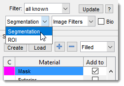
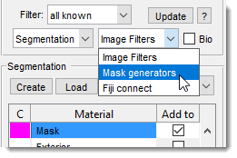

# MIB Panels

*Back to [MIB](../../index.md) | [User interface](../index.md)*

---

## Overview

Microscopy Image Browser (MIB) provides a variety of panels to assist with image processing, segmentation, and analysis. 
These panels are designed to streamline your workflow, offering tools for managing directories, viewing images, and performing 
advanced tasks like segmentation and filtering.
  MIB's panel system includes both fixed and interchangeable panels, giving you flexibility to customize your interface.

---

## Fixed panels

These panels are always visible and provide core functionality for navigating and interacting with your datasets:

- **[Path](path/index.md)**: view and modify the current working directory or file path.
- **[Directory Contents](dircontents/index.md)**: navigate your files and folders, select images to load, options to switch between interchangeable panels using dropdown menus.
- **[Image View](imview/index.md)**: display and interact with your images.
- **[Selection](selection/index.md)**: make and refine selections on your images, with tools for manual and automated selection processes.
- **[View Settings](viewsettings/index.md)**: adjust display options, such as live auto-contrast, color channels, toggle visibility of layers to optimize image viewing.

---

## Left interchangeable panels

{.on-glb align=left width="300"}

These panels can be swapped using the dropdown menu in the [Directory Contents](../panels/dircontents/index.md) panel, allowing you to choose the toolset that best suits your current task.

- **[Segmentation Panel](../panels/segm/index.md)**: Offers a suite of tools for segmenting images, including 3D ball, brush, and advanced AI-based segmentation (e.g., Segment Anything Model).
- **[ROI Panel](../panels/roi/index.md)**: Define and manage regions of interest (ROIs) for focused analysis or measurements.

---

## Right interchangeable panels

{.on-glb align=left width="300"}

These panels are also interchangeable via the [Directory Contents](../panels/dircontents/index.md) dropdown, providing specialized tools for image enhancement and external integration.

- **[Image Filters](../panels/imfilters/index.md)**: Apply filters to enhance or preprocess your images, with options for custom adjustments.
- **[Mask Generators](../panels/maskgen/index.md)**: Create masks to isolate specific image regions, useful for downstream analysis or segmentation.
- **[Fiji Connect](../panels/fijiconnect/index.md)**: Integrate with Fiji (ImageJ) for additional processing capabilities, bridging MIB with external tools.

---

Explore each panel's documentation via the links above to learn more about their specific tools and how they can enhance your microscopy research.

---

*Back to [MIB](../../index.md) | [User interface](../index.md)*