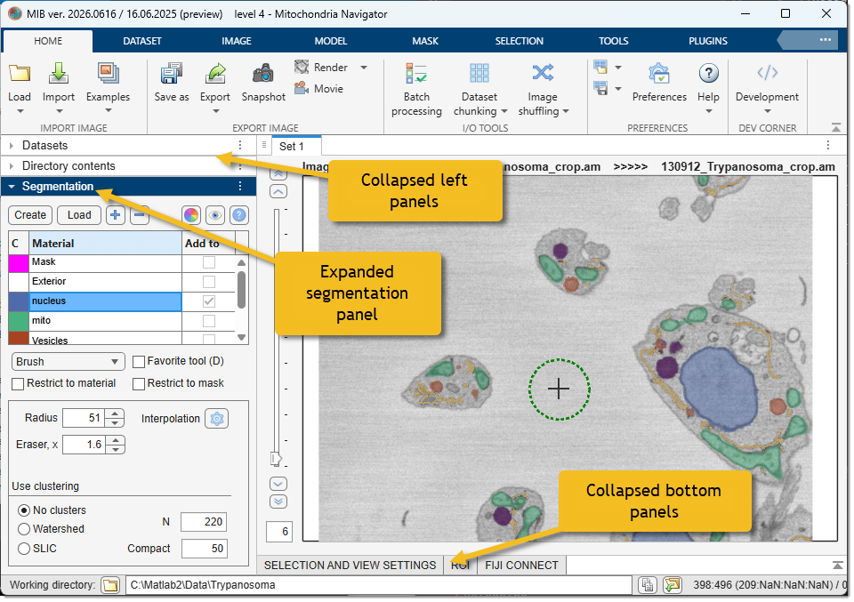

# MIB Panels

## Overview

Microscopy Image Browser (MIB) provides a set of panels to assist with image processing, segmentation, and analysis.

{.on-glb}

MIB3 is built on MATLAB's **AppContainer** framework, which gives every panel a consistent set of layout controls:

- **Resizable** — drag any panel border to redistribute space between panels.
- **Collapsible** — click the panel title bar to collapse it to a slim strip, freeing space for the image area.
- **Moveable** — panels can be dragged to any edge of the MIB window, rearranged, or floated as independent windows, letting you build a layout optimised for your screen and workflow.

---

## Panels

- **[Datasets](datasets/index.md)**: manage up to 10 open dataset buffers per set; switch between them, duplicate, sync or link views, and set the memory access mode.
- **[Directory Contents](dircontents/index.md)**: navigate your files and folders, select images to load, options to switch between interchangeable panels using dropdown menus.
- **[Segmentation](segm/index.md)**: suite of tools for segmenting images, including 3D ball, brush, and advanced AI-based segmentation (e.g., Segment Anything Model).
- **[Selection and View Settings](selection_imview/index.md)**: manipulate the Selection layer (add, subtract, replace, erode, dilate) and control layer visibility, color channels, and contrast.
- **[ROIs](roi/index.md)**: define and manage Regions of Interest for focused analysis or measurements.
- **[Fiji Connect](fijiconnect/index.md)**: integrate with Fiji (ImageJ) for additional processing capabilities, bridging MIB with external tools.

---

*Back to [MIB](../../index.md) | [User interface](../index.md)*
