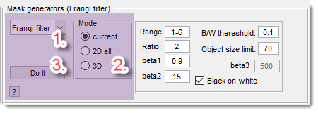
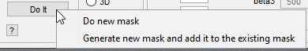
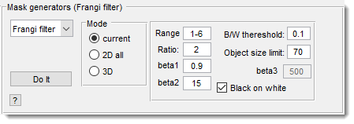
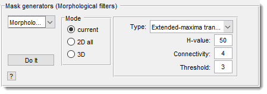
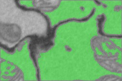
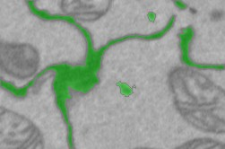
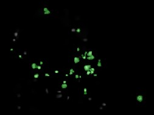
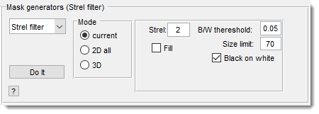

# Mask Generators Panel

*Back to [MIB](../../../index.md) | [User Guide](../../index.md) | [Panels](../index.md)*

---

## Overview

The **Mask Generators Panel** offers automated methods to create masks based on specific criteria or algorithms. These masks are useful for segmentation or targeting areas of interest. Learn more in [Data Layers](../../image-layers.md).

---

## Common fields

{align=left}

These controls apply across all mask generators:

- **1. Filter type**: select a mask generator 
from the list.
- **2. Mode radio buttons**:
- 
    - Current: generates a mask for the current 
    slice only.
    - 2D all: generates masks for 
    all slices using a 2D approach.
    - 3D: generates a mask for the entire 
    dataset in 3D.
- **3. Do it button**:
    - <mouse class="left"></mouse>: Starts the selected generator, replacing the existing mask.
    - <mouse class="right"></mouse> → **Do new mask**: Starts the generator, replacing the existing mask.  
    {.on-glb align=left width="300"}
    - <mouse class="right"></mouse> → **Generate new mask and add it to the existing mask**: 
    Adds the new mask to the existing one. 
    Useful for multidimensional filtering:
        1. Run generator for XY.
        2. Switch to XZ or YZ via the [Toolbar](../../quick-access-bar/index.md).
        3. Run generator again with this option.

---

## Frangi Filter

{align=left}

Based on Marc Schrijver and Dirk-Jan Kroon’s 
[Hessian-based Frangi Vesselness filter](http://www.mathworks.com/matlabcentral/fileexchange/24409-hessian-based-frangi-vesselness-filter), this uses 
Hessian eigenvectors to detect vessels or 
ridges (Frangi [1998](http://www.dtic.upf.edu/~afrangi/articles/miccai1998.pdf), [2001](http://www.tecn.upf.es/~afrangi/articles/tmi2001.pdf)). 

May require compilation; see [System Requirements](https://mib.helsinki.fi/downloads_systemreq.html#frangi).

???+ info "Parameters"
    - **Range**: Sigma range (default: [1-6]).
    - **Ratio**: Step size between sigmas (default: 2).
    - **beta1**: Frangi correction constant (default: 0.9).
    - **beta2**: Frangi correction constant (default: 15).
    - **beta3**: Vesselness threshold (default: 500; rule of thumb: vessel greyvalues ÷ 4–6).
    - **B/W threshold**: Threshold for Mask layer; 0 yields a filtered image instead of binary.
    - **Object size limit**: Removes 2D objects smaller than this value post-filtering.
    - Black on white: Detects black ridges on white background when checked.

---

## Morphological Filters

{align=left}

MATLAB-based morphological filters

{align=left}
**Extended-maxima transform**: Uses MATLAB’s [imextendedmax](https://se.mathworks.com/help/releases/R2024b/images/ref/imextendedmax.html) 
to find regional maxima in the H-maxima transform (constant-intensity regions 
with lower external boundaries).

{align=left} 
**Extended-minima transform**: Uses [imextendedmin](https://se.mathworks.com/help/releases/R2024b/images/ref/imextendedmin.html)
 for regional minima in the H-minima transform (constant-intensity regions with higher external boundaries).  
 

{align=left}
**H-maxima transform**: Suppresses maxima below an H-value, then thresholds with a specified value. 
Regional maxima have constant intensity and lower external boundaries.

**H-minima transform**: Suppresses minima below an H-value, then thresholds. Regional minima have constant intensity and higher external boundaries.
 **Regional maxima**: Uses [imregionalmax](https://se.mathworks.com/help/releases/R2024b/images/ref/imregionalmax.html)
to create a binary mask of regional maxima (1 for maxima, 0 otherwise).
 **Regional minima**: Uses [imregionalmin](https://se.mathworks.com/help/releases/R2024b/images/ref/imregionalmin.html)
for a binary mask of regional minima (1 for minima, 0 otherwise).

---

## Strel Filter

{align=left}

Generates a mask via morphological opening and black-and-white thresholding.  
Uses bottom-hat filtering ([imbothat](https://se.mathworks.com/help/releases/R2024b/images/ref/imbothat.html)
) if Black on white is checked, 
or top-hat ([imtophat](https://se.mathworks.com/help/releases/R2024b/images/ref/imtophat.html)
) if unchecked, followed by thresholding.

- **Strel size**: Sets the disk-type structural element size for `imtophat`/`imbothat`.
- Fill: Fills holes in the resulting Mask.
- **B/W threshold**: Sets the black-and-white thresholding parameter.
- **Size limit**: Removes 2D objects smaller than this value from the Mask.
- Black on white: Uses bottom-hat filtering when checked, top-hat when unchecked.

---

*Back to [MIB](../../../index.md) | [User Guide](../../index.md) | [Panels](../index.md)*