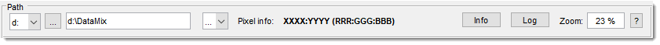
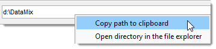
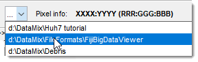
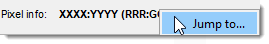
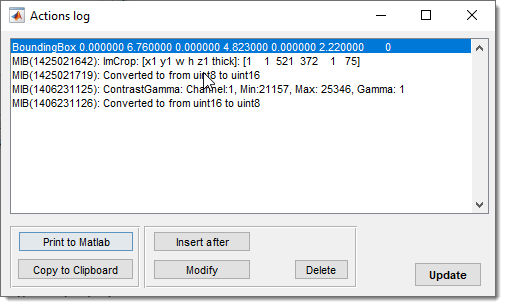
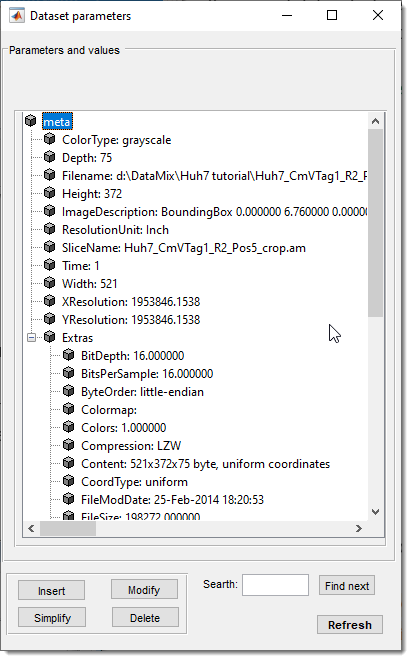
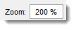
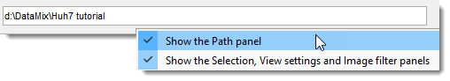

# Path Panel

Specifies the current directory of image datasets in Microscopy Image Browser.

---

## Overview

The **Path Panel** allows users to define the path to image datasets and provides additional tools 
for navigation and dataset information.

---

## Logical drive dropdown

Logical drive: quickly selects available logical drives, 
initialized at MIB startup.
!!! info "Only in Windows OS"
    This dropdown is available only in MIB on Windows

## Directory selection button

'...': opens a dialog to select the current directory.

## Current path edit box

Current path: displays the current folder path, with 
its contents shown in the [Directory Contents panel](../dircontents/index.md).  

Right-click for a context menu:  

{align=left}

- **Copy to clipboard**: copies the path to the system clipboard  
- **Open directory in the file explorer**: opens the folder in the system file explorer  

## List of recently used directories
{align=left}

Shows recently loaded dataset directories.  
[:fontawesome-brands-youtube:{.red-color} MIB in brief: list of recent directories](https://youtu.be/xx7pGehTJXA)

 

## Pixel Info field

{align=left}

Displays pixel location and intensity under the mouse cursor in 
the [Image View panel](../imview/index.md), formatted as
 `X, Y (Red:Green:Blue) / [material index]`. 

 
!!! info
    - Updates in real-time as the cursor moves over the image, aiding pixel value analysis and navigation.  
    - Use <mouse class="right"></mouse> to access a jump-to-point menu.

## Log button

{.on-glb width="400" align=left}

Log: shows a log of actions performed on the current dataset, stored in the `ImageDescription` field of TIF files with date/time stamps.  
[:fontawesome-brands-youtube:{.red-color} MIB in brief: Log of performed actions](https://youtu.be/1ql4cRxZ334)   

 

Actions:
  
- **Print to MATLAB**: outputs the log to the MATLAB command window  
- **Copy to Clipboard**: copies the log for pasting (++ctrl+v++ on Windows)  
- **Insert after**: adds a new entry after the selected one  
- **Modify**: edits the selected entry  
- **Delete**: removes the selected entry  
- **Update**: manually refreshes the log if not updated automatically

## Info button

{.on-glb width="320" align=left}

Info: opens a tree list of dataset parameters.   
XY resolution is in `XResolution`, `YResolution`, and `BoundingBox` within `ImageDescription`. 
 Includes a search field for metadata.

 

## Zoom edit box

{align=left}

Zoom sets the desired zoom level.  

 

## Help

Links to this help page.

## Right-click dropdown menu

 

Do <mouse class="right"></mouse> at an empty area opens a menu to hide/show panels, 
expanding the Image View panel space. 
!!! warning
    It may be tricky to find an "empty" space as most space is occupied with other widgets. 
    However, it is possible to call the same operation by <mouse class="right"></mouse> at empty space
    in the [Image View](../imview/index.md) panel.

---

*Back to [MIB](../../index.md) | [User interface](../index.md) | [Panels](../index.md)*