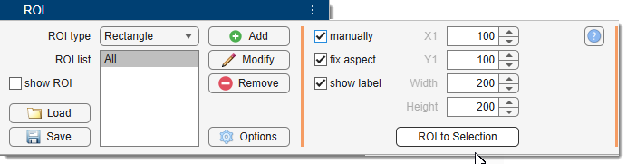
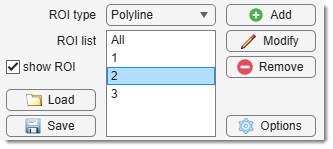
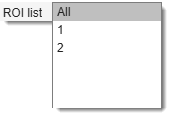
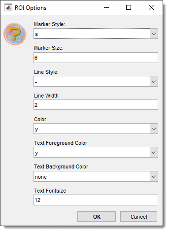
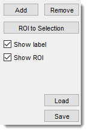

# ROI Panel

---

## Overview

{align=left}

The **ROI Panel** allows you to add one or more Regions of Interest (ROIs)
over your image for focused analysis or filtering.  
Updated in MIB version 0.998, this implementation uses code 
from Jan Neggers’ [Image Measurement Utility](http://www.mathworks.com/matlabcentral/fileexchange/25964-image-measurement-utility) 
(Eindhoven University of Technology).

---

## Select ROI type and add it

{align=left}

ROI type

Select the ROI type to add. By default, ROIs are placed interactively, but you can define them manually using the *Define parameters manually* panel below the dropdown.

Available ROI types:

- **Rectangle**: Rectangular ROI. 
    - press Add, 
    - define two corners with <mouse class="left"></mouse>, 
    - adjust as needed, and 
    - double-click to accept.
- **Ellipse**: Ellipsoid ROI. 
    - press Add, 
    - define the center and a side with <mouse class="left"></mouse>, 
    - adjust, and 
    - double-click to accept.
- **Polyline**: Polyline with a set number of vertices (specified in *Define parameters manually*). 
    - press Add, 
    - click for each vertex, 
    - adjust (add vertices with A + <mouse class="left"></mouse>, remove with <mouse class="right"></mouse> → Delete), 
    - and double-click to accept.
- **Lasso**: Freehand ROI. 
    - press Add, 
    - hold <mouse class="left"></mouse> to draw, 
    - release to convert to a polyline ROI with a suggested vertex reduction 
    (fewer vertices improve rendering performance).

Define parameters manually

Enable manual ROI placement by checking 
Manually:

- enter coordinates, 
- press Add.

Fix aspect ratio: locks the aspect ratio of ROIs during initial placement or later edits.

---

## ROI List

{align=left}

Select single or all ROIs for filtering/analysis. 

<mouse class="right"></mouse> for additional actions:

- **Rename**: Change the ROI’s name.
- **Edit**: Modify the ROI’s position (double-click to finish; add vertices to polylines with A).
- **Remove**: Delete the ROI from the list.

{.on-glb align=left width="200"}

Options: customize ROI visualization (marker type/size/color, line width/color, label size/color).

---

## Settings and buttons

{align=left}

- Add button: adds the selected ROI to the image.
- Remove button: deletes the highlighted ROI from the **ROI List**.
- ROI to Selection button: transfers the area under the current ROI to the Selection layer.
- Load button: loads ROIs from disk.
- Save button: saves ROI data to disk in MATLAB format (structure with `label`, `type`, `X`, `Y`, `orientation` fields).

- Show label: displays ROI labels in the [Image View Panel](../../image-document/index.md) when checked.
- Show ROI: shows ROIs in the [Image View Panel](../../image-document/index.md) when checked. 
Alternatively, toggle visibility with the R 
button in the [Toolbar](../../quick-access-bar/index.md#roi-mode-switch).

---

---

*Back to [MIB](../../../index.md) | [User Guide](../../index.md) | [Panels](../index.md)*