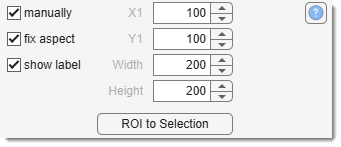

# ROI Panel

---

## Overview

The **ROI Panel** allows you to add one or more Regions of Interest (ROIs)
over your image for focused analysis or filtering.  
Updated in MIB version 0.998, this implementation uses code 
from Jan Neggers’ [Image Measurement Utility](http://www.mathworks.com/matlabcentral/fileexchange/25964-image-measurement-utility) 
(Eindhoven University of Technology).

{align=left}

---

## Select ROI type and add it

{align=left}

ROI type

Select the ROI type to add. By default, ROIs are placed interactively, but you can define them manually using the *Define parameters manually* panel below the dropdown.

Available ROI types:

- **Rectangle**: Rectangular ROI. 
- **Ellipse**: Ellipsoid ROI. 
- **Polyline**: Polyline with a set number of vertices. 
- **Lasso**: Freehand ROI.  
    - release to convert to a polyline ROI with a suggested vertex reduction 
    (fewer vertices improve rendering performance).

??? info "How to place ROI"
    - press Add 
    - use <mouse class="left"></mouse> to place a ROI
    - use <mouse class="double"></mouse> to accept the ROI

### ROI List

{align=left}

Select single or all ROIs for filtering/analysis.

### Settings and buttons

Add button: adds ROI of the selected type to the image

Modify button: modify ROI selected in **ROI List**

Remove button: deletes the highlighted ROI from the **ROI List**.

Load button: loads ROIs from disk.

Save button: saves ROI data to disk in MATLAB format (structure with `label`, `type`, `X`, `Y`, `orientation` fields).

Show ROI: shows ROIs in the [Image View Panel](../../image-document/index.md) when checked. 
Alternatively, toggle visibility with the {.off-glb } button in the [Toolbar](../../quick-access-bar/index.md#roi-mode-switch).

{.on-glb align=right width="200"}

Options: customize ROI visualization (marker type/size/color, line width/color, label size/color).

---

## Define parameters manually

{align=left}

Enable manual ROI placement by checking 
Manually and use:

- X1 to define X-coordinate of the top left corner
- Y1 to define Y-coordinate of the top left corner
- Width to define width of the ROI
- Height to define height of the ROI
- press Add.

Fix aspect: locks the aspect ratio of ROIs during initial placement or later edits.

ROI to Selection: transfers the area under the current ROI to the Selection layer.

---

*Back to [MIB](../../../index.md) | [User Guide](../../index.md) | [Panels](../index.md)*