# Segmentation Panel

---

## Overview

The segmentation panel is the main panel used for segmentation. It allows creating models, modifying materials, and selecting different segmentation tools.

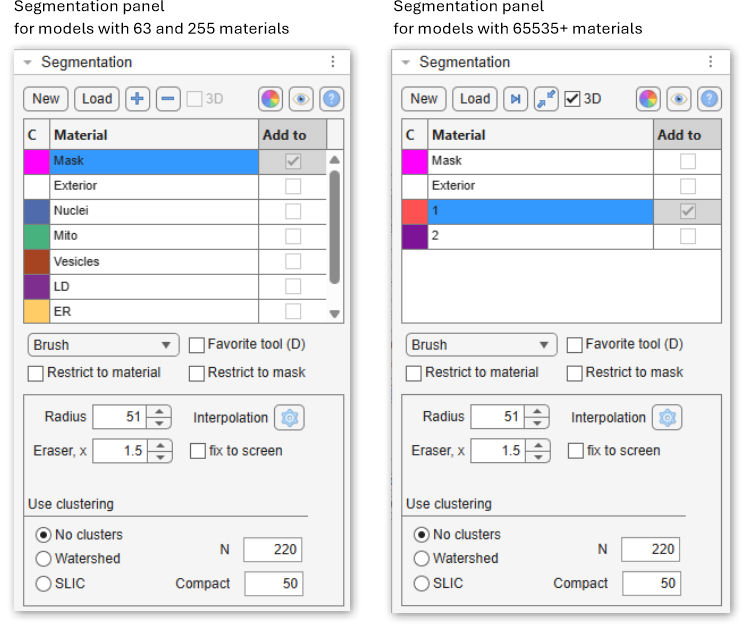{.on-glb width="460" align=left} 

<div class="clear-float"></div>

---

## What are the models

A model is a matrix with dimensions equal to those of the opened image dataset: <br> 
`[1:imageHeight, 1:imageWidth, 1:imageThickness]`.<br>
The model consists of materials, and each element of the model matrix (pixel) can belong only to a 
single material (having indices: `1, 2, 3, etc`) or to an exterior (with index `0`). 
Therefore, it is not possible to have 
several materials overlapping above the same pixel of the image. 
<br>Each material in the model matrix is encoded with its own index.

???+ example "Example of a model 4x4 pixels"

    ```
    Model = \[1 1 0 0; 1 1 0 0; 0 0 2 2; 0 0 2 2\]
       
    [   1 1 0 0
        1 1 0 0
        0 0 2 2
        0 0 2 2   ]
    ```
    In this example, the shown matrix represents a model with 2 materials encrypted with **1** 
    (the upper left corner) and **2** (the lower right corner) for the image of 4x4 pixels.
    Index *0* encodes background (Exterior).

---

## Create button

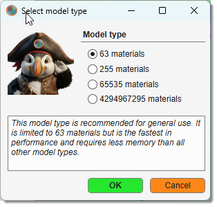{.on-glb align=left width="250"}

The <span class="widget widget-button">Create</span> button is used to start a new model. 
When clicked, the existing model layer will be removed.

Whenever possible, it is recommended to use models with **63** materials. 
If you need to work with materials exceeding 255, see this video:

- [:fontawesome-brands-youtube:{.red-color} MIB 2.1: Compatible with models with more than 255 materials](https://youtu.be/r3lpmWyvrJU)

For more information about different types of models visit 

* [Ribbon → Model → Convert type](../../ribbon/model/index.md#convert-type)

<div class="clear-float"></div>

---

## Load button

The <span class="widget widget-button">Load</span> button is used to load a model from disk. The following formats are accepted:

- MATLAB (`*.MAT`): default and recommended format.
- Amira Mesh binary (`*.AM`): for models saved in [Amira](http://www.vsg3d.com/amira/overview) format.
- Hierarchical Data Format (`*.H5`): for data exchange with [Ilastik](http://ilastik.org/).
- Medical Research Council format (`*.MRC`): for data exchange with [IMOD](http://bio3d.colorado.edu/imod/).
- NRRD format (`*.NRRD`): for models saved in [3D Slicer](http://www.slicer.org/) format.
- TIF format (`*.TIF`).
- Hierarchical Data Format with XML header (`*.XML`).
- All standard file formats when selecting `All files(*.*)`.

Alternatively, use [Ribbon → Model → Load model](../../ribbon/model/index.md#load-model) or 
drag-and-drop a `*.model` file to the [Image document view](../../image-document/index.md).

---

## \[+\], \[-\], \[>|\], \[Squeeze\], \[Recolor\] buttons

These buttons are located in the Segmentation panel above the segmentation table and depending on the model type
do different operations.

- <span class="widget widget-button">+</span> add a new material to the model (*only for models with 63 and 255 materials*).
- <span class="widget widget-button">-</span> delete the selected material(s) from the model (*only for models with 63 and 255 materials*).
- 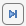 find and select the next empty index in the model (*only for models with more than 255 materials*).
- 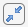 squeeze the model—remove all empty indices and select the next available empty index (*only for models with more than 255 materials*).
- 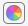 regenerate colors of materials: <mouse class="left"></mouse> for random colors, 
<mouse class="right"></mouse> for a context menu with additional settings:

??? info "Color schemes and options"

    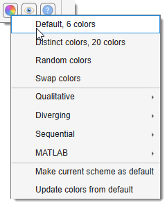{.on-glb align=left}

    The context menu is organized into four groups:

    **Fixed palettes**

    - **Default, 6 colors** — the built-in six-color palette used when MIB starts.
    - **Distinct colors, 20 colors** — a palette of 20 perceptually distinct colors, useful when many materials are present.
    - **Random colors** — generates a fully random color for each material.
    - **Swap colors** — swaps the colors of two materials (prompts for the two indices).
    
    <div class="clear-float"></div>

    **Qualitative** — suitable for categorical data with no implied order:

    - Monte Carlo → Half Baked (3–12 colors)

    **Diverging** — suitable for data with a meaningful midpoint between two extremes:

    - Deep Bronze → Deep Teal (3–11 colors)
    - Ripe Plum → Kaitoke Green (3–11 colors)
    - Bordeaux → Green Vogue (3–11 colors)
    - Carmine → Bay of Many (3–11 colors)

    **Sequential** — suitable for ordered data progressing from low to high:

    - Kaitoke Green (3–9 colors)
    - Catalina Blue (3–9 colors)
    - Maroon (3–9 colors)
    - Astronaut Blue (3–9 colors)
    - Downriver (3–9 colors)

    **MATLAB** — standard MATLAB colormaps sampled across the number of materials:

    - Jet
    - HSV

    ---

    **Managing the default palette**

    - **Make current scheme as default** — saves the currently applied colors as the personal default, restored on next MIB start.
    - **Update colors from default** — resets material colors to the saved personal default.
-  update the visualization settings **Filled** or **Contour** for both models and mask.
**Note!** Filled visualization is more efficient.

??? info "Color schemes and options"
    
    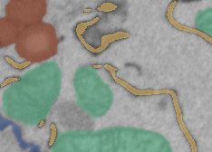{align=left}
    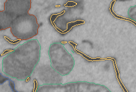{align=left}

    <div class="clear-float"></div>

    - **Filled**: draw materials as filled shapes (faster, left image).
    - **Contour**: draw only the contours of materials (slower, right image).

    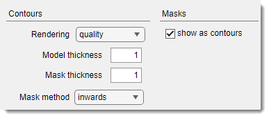{align=left}   
        
    Tweak contour thickness via<br>
    [Ribbon → Home → Preferences → Colors and styles → Contours](../../ribbon/home/home-preferences.md#contours).
    

---

## Segmentation table

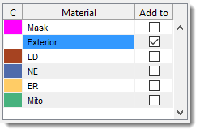{align=left}

The Segmentation table displays the list of materials in the model.

- [:fontawesome-brands-youtube:{.red-color} MIB in brief: Segmentation Table](https://youtu.be/_iwQI2DIDjk)

<div class="clear-float"></div>

<div class="h4-like">The table has three columns:</div>

- **C**: shows colors for each material. <mouse class="left"></mouse> over the color box to open a color selection dialog.
- **Material**: lists all model materials. Right-click (<mouse class="right"></mouse>) to open a context menu with additional options (see below).
- **Add to**: defines the destination material for the Selection layer during **Add** (++a++) and **Replace** (++r++)
actions.
<br>Linked to the selected material by default, but can be unlinked with 
<span class="widget widget-checkbox">Restrict to material</span> or the 
context menu **Unlink material from Add to**.

<div class="h4-like">Context menu options</div>

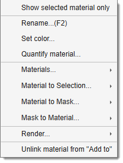{align=left}

- **Show selected material only** toggle to show only the selected material in 
the [Image View panel](../../image-document/index.md).
- **Rename (F2)** rename the selected material, use ++f2++ key shortcut.
- **Set color** change the color of the selected material (*same as <mouse class="left"></mouse> on the color box in the first column of the table*)
- **Quantify material...** calculate properties for objects of the selected material. 
See [Ribbon → Model → Model/Mask quantify](../../ribbon/mask/mask-stats.md).

<div class="clear-float"></div>

- **Materials**: direct operations available for materials of the model ([:fontawesome-brands-youtube:{.red-color} Materials menu demo](https://youtu.be/l1RkVkq59To))
 
??? abstract "List of available Material operations"
    
    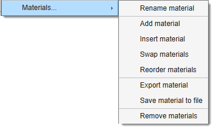{align=right width="300"}

     - **Rename material** rename the selected material.
     - **Add material** add a new material to the bottom of the list.
     - **Insert material** insert a material at a specified position, shifting others.
     - **Swap materials** swap positions of two materials.
     - **Reorder materials** reorder materials with a new order.
     - **Import material** import selected materials (names, colours, and voxels) from a saved model file; appended as new materials and matched to the closest pyramid level for [BigData](../datasets/index.md) models.
     - **Export material** export to MATLAB workspace or Imaris.
     - **Save material to file** save the selected material to a file.
     - **Remove material** remove selected material(s).
  
- **Material to Selection**: copy the selected materials to the Selection layer.

??? abstract "List of available operations"

    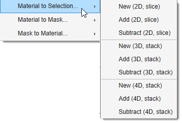{align=right width="300"}

    - **NEW (2D, Slice)** generate a new Selection layer from the selected material for the current slice.
    - **ADD (2D, Slice)** add the selected material to the Selection layer for the current slice.
    - **REMOVE (2D, Slice)** remove the selected material from the Selection layer for the current slice.
    - **NEW (3D, Stack)** generate a new Selection layer for the current 3D stack.
    - **ADD (3D, Stack)** add to the Selection layer for the current 3D stack.
    - **REMOVE (3D, Stack)** remove from the Selection layer for the current 3D stack.
    - **NEW (4D, Dataset)** generate a new Selection layer for the whole dataset.
    - **ADD (4D, Dataset)** add to the Selection layer for the whole dataset.
    - **REMOVE (4D, Dataset)** remove from the Selection layer for the whole dataset.
- **Material to Mask** copy the selected material to the Mask layer.

??? abstract "List of available operations"

    {align=right width="300"}

    - **NEW (2D, Slice)** generate a new Mask layer from the selected material for the current slice.
    - **ADD (2D, Slice)** add the selected material to the Mask layer for the current slice.
    - **REMOVE (2D, Slice)** remove the selected material from the Mask layer for the current slice.
    - **NEW (3D, Stack)** generate a new Mask layer from the selected material for the current 3D stack.
    - **ADD (3D, Stack)** add the selected material to the Mask layer for the current 3D stack.
    - **REMOVE (3D, Stack)** remove from the Mask layer the selected material for the current 3D stack.
    - **NEW (4D, Dataset)** generate a new Mask layer from the selected material for the whole dataset.
    - **ADD (4D, Dataset)** add the selected material to the Mask layer for the whole dataset.
    - **REMOVE (4D, Dataset)** remove the selected material from the Mask layer for the whole dataset.

- **Mask to Material** copy the Mask layer to the selected material.

??? abstract "List of available operations"

    {align=right width="300"}

    - **NEW (2D, Slice)** generate a new Material layer from the Mask layer for the current slice.
    - **ADD (2D, Slice)** add the Mask layer to the Material layer for the current slice.
    - **REMOVE (2D, Slice)** remove the Mask layer from the Material layer for the current slice.
    - **NEW (3D, Stack)** generate a new Material layer from the Mask layer for the current 3D stack.
    - **ADD (3D, Stack)** add to the Mask layer the Material layer for the current 3D stack.
    - **REMOVE (3D, Stack)** remove the Mask layer from the Material layer for the current 3D stack.
    - **NEW (4D, Dataset)** generate a new Material layer from the Mask layer for the whole dataset.
    - **ADD (4D, Dataset)** add the Mask layer to the Material layer for the whole dataset.
    - **REMOVE (4D, Dataset)** remove the Mask layer from the Material layer for the whole dataset.
- **Render** render the model using variety of methods

??? abstract "List of available rendering options"

    - **Show as volume (MIB)** visualize the selected material using [MIB 3D Viewer](../../ribbon/home/home-mib3Dviewer.md) (MATLAB R2018b+).
    - **Show isosurface (MATLAB)** visualize the model or selected material 
    (if **Show selected material only** is checked) as an [isosurface](../../ribbon/model/index.md#matlab-isosurface).
    - **Show as volume (Fiji)** visualize using [Fiji 3D viewer](../../ribbon/model/index.md#fiji-volume-viewer).

    !!! tip "Additional rendering options"
        - **[Ribbon → Model → Render](../../ribbon/model/index.md#render)** — render the model alone with additional options.
        - **[Ribbon → Home → Render Volume](../../ribbon/home/index.md#render-volume)** — render the image dataset together with the model overlaid.

- **Unlink material from Add to** prevent the **Add to** column from changing with material selection.

<div class="clear-float"></div>

<div class="h3-like">Keyboard shortcuts</div>

- <span class="widget widget-button">Ctrl</span> + <span class="widget widget-button">A</span>: highlight the selected material in the Selection layer for the current slice.
- <span class="widget widget-button">Alt</span> + <span class="widget widget-button">A</span>: highlight for the selected material on all slices of the dataset.
!!! info 
    Sensitive to <span class="widget widget-checkbox">Restrict to material</span> 
    and <span class="widget widget-checkbox">Restrict to mask</span>.<br> 
    See [Shortcuts](../../key-and-mouse-shortcuts.md).

??? info "Select a combination of Mask and another layer"
    - Select the Mask entry in the table.
    - Check <span class="widget widget-checkbox">Restrict to material</span>.
    - Select the second material in the **Add to** column.
    - Press ++ctrl+a++ or ++alt+a++.

---

## Segmentation tools dropdown

The <span class="widget widget-dropdown">Segmentation tools</span> dropdown provides tools to 
separate and identify regions or objects within an image. 

<div class="h4-like">List of the segmentation tools:</div>

- [3D ball](segm-3dball.md)
- [3D lines](segm-3dlines.md)
- [Annotations](segm-annotations.md)
- [Brush](segm-brush.md)
- [BW Thresholding](segm-bwthres.md)
- [Drag & Drop materials](segm-dragdrop.md)
- [Lasso](segm-lasso.md)
- [MagicWand-RegionGrowing](segm-magicwand.md)
- [Membrane ClickTracker](segm-membrtracker.md)
- [Object Picker](segm-objpick.md)
- [Segment-anything model](segm-sam.md)
- [Spot](segm-spot.md)

---

## Restrict to material checkbox

The <span class="widget widget-checkbox">Restrict to material</span> checkbox ensures segmentation tools apply 
only to pixels that already belong to the material selected in the **Material** column of the table.
Pixels belonging to any other material are not touched, even if the tool passes over them.

??? example "Use case: assign Exterior pixels to a material without overwriting others"

    A common need is to paint new pixels into a material while leaving all existing material assignments intact.
    For example, to extend **Material 2** only with unassigned (Exterior) pixels:

    1. Select **Exterior** in the **Material** column.
    2. Select **Material 2** in the **Add to** column.
    3. Check <span class="widget widget-checkbox">Restrict to material</span>.
    4. Use the [Brush](segm-brush.md) (or any other selection tool) to paint over the region of interest.
       The Selection layer is built only from pixels that are currently **Exterior** - pixels already
       assigned to Material 1, Material 3, etc. are skipped entirely.
    5. Press ++a++ to add the Selection to **Material 2**.

    **The result:** only previously unassigned pixels move into Material 2; nothing else changes.

---

## Restrict to mask checkbox

The <span class="widget widget-checkbox">Restrict to mask</span> checkbox limits segmentation tools
to pixels that lie inside the Mask layer. Any selection or segmentation action outside the masked area is silently ignored, making it easy to confine automated tools to a hand-drawn region of interest.

??? example "Use case: threshold only inside a hand-drawn region of interest"

    A typical workflow for precise local thresholding:

    1. Select the [Brush tool](segm-brush.md) and roughly paint around the region of interest on a few key slices.
    2. Press ++ctrl+i++ to interpolate the Selection between the painted slices - MIB fills in the intermediate slices using a liner interpolation between the shapes.
    3. Press ++shift+r++ to commit the Selection to the Mask layer. 
    4. Check <span class="widget widget-checkbox">Restrict to mask</span>.
    5. Switch to the [BW Thresholding tool](segm-bwthres.md) and adjust the threshold. The threshold is applied **only within the masked area** - structures outside your rough boundary are untouched regardless of their intensity.
    6. Press ++a++ (++shift+a++) to add the thresholded result to the target material.
    7. Optionally clear the Mask when finished: **Ribbon → Mask → Clear mask**.
    8. Uncheck <span class="widget widget-checkbox">Restrict to mask</span> when finished

---

## Favorite tool (D) checkbox

The <span class="widget widget-checkbox">Favorite tool (D)</span> checkbox marks favorite selection tools 
for quick access with the <span class="widget widget-button">D</span> key. 

!!! info "Specify two additional tools"
    - ++shift+d++ - use this key shortcut to select the first predefined favorite tool
    - ++ctrl+d++ - use this key shortcut to select the second predefined favorite tool
    <br>These favorite tools can be specified from
    [Ribbon → Home → Preferences → Segmentation tools](../../ribbon/home/home-preferences.md#favorite-tools)

---


*Back to [MIB](../../../index.md) | [User interface](../../index.md) | [Panels](../index.md)*