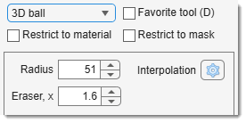

# The 3D Ball Tool

---
## 3D ball overview

{align=left}

The **3D ball** tool allows you to make a selection in the form of a spherical object in 3D space. 
To use it, specify the radius in the Radius, px edit box, which defines the sphere's size. 
Larger radii result in larger selections.

The Eraser, x edit box modifies the eraser size multiplier. 
When holding ++ctrl++ and using the eraser (++ctrl++ + <mouse class="left"></mouse>), the size of the eraser brush increases based on this value.

- [:fontawesome-brands-youtube:{.red-color} MIB in brief: Manual segmentation tools](https://youtu.be/ZcJQb59YzUA?t=1s)

!!! note
    The aspect ratio for the depth size of the 3D ball is defined by pixel dimensions. 
    See *Dataset Parameters* in [Ribbon → Dataset -> Parameters](../../ribbon/dataset/index.md#parameters).

!!! info "Selection modifiers"
    - **None** or Shift + <mouse class="left"></mouse>: add 3D ball selection to the existing one.
    - Ctrl + <mouse class="left"></mouse>: remove 3D ball selection from the current selection layer.

---

## Presets
Use the following key shortcuts to define and restore presets

- ++shift+1++, ++shift+2++, ++shift+3++ - store preset 1, 2, or 3 correspondingly
- ++1++, ++2++, ++3++ - restore preset 1, 2, or 3 correspondingly

---

*Back to [MIB](../../../index.md) | [User interface](../../index.md) | [Panels](../index.md) | [Segmentation](index.md)*