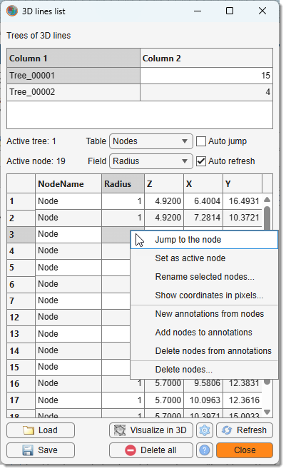
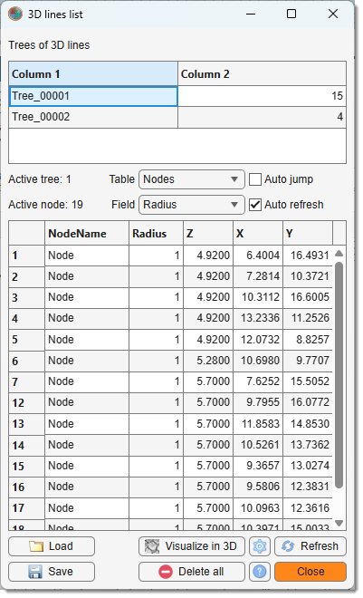
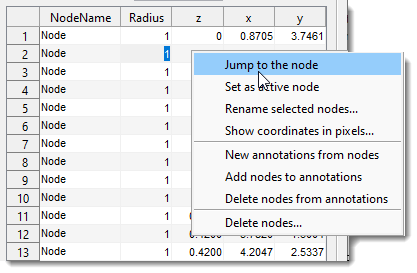
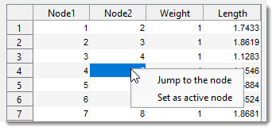
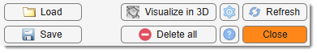

# The 3D Lines Tool

---

## 3D Lines overview

{align=left}

The **3D lines** tool allows drawing lines in 3D space, arranging them as graphs or skeletons. It consists of nodes (vertices) connected by edges (lines). Nodes represent points, and edges represent connections, forming trees—distinct sets of 3D lines—for better organization.

- [:fontawesome-brands-youtube:{.red-color} Use of 3D lines for skeletons and measurements](https://youtu.be/DNRUePJiCbE)

Modify nodes with mouse clicks, extended by key modifiers (Shift, Ctrl, Alt) for various actions (see below).

???+ info "Available actions"
    - Add node add a new node to the active tree, connecting it to the active point (shown in red).
    - Assign active node assign the closest node to the mouse click as the new active node.
    - Connect to node connect the active node to another existing node.
    - Delete node remove the closest node, rearranging edges to prevent tree splitting.
    - Insert node after active insert a new node after the active node.
    - Modify active node move the active node to a new position with a mouse click.
    - New tree add a node to a new, unconnected tree.
    - Split tree split a tree by deleting the closest node.

    Use Show lines to toggle visibility of edges in the [Image View panel](../imview/index.md).  
    Press Table view to open a window with tables describing the 3D lines (see below).

##Lines 3D View

### List of trees table

{.on-glb align=left}

**Table with the list of trees**  
The upper table in the **Lines 3D View** window lists trees and their node counts. Each tree must have a unique name.
 

Right-click a tree for options:

- **Rename selected tree**: rename the tree (must be unique).
- **Find tree by node**: find a tree by node index.
- **Visualize in 3D selected tree(s)**: plot selected trees in 3D.
- **Save/export selected tree(s)**: export to MATLAB or save to a file (formats listed in Tools panel below).
- **Delete selected tree(s)**: remove selected trees.

### Space between the tables

- **Active tree** index of the active tree.
- **Active node** index of the active node.
- Table select *Nodes* or *Edges* for the lower table.
- Field add an extra field (*Radius* or *Weights* by default) to the lower table.
- Auto jump jump to the selected node and show it in the [Image View panel](../imview/index.md).
- Auto refresh automatically refresh tables (may be slow with many nodes).

### Nodes table

{.on-glb align=left width="360"}

Lists nodes with actions via a popup menu:  

- Jump to the node center the selected node in the [Image View panel](../imview/index.md).
- Set as active node make the selected node active.
- Rename selected nodes assign a new name.
- Show coordinates in pixels show node coordinates in pixels 
(default is physical units per [bounding box](../../ribbon/dataset/index.md#bounding-box)).
- New annotations from nodes generate new annotations from node positions.
- Add nodes to annotations add selected nodes to existing annotations.
- Delete nodes from annotations remove selected nodes from annotations.
- Delete nodes delete selected nodes.

### Edges table

{align=left}

Lists edges with actions via a popup menu:

- Jump to the node ▼: center the selected node in the [Image View panel](../imview/index.md).
- Set as active node ▼: make the selected node active.

### Tools panel

{align=left}

- Load: load 3D lines from a MATLAB-compatible *.lines3d file.
- Save: export to MATLAB or save as:
    - **MATLAB format, *.lines3d**: recommended format.
    - **Amira Spatial graph, *.am**: Amira-compatible (binary or ASCII).
    - **Excel format, *.xls**: export Nodes and Edges tables.
- Refresh: refresh the tables.
- Delete all: delete all 3D lines.
- Visualize in 3D: plot all trees in 3D.
- Settings: modify color and thickness of 3D lines.

---
## Presets
Use the following key shortcuts to define and restore presets

- ++shift+1++, ++shift+2++, ++shift+3++ - store preset 1, 2, or 3 correspondingly
- ++1++, ++2++, ++3++ - restore preset 1, 2, or 3 correspondingly

---

*Back to [MIB](../../../index.md) | [User interface](../../index.md) | [Panels](../index.md) | [Segmentation](index.md)*