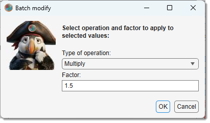
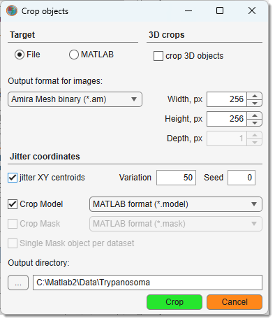

# The Annotations Tool

!!! success "BigData mode: supported"
    Annotations work with **BigData** datasets (they are stored as coordinates, independent of resolution).

---

## Overview

{align=left}

Tools to add/remove annotations, marking specific locations with a label and a value.

- [:fontawesome-brands-youtube:{.red-color} MIB in brief: Annotations](https://youtu.be/3lARjx9dPi0)
- [:fontawesome-brands-youtube:{.red-color} MIB in brief: Annotations](https://youtu.be/6otBey1eJ0U)

Addition and removal of annotations

  
- <mouse class="left"></mouse>: add an annotation at the mouse cursor.
- ++ctrl++ + <mouse class="left"></mouse>: remove the closest annotation.
- ++shift++ + <mouse class="left"></mouse>: interpolate annotations between the previous and new annotation across dataset depth.

---

## Annotation panel widgets
- Annotation list open a window listing annotations. Load/save to MATLAB workspace or file (MATLAB/Excel formats), [see below](#list-of-annotations).
- Precision specify digits after the decimal point.
- Show prompt show a dialog for label/value after adding an annotation; otherwise, use the previous annotation’s values. 
- Focus on Value prioritize value over label during visualization. 
- Delete All remove all annotations.
- **Display as**: choose display mode in the [Image View panel](../../image-document/index.md):
      - **Marker**: show only a cross-marker.
      - **Label**: show marker and label.
      - **Value**: show marker and value.
      - **Label + Value**: show marker, label, and value.
---

## Presets
Use the following key shortcuts to define and restore presets

- ++shift+1++, ++shift+2++, ++shift+3++ - store preset 1, 2, or 3 correspondingly
- ++1++, ++2++, ++3++ - restore preset 1, 2, or 3 correspondingly

---

## List of annotations

{.on-glb align=left width="400"}

- **List of annotations table**: shows annotations. 

Right-click (<mouse class="right"></mouse>) for options

- **Jump to annotation**: center the selected annotation in the [Image View panel](../../image-document/index.md).
- **Add annotation**: manually add an annotation by manually specifying its position, value and name.
- **Rename selected annotations**: rename selected annotations.
- **Batch modify selected annotations**: modify values/coordinates with expressions (e.g., set, multiply, add).
{.on-glb align=left width="320"}
- **Count selected annotations**: count occurrences, displayed in MATLAB and copied to clipboard. [:fontawesome-brands-youtube:{.red-color} Demo](https://youtu.be/rqZbH3Jpru8)
---

- **Copy selected annotations to clipboard**: copy as text for Excel.
- **Paste from clipboard to column**: paste Excel values to a selected column.
  
- {.on-glb align=right width="300"}
**Convert selected annotations to Mask**: generate 2D/3D Mask spots from annotations (fixed or scaled size).  
  

- **Crop out patches around selected annotations**: generate 2D/3D patches with customizable options (e.g., jitter). [:fontawesome-brands-youtube:{.red-color} Demo](https://youtu.be/QrKHgP76_R0)

??? info "Crop patches dialog"

    {.on-glb align=left width="300"}

    Each patch is centred on an annotation coordinate. The dialog controls how large the patches are, where they go, and what layers are included.

    **Output destination**

    - **Crop to file** — saves each patch as a separate image file in the chosen directory.
      Supported formats: TIF (LZW or uncompressed), Amira Mesh binary (`*.am`), MRC for IMOD (`*.mrc`), NRRD (`*.nrrd`).
    - **Crop to MATLAB** — exports each patch as a struct into the MATLAB workspace under an auto-generated variable name.
      The struct contains `img` (pixel data), `pixSize` (voxel size), and optionally `Model` and `Mask` subfields.

    

    **Patch dimensions**

    - **Width, px** — total patch width in pixels (centred on the annotation X coordinate).
    - **Height, px** — total patch height in pixels (centred on the annotation Y coordinate).
    - **Crop 3D objects** checkbox — when checked, crops a 3D slab; the **Depth** field sets the number of slices centred on the annotation Z coordinate.

    **Filename options** *(file output only)*

    A dialog asks which components to append to the base filename:

    - annotation name
    - Z, X, or Y coordinate
    - slice name as the filename template (uses per-slice names from the dataset when available)

    **Include model / mask**

    - **Crop Model** — include a cropped copy of the model layer alongside each image patch; choose the save format from the adjacent dropdown.
    - **Crop Mask** — include a cropped copy of the mask layer; choose its format separately.

    **Jitter**

    Adds a random XY offset to each patch centre, useful for data augmentation:

    - **Variation** — maximum pixel offset in each direction (offset drawn from `±Variation`).
    - **Seed** — random seed for reproducibility; `0` uses a new random seed each run.

- {.on-glb align=right width="320"}
**Interpolate between selected annotations**: interpolate annotations across slices (linear for two, linear/cubic/spline for more).

- **Export selected annotations**:
    - export to MATLAB
    - Amira landmarks (coordinates only)
    - PSI format
    - Excel

- **Export selected annotations to Imaris**: export to Imaris (export dataset first) :material-information-outline:{.red-color title="Implemented but not tested" }.
- **Order**: move annotations up/down the list.
- **Delete selected annotation(s)**: delete selected annotations.

### Tools panel

{.on-glb align=left width="300}

- Load import annotations from MATLAB or a file.
- Save export to MATLAB, CSV, Excel, Amira landmarks (coordinates only), or PSI format. [:fontawesome-brands-youtube:{.red-color} Demo](https://youtu.be/wHr6nHpmVMo)

- Precision adjust value field precision.
- Auto jump center the selected annotation in the [Image View panel](../../image-document/index.md).
- Sort table sort by Name, Value, X, Y, Z, T.
- Settings:

{.on-glb align=left width="340"}

  - **Show annotations for extra slices**: set depth range (0 = current slice only).
  - **Annotation size**: set marker size (8–20pt).
  - **Annotation color**: select color.

- Refresh table update the list.
- Delete all remove all annotations.

---

*Back to [MIB](../../../index.md) | [User interface](../../index.md) | [Panels](../index.md) | [Segmentation](index.md)*