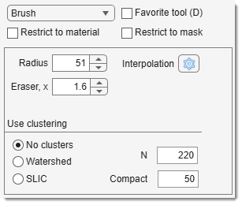
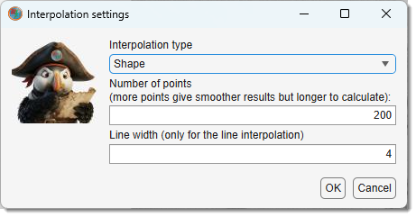
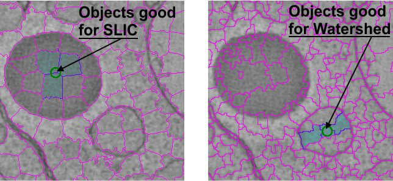

# The Brush Tool

---

## Overview

{align=left}

Use the brush to make selections, with size regulated by the Radius, px edit box 

- [:fontawesome-brands-youtube:{.red-color} Demo](https://youtu.be/VlTCxVAUxFc)
- [:fontawesome-brands-youtube:{.red-color} MIB in brief: Manual segmentation tools](https://youtu.be/ZcJQb59YzUA?t=37s)

???+ info "Controls"
    - Ctrl + **Mouse wheel**: change brush size.
    - **None** or Shift + <mouse class="left"></mouse>: paint with brush.
    - Ctrl + <mouse class="left"></mouse>: start eraser (radius amplified by Eraser, x).
    - Auto fill in the [Selection panel](../selection/index.md): autofill areas after brushing.

!!! tip
    Connect objects across slices using *Interpolation* (i shortcut or 
    [Ribbon → Selection -> Interpolate](../../ribbon/selection/index.md#interpolate)).

## Widgets of the brush panel

- **Radius**: define brush radius in pixels.
- **Eraser, x**: define eraser size multiplier.
- {.on-glb align=left width="200"}
  **Interpolation settings**: modify settings via dialog (also adjustable in 
  [Ribbon → Home -> Preferences -> Segmentation tools](../../ribbon/home/home-preferences.md)  
  or in [toolbar](../../quick-access-bar/index.md)).

- Watershed: cluster pixels with the watershed algorithm for selection as clusters.
- SLIC: cluster pixels with the SLIC algorithm for selection as clusters.

??? info "Superpixels with the Brush tool"
    Enable *Superpixels mode* with [:fontawesome-brands-youtube:{.red-color} Watershed](https://youtu.be/vVh1j3HBh-c) 
    or [:fontawesome-brands-youtube:{.red-color} SLIC](https://youtu.be/6bZb_Mr_nS0?list=PLGkFvW985wz8cj8CWmXOFkXpvoX_HwXzj) checkboxes. 
    The brush selects groups of pixels (superpixels) instead of individual pixels. 
    Undo the last superpixel with ++ctrl++ + ++z++.

    Algorithms:

    - **SLIC**: Simple Linear Iterative Clustering by [Radhakrishna Achanta et al., 2015](http://ivrl.epfl.ch/supplementary_material/RK_SLICSuperpixels/index.html) (good for distinct intensities).
    - **Watershed**: Good for distinct boundaries.

    Adjust superpixel size and shape with

    - N (default, **220** for SLIC, **15** for Watershed) 
    - **Compact/Invert** (higher compactness = more rectangular shapes; Invert: **1** for dark boundaries, **0** for bright). 
    !!! tip
        Use 
        ++ctrl++ + ++alt++ + **mouse wheel** or 
        ++ctrl++ + ++alt++ + ++shift++ + **mouse wheel** to adjust N.

    {.on-glb}
    /// caption
    Example of SLIC and Watershed superpixels
    ///

    SLIC boundaries use _drawregionboundaries.m_ by [Peter Kovesi](http://www.peterkovesi.com/projects/segmentation/).  
    !!! note
        * **Note 1**: Sensitive to Adapt. in the 
        [Selection panel](../selection/index.md), selecting superpixels based on mean ± standard deviation × Adapt. factor.  
        * **Note 2**: Adjust Adapt.  with the mouse wheel while drawing.  
        * **Note 3**: Requires compiling [slicmex.c](https://mib.helsinki.fi/downloads_systemreq.html#superpixels) for your OS.

    !!! abstract "References"  
    - Achanta et al., *SLIC Superpixels Compared to State-of-the-art Superpixel Methods*, IEEE TPAMI, 2012.  
    - Achanta et al., *SLIC Superpixels*, EPFL Technical Report, 2010.

---

## Presets
Use the following key shortcuts to define and restore presets

- ++shift+1++, ++shift+2++, ++shift+3++ - store preset 1, 2, or 3 correspondingly
- ++1++, ++2++, ++3++ - restore preset 1, 2, or 3 correspondingly

---

*Back to [MIB](../../../index.md) | [User interface](../../index.md) | [Panels](../index.md) | [Segmentation](index.md)*
