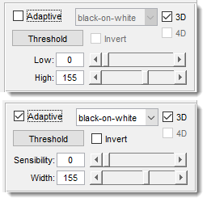
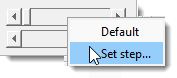

# Black and White Thresholding

*Back to [MIB](../../../index.md) | [User interface](../../index.md) | [Panels](../index.md) | [Segmentation](index.md)*

---

## Overview

{align=left}

Performs black-and-white thresholding on the current slice or dataset, depending on 3D and 
4D.

 Start thresholding modifying slider/edit box values or by pressing Threshold.

- [:fontawesome-brands-youtube:{.red-color} Demo](https://youtu.be/ZcJQb59YzUA?t=4m37s)

## Parameters and controls
Use the Low and High
sliders/edit boxes to set threshold values, selecting pixels with intensities between them. Thresholding starts automatically upon interaction.

If Masked area is checked, thresholding is limited to masked areas, ideal for local thresholding.

{align=left}
Right-click (<mouse class="right"></mouse>) on sliders opens a popup menu to set precision for slider movement.

The Adaptive checkbox enables adaptive thresholding with 
Sensitivity and Width parameters adjusted by scroll bars.

!!! tips "Usage notes"  
    For large 3D/4D datasets: 

    - Start in 2D mode (uncheck 3D and 4D).
    - Adjust parameters on the current slice.
    - Check 3D or 4D when ready.
    - Press Threshold to apply.

---

## Presets
Use the following key shortcuts to define and restore presets

- ++shift+1++, ++shift+2++, ++shift+3++ - store preset 1, 2, or 3 correspondingly
- ++1++, ++2++, ++3++ - restore preset 1, 2, or 3 correspondingly

---
*Back to [MIB](../../../index.md) | [User interface](../../index.md) | [Panels](../index.md) | [Segmentation](index.md)*