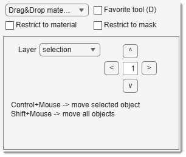

# Drag & Drop Materials

---

## Overview

{align=left}

Shifts MIB layers (selection, mask, model) left/right/up/down. Moves individual 2D/3D objects or entire layer contents in 2D/3D.
 [:fontawesome-brands-youtube:{.red-color} Demo](https://youtu.be/NGudNrxBbi0)

A combobox selects the layer to move. Mouse clicks or panel buttons shift the layer by a specified pixel amount.

## Mouse and key controls

| Start by                                                    | Modifier     | 3D | Action                                                                 |
|-------------------------------------------------------------|--------------|-----------------------------------------------|------------------------------------------------------------------------|
| <mouse class="left"></mouse> over an object                 | ++ctrl++     | Unchecked                                     | Move the selected object in 2D                                         |
| <mouse class="left"></mouse> over an object                 | ++ctrl++     | Checked                                       | Move the selected 3D object (MATLAB 2017b+ only)                      |
| <mouse class="left"></mouse>                                | ++shift++    | Unchecked                                     | Move all objects on the shown slice (2D movement)                     |
| <mouse class="left"></mouse>                                | ++shift++    | Checked                                       | Move all objects on all slices (3D movement)                          |
| ++arrow-left++/++arrow-right++/++arrow-up++/++arrow-down++  | -            | Unchecked                                     | Move all objects on the shown slice by specified pixels (2D movement) |
| ++arrow-left++/++arrow-right++/++arrow-up++/++arrow-down++  | -            | Checked                                       | Move all objects on all slices by specified pixels (3D movement)      |

---

## Presets
Use the following key shortcuts to define and restore presets

- ++shift+1++, ++shift+2++, ++shift+3++ - store preset 1, 2, or 3 correspondingly
- ++1++, ++2++, ++3++ - restore preset 1, 2, or 3 correspondingly

---
*Back to [MIB](../../../index.md) | [User interface](../../index.md) | [Panels](../index.md) | [Segmentation](index.md)*