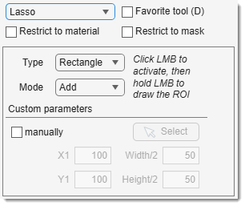

# The Lasso Tool

!!! success "BigData mode: supported"
    The Lasso tool works with **BigData** datasets (interactive Lasso/Rectangle/Ellipse/Polyline and manual entry).

---

## Overview

{align=left}

Selection with *lasso, rectangle, ellipse, or polyline* tools. 
[:fontawesome-brands-youtube:{.red-color} Demo](https://youtu.be/OHFdGj9uBro)

## How to use
- Press and release <mouse class="left"></mouse> above the image to initialize the lasso tool.
- Press and hold <mouse class="left"></mouse>, drag to select an area.
- Release <mouse class="left"></mouse> to finish.
- Modify the selected area if needed.
- Accept with double <mouse class="left"></mouse>.

!!! abstract "Modes"  
    - **Add**: add new selection to the existing one.
    - **Subtract**: subtract new selection from the existing one.

!!! info
    Works in 3D 
    Requires checked 3D in the [Selection and View settings panel](../selection_imview/index.md)

---

*Back to [MIB](../../../index.md) | [User interface](../../index.md) | [Panels](../index.md) | [Segmentation](index.md)*