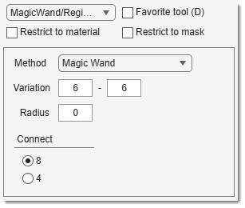

# The Magic Wand + Region Growing Tools

!!! success "BigData mode: supported"
    Both tools work with **BigData** datasets; the region is read at full resolution around the clicked point.

---

## Overview

{align=left}

Selects pixels with a mouse click using one of two intensity-based methods, chosen from the Method dropdown. 
[:fontawesome-brands-youtube:{.red-color} Demo](https://youtu.be/ZcJQb59YzUA?t=1m50s)

---

## Methods

### Magic Wand

Selects all pixels that are **connected** to the clicked seed point and whose intensity lies within an adjustable range around the seed value. The range is defined by two Variation fields:

- **left field** — lower bound shift: pixels with intensity < `seed − left` are excluded
- **right field** — upper bound shift: pixels with intensity > `seed + right` are excluded

Connected pixels are found using MATLAB's `bwselect` at the selected connectivity (8/26 or 4/6 for 2D/3D).

### Region Growing

Grows a region outward from the clicked seed point using a fast MEX-based algorithm (C. Wuerslin, University of Tübingen). A neighbouring pixel is added to the region if its intensity differs from the **region's current mean intensity** by no more than the Variation value. The region expands iteratively until no more pixels satisfy this criterion.

- Only the **left** Variation field is active in this mode.
- Connectivity is fixed internally (4-connected in 2D, 6-connected in 3D); the **Connect** radio buttons have no effect.

---

## Widgets and parameters

- Method: select `Magic Wand` or `Region Grow`.
- Variation: intensity threshold relative to the seed value.
    - *Magic Wand*: left field = lower bound shift; right field = upper bound shift.
    - *Region Growing*: left field only — maximum intensity difference from the growing region's mean.
- **Connect** — 8 / 4: connectivity used by the Magic Wand - 8/26-connected (default) or 4/6-connected (2D/3D). Not used by Region Growing.
- Radius: limit the selection to pixels within this distance from the seed in pixels (0 = no limit).

???+ info "Selection modifiers"
    - <mouse class="left"></mouse>: replace existing selection with the new one.
    - ++shift++ + <mouse class="left"></mouse>: add new selection to the existing one.
    - ++ctrl++ + <mouse class="left"></mouse>: remove new selection from the current one.

!!! info
    Works in 3D 
    Requires checked 3D in the [Selection panel](../selection/index.md)

---

## Presets
Use the following key shortcuts to define and restore presets

- ++shift+1++, ++shift+2++, ++shift+3++ - store preset 1, 2, or 3 correspondingly
- ++1++, ++2++, ++3++ - restore preset 1, 2, or 3 correspondingly

---
*Back to [MIB](../../../index.md) | [User interface](../../index.md) | [Panels](../index.md) | [Segmentation](index.md)*
