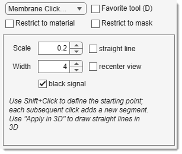

## The Membrane Click Tracker Tool

---

## Overview

{align=left}

Tracks membrane-type objects using two mouse clicks to define start and end points.

- [:fontawesome-brands-youtube:{.red-color} 2D Demo](https://youtu.be/ZcJQb59YzUA?t=3m14s)
- [:fontawesome-brands-youtube:{.red-color} 3D Demo](https://youtu.be/ZcJQb59YzUA?t=2m22s)

## How to use
- Ctrl + <mouse class="left"></mouse>: define the starting point (before MIB 2.651, Shift + <mouse class="left"></mouse> was used).
- <mouse class="left"></mouse>: trace the membrane from the start to the clicked point.

## Additional parameters
- Scale: enhance the image during tracing based on start/end intensities  
(`img(img>min([val1 val2])-diff([val1 val2])*options.scaleFactor) = maxIntensity`).
- Width: define the trace width.
- BlackSignal: set signal as black on white or white on black.
- Straight line: connect points with a straight line.

    !!! note
        When the 3D switch in the [Selection panel](../../panels/selection_imview/selection.md) is enabled, it connects points linearly in 3D (useful for microtubules).
        Alternatively, use the [3D lines tool](segm-3dlines.md).

???+ info "Reference and compilation"
    Uses the *Accurate Fast Marching* function by [Dirk-Jan Kroon, 2011](http://www.mathworks.se/matlabcentral/fileexchange/24531-accurate-fast-marching), University of Twente.

    !!! note
        Compile the function for your OS (see [System Requirements - Membrane Click Tracker](https://mib.helsinki.fi/downloads_systemreq.html#clicktracker)), as it’s slow otherwise.

---

## Presets
Use the following key shortcuts to define and restore presets

- ++shift+1++, ++shift+2++, ++shift+3++ - store preset 1, 2, or 3 correspondingly
- ++1++, ++2++, ++3++ - restore preset 1, 2, or 3 correspondingly

---

*Back to [MIB](../../../index.md) | [User interface](../../index.md) | [Panels](../index.md) | [Segmentation](index.md)*