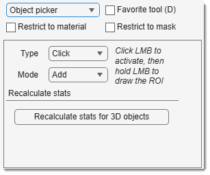

# Object Picker

---

## Overview

{align=left}

Fast selection of objects from *Mask* or *Model* layers, depending on the selected row in the [Segmentation table](index.md#segmentation-table).

[:fontawesome-brands-youtube:{.red-color} Demo](https://youtu.be/mzILHpbg89E)

 Works in 3D (enable 3D in the [Selection panel](../selection/index.md)).

!!! info "Object picker for 3D objects"
    3D mode requires object statistics.  
    Select the material in the [Segmentation table](index.md#segmentation-table) and press 
    Recalculate stats for 3D objects 
    (available when 3D in the [Selection panel](../selection/index.md) is checked).

!!! info
    Advanced filtering of objects is available via 
    - [Ribbon → Mask -> Mask statistics](../../ribbon/mask/mask-stats.md) 
    - [Ribbon → Model -> Model statistics](../../ribbon/mask/mask-stats.md).

## Object Picker selection modes

- **1. Single Click**: <mouse class="left"></mouse> selects an object from *Mask/Model*.
!!! warning
      **Note 1**: Sensitive to connectivity value selected from the [Magic Wand tool](segm-magicwand.md).   
      **Note 2**: In 3D, uses statistics generated by Recalc. Stats (recalculate if layers change).

- **2. Lasso**: Select with lasso (None/++shift++/++ctrl++ + <mouse class="right"></mouse>, 
then hold <mouse class="left"></mouse> and drag). Works in 3D if 3D in the [Selection panel](../selection/index.md) is checked.
- **3. Rectangle or Ellipse**: Similar to lasso, but with rectangular/elliptical shapes. Works in 3D.
- **4. Polyline**: Draw a polygon point-by-point (start with <mouse class="right"></mouse>, finish with double-click or <mouse class="right"></mouse>). Works in 3D.
- **5. Brush**: Select areas with a brush (size set in the *Brush* edit box).
- **6. Mask within selection**: <mouse class="left"></mouse> creates a selection intersecting *Mask/Model*. 
++ctrl++ + <mouse class="left"></mouse> subtracts *Mask* from selection. Sensitive to 3D.

???+ info "Selection modifiers"
    - **None** or Shift + <mouse class="left"></mouse>: add selection to the existing one.
    - ++ctrl++ + <mouse class="left"></mouse>: remove selection from the current one.

---

## Presets
Use the following key shortcuts to define and restore presets

- ++shift+1++, ++shift+2++, ++shift+3++ - store preset 1, 2, or 3 correspondingly
- ++1++, ++2++, ++3++ - restore preset 1, 2, or 3 correspondingly

---

*Back to [MIB](../../../index.md) | [User interface](../../index.md) | [Panels](../index.md) | [Segmentation](index.md)*