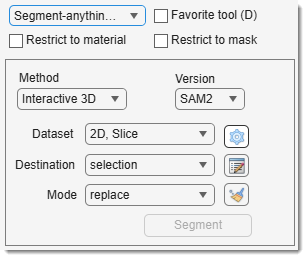
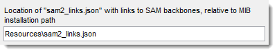
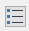
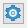
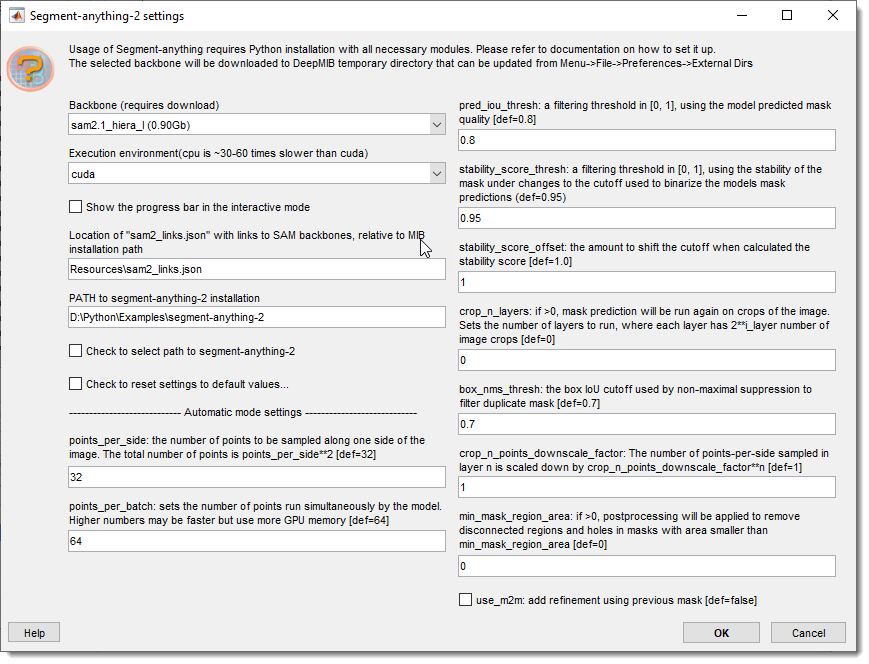

# Segment Anything Model

!!! info "BigData mode: partially supported"
    The **Interactive**, **Landmarks** and **Interactive 3D** modes work with **BigData** datasets (a model must already exist). **Automatic everything** is *not* available in BigData mode — it produces a 65535-material model that the disk-backed BigData model cannot hold.

---

## Overview

{align=left}

Uses Segment-anything model (SAM1 or SAM2) for object segmentation with one or few mouse clicks.

- [:fontawesome-brands-youtube:{.red-color} Tutorial (SAM-2)](https://youtu.be/o9k8mBgItiA)
- [:fontawesome-brands-youtube:{.red-color} Tutorial (SAM-1)](https://youtu.be/J3pivV4udGU)

## General information and references
Developed by [Meta AI Research, FAIR](https://ai.facebook.com/research), SAM segments objects or entire images with minimal clicks.  

- SAM-1: [https://segment-anything.com](https://segment-anything.com)  
- SAM-2 \[*recommended*\]: [https://ai.meta.com/sam2/](https://ai.meta.com/sam2/), faster than SAM-1; can also work in 3D

Implemented in MIB via an external Python interpreter. See [Requirements and installation](https://mib.helsinki.fi/downloads_systemreq_sam2.html).

!!! warning
    GPU is recommended (30–60x faster than CPU).

??? info "SAM-1 Models in MIB"
    
    
Original SAM-1 models:

    - **vit_b (0.4Gb)**: fastest (x1), less precise.
    - **vit_l (1.2Gb)**: moderate speed (~x1.4 slower), better predictions.
    - **vit_h (2.5Gb)**: slowest (x2.0 slower), best predictions.
    !!! abstract "Reference"
        *Reference*: Kirillov et al., *Segment Anything*, [arXiv:2304.02643](https://doi.org/10.48550/arXiv.2304.02643).

    
Microscopy extensions:

    
    - **vit_b Electron Microscopy (0.4Gb)**: fast, for EM datasets.
    - **vit_b Light Microscopy (0.4Gb)**: fast, for LM datasets.
    - **vit_h Electron Microscopy (2.5Gb)**: best results, for EM.
    - **vit_h Light Microscopy (2.5Gb)**: best results, for LM.
    - **vit_b for EM Generalist (0.4Gb)**: pretrained for mitochondria in EM.
    - **vit_b for EM Boundaries (0.4Gb)**: pretrained for membrane organelles in EM.  
    !!! abstract "Reference"    
        Archit et al., *Segment Anything for Microscopy*, [bioRxiv](https://www.biorxiv.org/content/10.1101/2023.08.21.554208v1).

??? info "SAM-2 Models in MIB"

    
Original SAM-2.1 models:

    - **sam2.1_hiera_tiny (0.15Gb)**  
    - **sam2.1_hiera_small (0.18Gb)**  
    - **sam2.1_hiera_base_plus (0.32Gb)**  
    - **sam2.1_hiera_large (0.90Gb)**

    
Original SAM-2.0 models:

    - **sam2_hiera_tiny (0.15Gb)**  
    - **sam2_hiera_small (0.18Gb)**  
    - **sam2_hiera_base_plus (0.32Gb)**  
    - **sam2_hiera_large (0.90Gb)**  
    !!! abstract "Reference"
        Ravi et al., *SAM 2: Segment Anything in Images and Videos*, [arXiv:2408.00714](https://arxiv.org/abs/2408.00714).

## Requirements and installation instructions
SAM requires installation:

- SAM-1: [https://mib.helsinki.fi/downloads_systemreq_sam.html](https://mib.helsinki.fi/downloads_systemreq_sam.html)  
- SAM-2: [https://mib.helsinki.fi/downloads_systemreq_sam2.html](https://mib.helsinki.fi/downloads_systemreq_sam2.html)

!!! info Download links and configuration

    SAM networks are automatically downloaded, connected, and initialized in MIB. 
    Customize via `sam_links.json` (SAM-1) or `sam2_links.json` (SAM-2) in the `MIB/Resources` subfolder, or specify a new location in SAM settings available 
    within the SAM panel.
    {align=left}

## How to use

SAM segmentation in MIB has 4 options

### Interactive

[:fontawesome-brands-youtube:{.red-color} SAM-2, Interactive](https://www.youtube.com/watch?v=o9k8mBgItiA&t=1630s)

Default mode, segments the visible image area:  

- Destination: choose *selection*, *mask*, or *model* for results.
- Mode:  
    - Replace: replace destination layer objects with new results.
    - Add: add results to the destination layer.
    - Subtract: subtract results from the destination layer.
    - Add, +next material: add to the selected material and create a new one 
      (for 65535+ models, *model* or *selection* only).
- <mouse class="left"></mouse>: specify a point on an object to segment.  
    - Shift + <mouse class="left"></mouse>: expand the object (positive seed).
    - Ctrl + <mouse class="left"></mouse>: constrain the object from the clicked area (negative seed).
- Dataset: 3D, Stack: perform 3D segmentation by clicking on one slice, scrolling, and using 
Shift + <mouse class="left"></mouse>. Interpolates seeds (positive/negative clicks) across slices.  
!!! warning
    - **Note 1**: Not available for SAM1.  
    - **Note 2**: It is recommended to use the **Interactive 3D** mode instead as it is faster and more intelligent

### Interactive 3D

[:fontawesome-brands-youtube:{.red-color} SAM-2, Interactive 3D](https://www.youtube.com/watch?v=o9k8mBgItiA&t=2108s)

Best for 3D segmentation:

- Mode: same as above.
- <mouse class="left"></mouse>: start an object.
- ++shift++ + <mouse class="left"></mouse>:  expand the object (positive seed).
- ++ctrl++ + <mouse class="left"></mouse>: constrain the object from the clicked area (negative seed).
- Scroll to another slice, use ++shift++ + <mouse class="left"></mouse> to segment between slices.  
!!! warning
    - **Note**: Only the image area visible in the [Image View](../imview/index.md) panel is processed. 

### Landmarks

[:fontawesome-brands-youtube:{.red-color} SAM-2, Landmarks](https://www.youtube.com/watch?v=o9k8mBgItiA&t=2277s)

Process full images using annotations:

- Dataset: select stack portion.
- Destination and Mode: define layer and mode (see [Interactive](#interactive)).
- Use <mouse class="left"></mouse>to add annotations:

  - **Value=1** for object, positive seed;
  - **Value=0** for background, negative seed).  

??? tips

    - Use Annotations -> Focus on Value to prioritize value.
    - Uncheck Show prompt to skip the dialog.
    - ++ctrl++ + <mouse class="left"></mouse>: remove the closest annotation.
    - Access the list with {.inline-image}. 
    - Press Segment to segment.
    - Use Clear annotations to remove landmarks after successive segmentation

### Automatic everything

[:fontawesome-brands-youtube:{.red-color} SAM-2, Automatic everything](https://www.youtube.com/watch?v=o9k8mBgItiA&t=2433s)

Automatically segments all objects into a new model:  

- Dataset: select stack portion.
- Press Segment to segment.

## SAM settings
Press  to open settings. 

{.on-glb align=left width="300"}

Key parameters:
 

- Backbone: choose a pretrained backbone (see [General information](#general-information-and-references)).
- Execution environment: select *cuda* (GPU) or CPU (slower).
- Show the progress bar in the interactive mode: toggle progress bar.
- PATH to segment-anything installation: set the unzipped package location 
 (use Check to select path for a dialog).

---

## Presets
Use the following key shortcuts to define and restore presets

- ++shift+1++, ++shift+2++, ++shift+3++ - store preset 1, 2, or 3 correspondingly
- ++1++, ++2++, ++3++ - restore preset 1, 2, or 3 correspondingly

---

*Back to [MIB](../../../index.md) | [User interface](../../index.md) | [Panels](../index.md) | [Segmentation](index.md)*