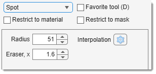

# The Spot Tool

!!! success "BigData mode: supported"
    The Spot tool works with **BigData** datasets (the spot is written at full resolution at the clicked position).

---

## Overview

{align=left}

Adds a circular spot with a mouse click.

- [:fontawesome-brands-youtube:{.red-color} Demo](https://youtu.be/AlCzjKuyJww)

## Widgets and parameters
- Radius, px: specify the spot radius.
- Eraser, x: set the eraser size multiplier.

Works in 3D (enable 3D in the [Selection panel](../selection/index.md))

!!! info "Selection modifiers"  
    - **None** or Shift + <mouse class="left"></mouse>: add a new spot to existing ones.
    - ++ctrl++ + <mouse class="left"></mouse>: remove selection from the current one.

---

## Presets
Use the following key shortcuts to define and restore presets

- ++shift+1++, ++shift+2++, ++shift+3++ - store preset 1, 2, or 3 correspondingly
- ++1++, ++2++, ++3++ - restore preset 1, 2, or 3 correspondingly

---

*Back to [MIB](../../../index.md) | [User interface](../../index.md) | [Panels](../index.md) | [Segmentation](index.md)*