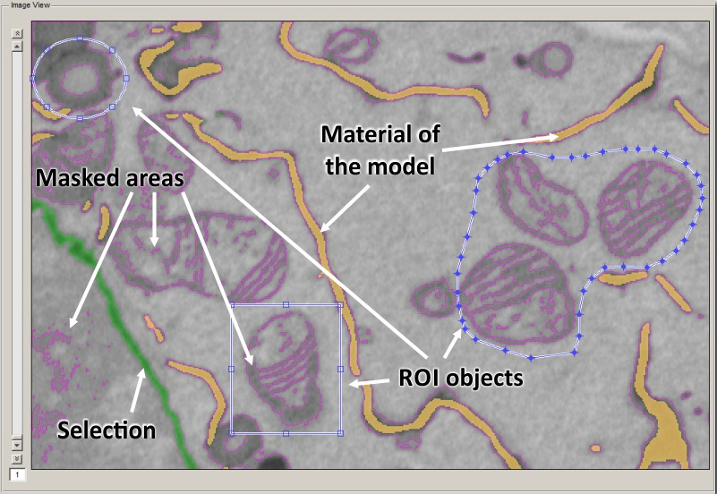
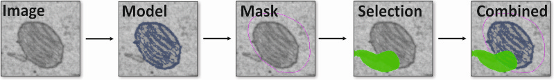
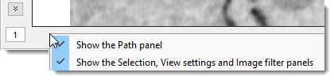
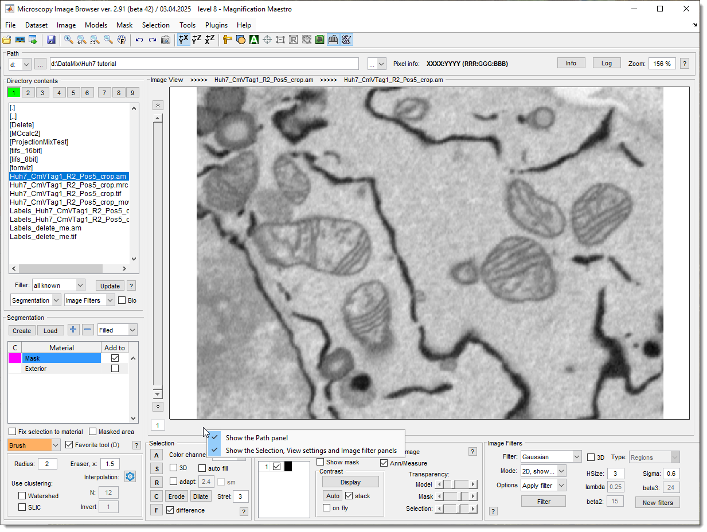
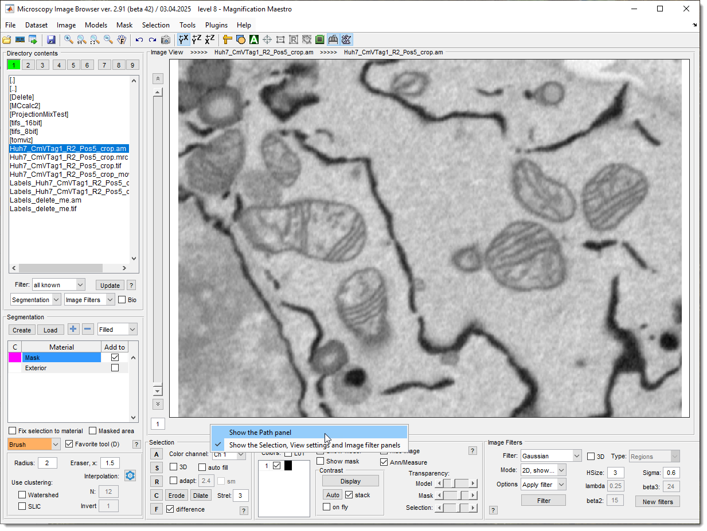
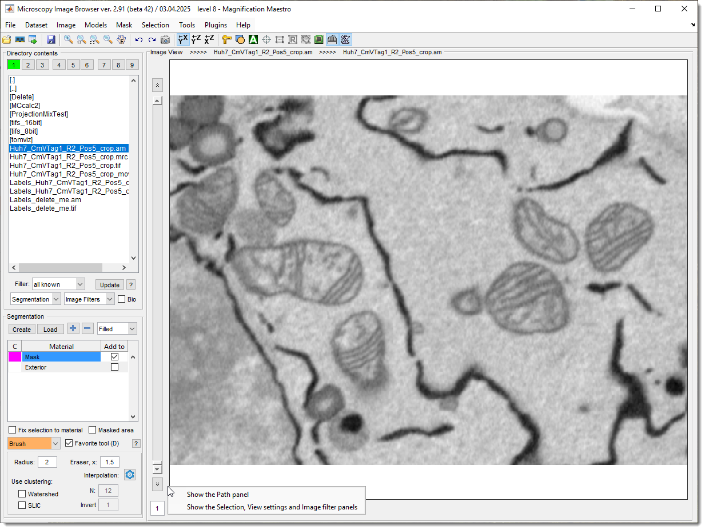
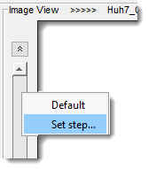
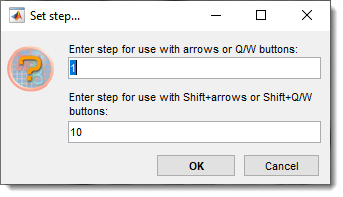

# Image View Panel

!!! info "MIB3"
    In MIB3 this component is replaced by the **[Image Document](../../image-document/index.md)**,
    which adds multi-document (tabbed/split) layout, per-document slice and frame navigation,
    and drag-and-drop loading. This page is retained for MIB2 reference.

---

## Overview

The **Image View Panel** displays slices of the opened dataset, allowing you to visualize your images in 
XY, ZX, or ZY orientations. The orientation is selected via 
the [Toolbar](../../quick-access-bar/index.md). 
 On the left side, a slider and edit box let you navigate through slices—though these are 
hidden for single-slice datasets.

---

## Image layers in MIB

{.on-glb}
/// caption
The Image View Panel can simultaneously display multiple layers, each serving a distinct purpose:
///

- **Grayscale or multichannel image**: Shows the original image being analyzed, in grayscale or multichannel format.
- **Model layer**: Displays segmented model materials or a difference map for correlation analysis. 
See [Data Layers](../../image-layers.md) for details.
- **Mask layer**: A black-and-white (bitmap) mask generated by filters, used as a source for shapes in segmentation 
or for local black-and-white thresholding with 
the [BW Thresholding tool](../segm/segm-bwthres.md).
- **Selection layer**: A temporary layer for segmentation, easily modified before transferring to the 
Mask or Model layers.
- **ROI layer**: Shows Regions of Interest (ROIs) when enabled, allowing focused selection and 
analysis within the image.

{.on-glb}

You can adjust the colors and transparency of the Model, Mask, and Selection layers using 
sliders in the [View Settings panel](viewsettings.md) or 
the [Ribbon → Home -> Preferences -> Colors and styles](../../ribbon/home/home-preferences.md#colors-and-styles) (*Ribbon → Home -> Preferences -> Colors*).

---

## Mouse actions

Interact with the image using these mouse actions:

- **Move mouse**: hover to see pixel information and coordinates in the [Path Panel](../path/index.md).
- <mouse class="left"></mouse>: to select pixels based on the method chosen in 
the [Segmentation Panel](../segm/index.md).
- <mouse class="right"></mouse> + **move mouse**: right-click and drag to pan the image left/right or up/down.
- ++ctrl++ + <mouse class="left"></mouse>: erase from the current selection.
- ++ctrl++ + **mouse wheel** (or ++ctrl++ + ++shift++ + **mouse wheel**): adjust the size of the brush or 
other selection tools.
- **Mouse wheel**: Scroll to change slices or zoom in/out, depending on settings in 
the [Preferences dialog](../../ribbon/home/home-preferences.md).
- ++shift++ + **mouse wheel**: Jump 10 slices at a time (customizable via right-click on the slice slider).

Right mouse click menu

{.on-glb align=left width="300"}

<mouse class="right"></mouse> an empty area in the panel opens a dropdown menu to hide/show other panels, expanding the Image View Panel's space.

??? abstract "Modification of GUI depending on configuration of these checkboxes"

    
Examples of the MIB interface when states of these checkboxes changes:

    
    <label class="widget widget-checkbox">Show the Path panel</label> 
    <label class="widget widget-checkbox">Show the Selection, View settings, Image Filters panels</label> 
    {.on-glb align=left width="400"}
    

    <label class="widget widget-checkbox widget-checkbox-unchecked">Show the Path panel</label> 
    <label class="widget widget-checkbox">Show the Selection, View settings, Image Filters panels</label> 
    {.on-glb align=left width="400"}
    

    <label class="widget widget-checkbox widget-checkbox-unchecked">Show the Path panel</label> 
    <label class="widget widget-checkbox widget-checkbox widget-checkbox-unchecked">Show the Selection, View settings, Image Filters panels</label> 
    {.on-glb align=left width="400"}
    

---

## Key actions

Navigate and manipulate the image with these shortcuts:

- ++w++: zoom in to the area under the cursor.
- ++q++: zoom out from the area under the cursor.
- **Mouse wheel**: show next/previous slice.
- ++shift++ + **mouse wheel**: jump 10 slices forward/back (adjustable via slider context menu).
- ++arrow-up++: show next slice.
- ++arrow-down++: show previous slice.
- ++arrow-right++: show next time point.
- ++arrow-left++: show previous time point.

Customize shortcuts in [Ribbon → Home -> Preferences -> Keyboard shortcuts](../../ribbon/home/home-preferences.md#keyboard-shortcuts). 
See the full list in [Key and Mouse Shortcuts](../../key-and-mouse-shortcuts.md).

---

## Drag and drop files

Load files directly into the Image View Panel by dragging and dropping:

- **Images**: Drag image files from a file explorer to load them.
- **Models**: Drop files with a `.model` extension to load as a new model. 
For labeled models with other extensions, drop them onto 
the Segmentation table in the [Segmentation Panel](../segm/index.md).
- **Masks**: Drag `.mask` files to load them automatically.
- **Annotations**: Drop `.ann` files to load annotations instantly.

---

## Extra parameters for the slice slider

{align=left}

The slice slider appears only for 3D or 4D datasets. By default, the mouse wheel changes slices by 1. 

To adjust this step:

{align=left}

- <mouse class="right"></mouse> the slider.
- Choose your desired step from the context menu.

---

*Back to [MIB](../../../index.md) | [User interface](../../index.md) | [Panels](../index.md) | [Selection and View Settings](index.md)*
