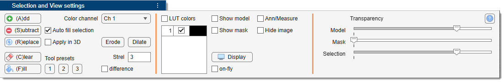

# Selection and View Settings Panel

The **Selection and View Settings panel** combines tools for manipulating the Selection layer with
controls for visualizing the dataset — color channels, layer visibility, transparency, and contrast.

{.on-glb align=left}

---

## Overview

The panel is divided into two functional areas:

- **[Selection](selection.md)** — operations on the Selection layer: add, subtract, replace, clear,
  fill holes, erode, dilate.  Also holds the active color-channel selector and mode checkboxes
  (3D, Auto fill, Adapt, Difference).
- **[View Settings](viewsettings.md)** — color-channel table, layer visibility toggles (Show Model,
  Show Mask, Hide Image, Annotations), contrast controls, and per-layer transparency sliders.

---

*Back to [MIB](../../../index.md) | [User interface](../../index.md) | [Panels](../index.md)*
