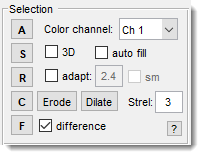
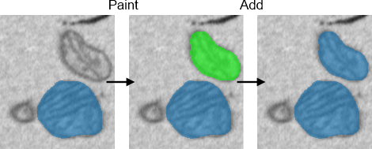
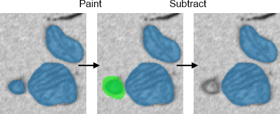
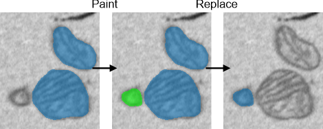
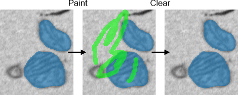
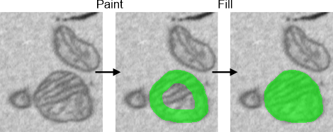
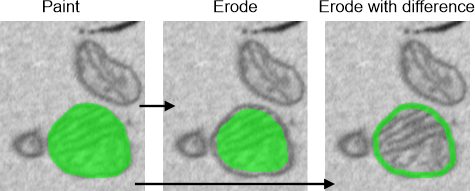
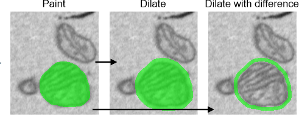
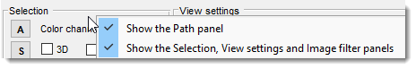

# Selection Panel

---

## Overview

{align=left}

The **Selection Panel** provides tools to manipulate the Selection layer, 
one of three key segmentation layers in MIB (Model, Selection, Mask).
This layer works in combination with others for tasks like adding, subtracting, or refining segmentations. 
Learn more about these layers in [Data Layers of MIB](../../image-layers.md).

---

## The A button

Adds the Selection layer to the chosen Model or Mask layer, as selected in the 
`Add to` column in the [Segmentation table](../segm/index.md#segmentation-table) of the Segmentation Panel.

{align=left}

???+ info "Shortcuts"
    - ++a++: add for the current slice only.
    - ++shift++ + ++a++: add for all slices in the dataset.
    - ++shift++ + ++alt++ + ++a++: add for all slices, including the time dimension.

---

## The S button

Subtracts the Selection layer from the chosen Model or Mask layer,
as selected in the `Add to` column in the [Segmentation table](../segm/index.md#segmentation-table) of the Segmentation Panel.

{align=left}

???+ info "Shortcuts"
    - ++s++: subtract for the current slice only.
    - ++shift++ + ++s++: subtract for all slices in the dataset.
    - ++shift++ + ++alt++ + ++s++: subtract for all slices, including the time dimension.

??? info "Possible usage combinations"
    | Select from   | Add to   | Fix Selection to Material | Masked area | Result of subtraction                        |
    |-----------|----------|---------------------------|-------------|----------------------------------------------|
    | Any       | Mask     | OFF                       | OFF         | Mask - Selection                             |
    | Material  | Mask     | ON                        | OFF         | Mask within selected material - Selection    |
    | Any       | NOT Mask | OFF                       | OFF         | All Materials - Selection                    |
    | Material  | NOT Mask | ON                        | OFF         | Selected material - Selection                |
    | Material  | NOT Mask | ON                        | ON          | Selected material within the Mask - Selection|

---

## The R button

Replaces the material or mask
selected in the `Add to` column in the [Segmentation table](../segm/index.md#segmentation-table) of the Segmentation Panel.
with the Selection layer contents. 
This is sensitive to the Masked area 
checkbox in the [Segmentation panel](../segm/index.md).

{align=left}

???+ info "Shortcuts"
    - ++r++: replace for the current slice only.
    - ++shift++ + ++r++: replace for all slices in the dataset.
    - ++shift++ + ++alt++ + ++r++: replace for all slices, including the time dimension.

---

## The C button

Clears the Selection layer.

{align=left}

???+ info "Shortcuts"
    - ++c++: clear the current slice only.
    - ++shift++ + ++c++: clear Selection for all slices in the dataset.
    - ++shift++ + ++alt++ + ++c++: Clear Selection for all slices, including the time dimension.

---

## The F button

Fills holes in the Selection layer.  
This can happen automatically if Auto fill is checked.

{align=left}

???+ info "Shortcuts"
    - ++f++: fill holes for the current slice only.
    - ++shift++ + ++f++: fill holes for all slices in the dataset.
    - ++shift++ + ++alt++ + ++f++: fill holes for all slices, including the time dimension.

---

## The Erode button

Performs binary erosion (shrinkage) on the Selection layer using MATLAB's [imerode](https://se.mathworks.com/help/releases/R2024b/images/ref/imerode.html) function, 
with the size set in the Strel edit box.  

{align=left}

???+ info "Shortcuts"
    - ++z++: erode Selection for the current slice only.
    - ++shift++ + ++z++: erode Selection for all slices in the dataset.
    - ++shift++ + ++alt++ + ++z++: erode Selection for all slices, including the time dimension.

???+ tip

    - Enable 3D for 3D erosion.
    - Check Difference to get the difference between 
    the current and eroded selections.

---

## The Dilate button

Performs binary dilation (expansion) on the Selection layer using MATLAB's [imdilate](https://se.mathworks.com/help/releases/R2024b/images/ref/imdilate.html)
function, with the size set in the Strel edit box. 

When Adapt. is checked, 
dilation adapts to image intensities in expanded areas, controlled 
by the Adapt. edit box (mean ± standard deviation × coefficient).

???+ info "Shortcuts"
    - ++x++: dilate Selection for the current slice only.
    - ++shift++ + ++x++: Dilate Selection for all slices in the dataset.
    - ++shift++ + ++alt++ + ++x++: Dilate Selection for all slices, including the time dimension.

???+ tip

    - Enable 3D for 3D dilation. 
    - Check Difference to get the difference between the 
    current and dilated selections.

---

## Additional controls

- **Color channel combo box**: selects the color channel used for segmentation tools in 
the [Segmentation Panel](../segm/index.md).
- 3D: enables 3D manipulations for image and Mask/Model layers.
- Auto fill: automatically fills shapes drawn with 
the brush tool (and eraser) after releasing the left mouse button.
- Adapt: enables adaptive dilation or supervoxel 
selection with the [Brush tool](../segm/segm-brush.md), limiting expansion 
based on mean ± standard deviation × Adapt. coefficient.
- Difference: shows the difference between original and 
eroded/dilated Selection layers.
- Strel edit box: sets the structural element size for 
erosion and dilation. Use a single number (e.g., 3) or two semi-colon-separated 
numbers (e.g., `3;5` for 3x5 pixels in 2D, or 3x3x5 in 3D).

---

## Right mouse click menu

{align=left}

Right-clicking an empty area opens a dropdown to hide/show panels, increasing the Image View Panel's space.

---

*Back to [MIB](../../../index.md) | [User interface](../../index.md) | [Panels](../index.md) | [Selection and View Settings](index.md)*
