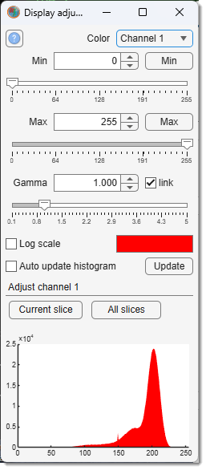
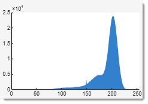

# Adjust Display Window

---

## Overview

{.on-glb align=left width="200"}

The **Adjust Display window** lets you fine-tune the contrast of your dataset for 
each color channel individually. 

!!! warning

    A histogram at the bottom shows intensity values for the currently displayed slice, 
    helping you visualize adjustments.

- [:fontawesome-brands-youtube:{.red-color} Demo](https://youtu.be/WhpzGMyslZU)

---

## List of widgets

- Color channel: choose the color channel to adjust.
- **Min slider and edit box** (*define the black point*)  
  {align=left}  
  Sets the black point; intensities below this are rendered black.  
     - <mouse class="left"></mouse> on the histogram sets this value; a click on the
       empty area to the **left** of the histogram moves the black point below the
       displayed range.
     - <mouse class="double"></mouse> on the slider sets it to 1.  
     - Enter values (including negative) directly in the edit box.
  

  - Min button: assigns the channel's minimal intensity as black.  
     - <mouse class="right"></mouse> on the button opens a menu to exclude a percentage of low-intensity points.  
  
- **Max slider and edit box** (*define the white point*)  
  {align=left}  
  Sets the white point; intensities above this are rendered white or pure color.  
     - <mouse class="right"></mouse> on the histogram sets this value; a click on the
       empty area to the **right** of the histogram moves the white point above the
       displayed range.
     - <mouse class="double"></mouse> on the slider sets it to the maximum for the image class.  
     - Enter values (including above max) in the edit box.
  

  - Max button: assigns the channel's maximal intensity as white.  
     - <mouse class="right"></mouse> on the button opens a menu to define the white point from the histogram.  
  
- **Gamma**: adjusts gamma: <1 enhances high intensities, >1 enhances low intensities.  
     - <mouse class="double"></mouse> on the slider sets it to 1.
  
Link: links all channels so Min/Max/Gamma changes apply to all simultaneously.

Log: switches histogram between linear and logarithmic scales.

Auto update histogram: enables automatic histogram updates after each slice change.  

Update: updates the histogram for the current slice.

Current slice: recalculates intensities for the selected channel on the current slice using specified parameters.  

All slices: recalculates intensities for the selected channel across all slices using specified parameters.

---

## Histogram 

{align=left}  

The histogram plots intensity values (X-axis) against pixel counts 
(Y-axis) for the image shown in the [Image Document](../../image-document/index.md) — not the full slice. 
!!! warning
    - Adjustments to **Gamma** are not reflected here
    - Only the shown part of the image

!!! tip "Set **Min** and **Max** values for the histogram"

    - Manual entry in the edit boxes
    - Slider adjustments
    - <mouse class="left"></mouse> (to set the minimum intensity, i.e. the black point) click on the histogram
    - <mouse class="right"></mouse> (to set the maximum intensity, i.e. the white point) click on the histogram

!!! tip "Extend the displayed range"

    The histogram is drawn over the current **Min**-**Max** range, so a click inside it can
    only narrow the range. To extend it, click on the empty area **beside** the plot,
    i.e. on the margins where the axes tick labels are:

    - <mouse class="left"></mouse> to the left of the histogram lowers the black point
    - <mouse class="right"></mouse> to the right of the histogram raises the white point

    Each such click shifts the point by at least 10% of the currently displayed range,
    so the range can be extended step by step with repeated clicks.

---

*Back to [MIB](../../../index.md) | [User interface](../../index.md) | [Panels](../index.md) | [View Settings](viewsettings.md)*
