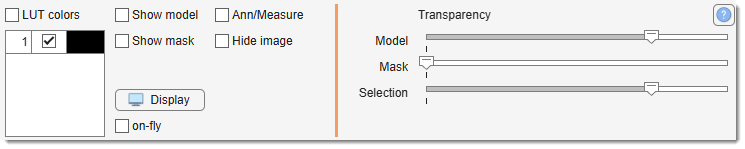
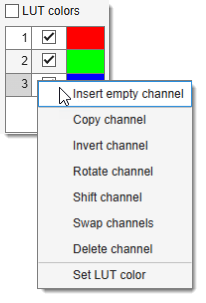
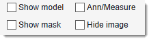
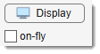
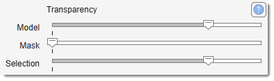

# View Settings Panel

---

## Overview

The **View Settings Panel** offers essential tools for visualizing your dataset, 
allowing you to adjust color channels, layer visibility, transparency, and display settings.

{align=left}

---

## Colors table and LUT checkbox

{align=left}

The **Colors table** lists the dataset's color channels. 
Enable or disable channels by checking/unchecking their boxes.
 Use ++ctrl++ + <mouse class="left"></mouse> on a checkbox 
to select a single channel exclusively.

[:fontawesome-brands-youtube:{.red-color} Demo: Working with color channels](https://youtu.be/gT-c8TiLcuY)

The LUT checkbox determines how the image is rendered:

- **Checked**: MIB generates the image using colors defined in the table's third column.
- **Unchecked**: Limits simultaneous display to 3 channels; if more are selected, only the first 3 are shown.

???+ info "Right-click actions for color channels"

    <mouse class="right"></mouse> a channel in the table for these options 
    (also available in [Ribbon → Image -> Color Channels](../../ribbon/image/index.md#color-channels)):

    - **Insert empty channel**: add a channel with all pixels set to 0 at a specified position.
    - **Copy channel**: duplicate the selected channel.
    - **Invert channel**: invert the selected channel's intensities.
    - **Rotate channel**: rotate the selected channel.
    - **Shift channel**: shift the channel by X and Y pixels.
    - **Swap channels**: swap the selected channel with another.
    - **Delete channel**: remove the selected channel.
    - **Set LUT color**: define colors for use with LUT (also in [Ribbon → Home -> Preferences](../../ribbon/home/home-preferences.md)).

---

## Checkboxes to toggle visibility of layers

{align=left}

Show Model checkbox, toggles the Model layer on/off. 
Shortcut: Space

Show Mask checkbox, toggles the Mask layer on/off. 
Shortcut: Ctrl + Space.

Ann/Measure checkbox, toggles visibility of the [Annotation layer](../segm/segm-annotations.md) 
and [Measurements](../../ribbon/tools/tools-measuretool.md).

Hide image checkbox, toggles the Image layer on/off.

---

## Other controls

{align=left}

The contrast panel can be used to quickly adjust image contrast settings:

- Display: starts the [Display Adjustments dialog](viewsettings-adjustments.md) allowing 
contrast stretching by defining black and white points for the dataset.

- <label class="widget widget-checkbox">On fly</label>: automatically adjusts contrast for each displayed image without altering the underlying data. 
The contrast stretching coefficients are taken from the portion of the image that is currently visible in the [Image View panel](../../image-document/index.md).

---

## Transparency sliders

{align=left}

Adjust layer transparency from opaque (left) to transparent (right):

- **Model slider**: controls the Model layer transparency.
- **Mask slider**: controls the Mask layer transparency.
- **Selection slider**: controls the Selection layer transparency.

---

*Back to [MIB](../../../index.md) | [User interface](../../index.md) | [Panels](../index.md) | [Selection and View Settings](index.md)*
